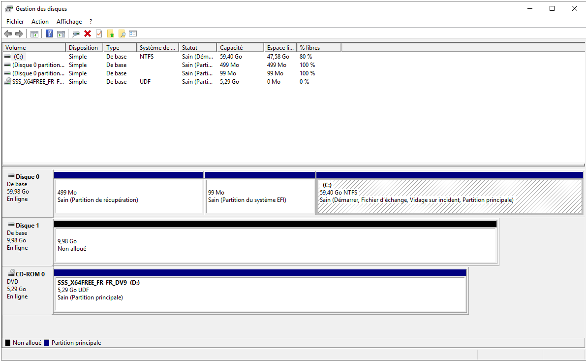

# 1 - Installation et configuration

Dans un premier temps, on commence par installer Windows Server 2019 en local sur ma machine. Le choix de l'hypervisuer se porte sur VMWare, où je trouve qu'il est plus aisé de créer des sous-réseaux distincts et est plus efficace dans la gestion des ressources :).

On commence donc par récupérer l'ISO de Windows Server 2019 : [https://www.microsoft.com/fr-fr/evalcenter/download-windows-server-2019](https://www.microsoft.com/fr-fr/evalcenter/download-windows-server-2019)

Puis on installe en bare-metal sur la machine :

<figure><figcaption></figcaption></figure>

Note : j'ai choisi évidemment un mot de passe des plus fort pour l'utilisateur "Administrateur" du DC.

Une fois l'install des VMWare Tools, du fullscreen ok... on a maintenant notre Windows Serveur installé :

<figure><figcaption></figcaption></figure>

Renommage du serveur en "**mesmots**", avec description "Serveur AD MesMots" :&#x20;

<figure><figcaption></figcaption></figure>

### Création du domaine :

La première étape étape, avant de créer le domaine Active Directory, consiste à installer le rôle "**ADDS**" : **Active Directory Domain Services**. Il s'agit du rôle permettant de créer un domaine Active Directory :

<figure><figcaption></figcaption></figure>

On pourvoie ensuite le serveur en DC, avec comme nom "**mesmots.local**" :

<figure><figcaption></figcaption></figure>

**Note :** Le nom de domaine NetBios sera **MESMOTS0**

### Création des OU :

Une fois le domaine créé, on peut commencer à créer les OU demandés, avec l'arborescence suivante :

<figure><figcaption></figcaption></figure>

A la fin on retrouve donc les OU contenant les membres, assignés à chaque groupe :

```rust
mesmots.local
├── Domain Controllers
└── OU MesMots
    ├── OU CODIR
    ├── OU IT
    ├── OU Administratif
    ├── OU Pédagogique
    │   └── OU Professeurs
    └── OU Ordinateurs
```

De ce fait on se retrouve avec l'arborescence complète suivante. Avec chaque utilisateur appartenant à un groupe au format "GRP\_CODIR", "GRP\_ADMIN"... suivant le nom de l'OU :&#x20;

```rust
mesmots.local
├── OU Domain Controllers
│   └── DN : OU=Domain Controllers,DC=mesmots,DC=local
│
├── OU MesMots
│   ├── OU CODIR
│   │   └── DN : OU=CODIR,OU=MesMots,DC=mesmots,DC=local
│   │       ├── DirGen (dirgen)  → GRP_CODIR
│   │       ├── DirPed (dirped)  → GRP_CODIR
│   │       └── DirAdm (diradm)  → GRP_CODIR
│   │
│   ├── OU IT
│   │   └── DN : OU=IT,OU=MesMots,DC=mesmots,DC=local
│   │       └── SysAdmin (sysadmin) → GRP_IT
│   │
│   ├── OU Administratif
│   │   └── DN : OU=Administratif,OU=MesMots,DC=mesmots,DC=local
│   │       ├── Alice Martin (amartin)       → GRP_ADMIN
│   │       ├── Bernard Dupont (bdupon)      → GRP_ADMIN
│   │       ├── Camille Laurent (claurent)   → GRP_ADMIN
│   │       ├── Dylan Moreau (dmoreau)       → GRP_ADMIN
│   │       ├── Eva Rousseau (erousse)       → GRP_ADMIN
│   │       ├── Fabien Garnier (fgarnie)     → GRP_ADMIN
│   │       ├── Gaëlle Marchal (gmarc)       → GRP_ADMIN
│   │       ├── Hugo Peyre (hpeyre)          → GRP_ADMIN
│   │       ├── Inès Chambon (ichamb)        → GRP_ADMIN
│   │       ├── Julien Blanchet (jblanch)    → GRP_ADMIN
│   │       ├── Karine Lemoine (klemon)      → GRP_ADMIN
│   │       ├── Luc Morel (lmorel)           → GRP_ADMIN
│   │       ├── Mélanie Aubert (maubert)     → GRP_ADMIN
│   │       ├── Nathan Roy (nroy)            → GRP_ADMIN
│   │       └── Olivia Dufour (odufour)      → GRP_ADMIN
│   │
│   ├── OU Pedagogique
│   │   └── DN : OU=Pedagogique,OU=MesMots,DC=mesmots,DC=local
│   │       └── OU Professeurs
│   │           └── DN : OU=Professeurs,OU=Pedagogique,OU=MesMots,DC=mesmots,DC=local
│   │               ├── Prof_Lettre_01 (pflettre01) → GRP_PROFS
│   │               ├── Prof_Lettre_02 (pflettre02) → GRP_PROFS
│   │               ├── Prof_Lettre_03 (pflettre03) → GRP_PROFS
│   │               ├── Prof_Lettre_04 (pflettre04) → GRP_PROFS
│   │               └── Prof_Lettre_05 (pflettre05) → GRP_PROFS
│   │
│   └── OU Ordinateurs
│       └── DN : OU=Ordinateurs,OU=MesMots,DC=mesmots,DC=local
```

### Création du disque partagé

En voulant créer la hiérarchie des dossiers sur le serveur sur "**D:**", je me suis aperçu que ce dernier n'existait pas sur le serveur. Il faudra donc créer une partition dédiée, avec un disque dur virtuel.

J'ai donc créé un disque dur virtuel au format "**.vmdk**" sur VMWare du nom "**partage\_commun.vmdk**" :

<figure><figcaption></figcaption></figure>

Une fois le disque créé on ouvre "**diskmgmt.msc"** sur l'AD, puis on peut le voir sur le serveur :

<figure><figcaption></figcaption></figure>

Le disque est ensuite monté en D:/. On y créé dessus un dossier nommé "**Partages**" et on peut ensuite y créer les dossiers avec leurs arborescences correspondant aux OU. En témoigne le listing du répertoire dessus :&#x20;

```powershell
PS C:\Users\Administrateur> cd D:\Partages
PS D:\Partages> ls


    Répertoire : D:\Partages


Mode                LastWriteTime         Length Name
----                -------------         ------ ----
d-----       15/04/2026     20:02                ADMINISTRATIF
d-----       15/04/2026     20:02                COMMUN
d-----       15/04/2026     20:02                DIRECTION
d-----       15/04/2026     20:02                INFORMATIQUE
d-----       15/04/2026     20:20                PEDAGOGIQUE

PS D:\Partages> ls .\PEDAGOGIQUE\


    Répertoire : D:\Partages\PEDAGOGIQUE


Mode                LastWriteTime         Length Name
----                -------------         ------ ----
d-----       15/04/2026     20:20                Profs
```

Le disque est ensuite monté en **D:/** et on peut ensuite y créer les dossiers demandés avec leurs arborescences :

```powershell
PS C:\Users\Administrateur> cd D:\Partages
PS D:\Partages> ls


    Répertoire : D:\Partages


Mode                LastWriteTime         Length Name
----                -------------         ------ ----
d-----       15/04/2026     20:02                ADMINISTRATIF
d-----       15/04/2026     20:02                COMMUN
d-----       15/04/2026     20:02                DIRECTION
d-----       15/04/2026     20:02                INFORMATIQUE
d-----       15/04/2026     20:20                PEDAGOGIQUE

PS D:\Partages> ls .\PEDAGOGIQUE\


    Répertoire : D:\Partages\PEDAGOGIQUE


Mode                LastWriteTime         Length Name
----                -------------         ------ ----
d-----       15/04/2026     20:20                Profs
```

Le TP me parle de X:, P:, etc. comme lecteurs mappés sur les clients. En partant de ce modèle, j'ai choisi que chaque lecteur portera les lettres suivantes :

* **X:** = partage SMB qui pointe vers "**D:\Partages**" (racine)
* **P:** = partage SMB qui pointe vers "**D:\Users{Username}**"

### Création du partage :

On peut d'abord voir que le rôle est déjà présent sur l'AD :

<figure><figcaption></figcaption></figure>

Dans l'assistant de création de partages de fichiers ici, on peut donc faire pointer vers "**D:/Partages**"

<figure><figcaption></figcaption></figure>

Le partage est créé, et il est maintenant visible dans la liste des partages :

<figure><figcaption></figcaption></figure>

Note : les permissions ont été laissés par défaut, car elles seront modifiées plus tard avec la méthode AGLP

### Définitions des permissions sur le partage :

Le TP donnait un tableau des permissions à appliquer sur le partage, en fonction de chaque groupe, pour définir qui à accès à quoi. En voici les extraits :

<figure><figcaption></figcaption></figure>

Ainsi que pour les autres groupes :&#x20;

<figure><figcaption></figcaption></figure>

<figure><figcaption></figcaption></figure>

Précision importante : chaque utilisateur est propriétaire (OWN) de son propre dossier uniquement. L'IT garde Lecture+Écriture sur tous pour maintenance.

Dans un premier temps, je créé un groupe global "**GG\_GRP\_ALL\_USERS**" qui regroupe tout les autres groupes d'utilisateur :

<figure><figcaption></figcaption></figure>

Puis on donne accès en lecture à ce groupe sur le dossier "**D:/Partages**" créé plus tôt. Cela nous permet d'avoir un accès SMB effectif, qui sera ensuite affiné avec les permissions NTFS :&#x20;

<figure><figcaption></figcaption></figure>

Les permissions NTFS sont définissables via un clique droit sur un sous dossier du partage "D:/Partages". Par exemple, pour définir la bonne permission sur le sous-dossier "COMMUN", on fait clique droit > Propriétés > Avancés en bas à droite :&#x20;

<figure><figcaption></figcaption></figure>

Puis on peut y appliquer les permissions NTFS en ajoutant chaque groupe voulu, puis en cochant les cases de permissions :

<figure><figcaption></figcaption></figure>

<figure><figcaption></figcaption></figure>

On met donc proprement chaque permissions nécessaires à chaque groupe pour chaque dossiers. Ce qui donne le listing Powershell suivant des permissions de chaque dossiers ;) :&#x20;

```ps1
# Dossier : ADMINISTRATIF
Utilisateur            Droits                       Hérité
-----------            ------                       ------
GG_GRP_ADMIN           Modify                       False
GG_GRP_CODIR           ReadAndExecute               False
GG_GRP_IT              Modify                       False

# Dossier : COMMUN
Utilisateur            Droits                       Hérité
-----------            ------                       ------
GG_GRP_ADMIN           Modify                       False
GG_GRP_CODIR           Modify                       False
GG_GRP_IT              Modify                       False
GG_GRP_PROFS           Modify                       False

# Dossier : DIRECTION
Utilisateur            Droits                       Hérité
-----------            ------                       ------
GG_GRP_CODIR           FullControl                  False
GG_GRP_IT              Modify                       False

# Dossier : INFORMATIQUE
Utilisateur            Droits                       Hérité
-----------            ------                       ------
GG_GRP_CODIR           ReadAndExecute               False
GG_GRP_IT              FullControl                  False

# Dossier : PEDAGOGIQUE
Utilisateur            Droits                       Hérité
-----------            ------                       ------
GG_GRP_ADMIN           ReadAndExecute               False
GG_GRP_CODIR           ReadAndExecute               False
GG_GRP_IT              Modify                       False
GG_GRP_PROFS           Modify                 
```

Chaque groupe possède alors granulairement les permissions qu'il lui fait pour accéder à chaque dossier. On s'assure donc de bien respecter les accès tels qu'ils sont définis dans le tableau des permissions.

### Configuration de la VM Windows 11 cliente et du réseau&#x20;

Maintenant que le serveur et que le partage sont en place, on peut créer une VM Windows 11 qui sera dans le même réseau local, pour simuler un poste client.

_Note : Pour permettre la jonction avec l'AD il est essentiel de choisir la version "Pro"._

Une fois la VM installée, procède à un debloating de Windows via [Sophia Script](https://github.com/farag2/Sophia-Script-for-Windows) pour libérer de la ressource sur ma machine et avoir un système plus léger :&#x20;

<figure><figcaption></figcaption></figure>

On définit ensuite l'adresse de l'AD en tant que serveur DNS, **192.186.1.100**, nécessaire afin de pouvoir bien communiquer ce dernier :&#x20;

<figure><figcaption></figcaption></figure>

On configure ensuite un réseau virtuel _**vmnet1**_ sous VMware afin d'établir une connexion pontée entre l'Active Directory et une VM Windows 11, avec une plage DHCP définie de **192.168.1.100 à 192.168.1.254** :&#x20;

<figure><figcaption></figcaption></figure>

Puis on installe le serveur DHCP, en nous aidant de ce guide :

[https://www.it-connect.fr/installer-et-configurer-un-serveur-dhcp-sous-windows-server-2019/](https://www.it-connect.fr/installer-et-configurer-un-serveur-dhcp-sous-windows-server-2019/)

On remarque ensuite que 2 users sont créés dans le groupe :

<figure><figcaption></figcaption></figure>

On créé ensuite un pool DHCP. Dans cet exemple, l'AD a l'adresse IP "**192.168.1.100**" également configuré en statique dessus. Nous allons créer une étendue pour distribuer les adresses IP de **192.168.1.100** à **124**, soit 24 adresses IPv4. Soit le nombres d'employés de la boite fictive !

On lui donne un nom, pour le coup "**LAN\_MesMots**" :

<figure><figcaption></figcaption></figure>

On met ensuite le bail DHCP de l'AD à 8 jours, réaliste pour un réseau entreprise :

<figure><figcaption></figcaption></figure>

On remarques que l'opération a bien réussi en jetant un oeil aux logs sur le serveur : "**C:\Windows\System32\dhcp**"

```powershell
55,04/26/26,16:53:39,Autorisé (en service),,mesmots.local,,,0,6,,,,,,,,,0
10,04/26/26,17:17:52,Assigner,192.168.1.101,WIN11-HOME-LAB.mesmots.local,000C29A1D0A3,,4172766725,0,,,,0x4D53465420352E30,MSFT 5.0,,,,0
```

Quitte à aller jusqu'au bout on peut aussi bloquer l'IP pour le PC Windows 11 avec une nouvelle réservation :

<figure><figcaption></figcaption></figure>

On remarque ainsi que notre machine WIN-11 récupère bien une IP + le FQDN du serveur associé :

```powershell
PS C:\WINDOWS\system32> ipconfig /all

Configuration IP de Windows

   Nom de l’hôte . . . . . . . . . . : WIN11-HOME-LAB
   Suffixe DNS principal . . . . . . : mesmots.local

Carte Ethernet Ethernet0 :

   Suffixe DNS propre à la connexion. . . : mesmots.local
   Adresse IPv4. . . . . . . . . . . . . .: 192.168.1.101(préféré)
   Masque de sous-réseau. . . . . . . . . : 255.255.255.0
   Bail obtenu. . . . . . . . . . . . . . : dimanche 26 avril 2026 17:17:52
   Bail expirant. . . . . . . . . . . . . : lundi 4 mai 2026 17:17:52
   Passerelle par défaut. . . . . . . . . : 192.168.1.254
   Serveur DHCP . . . . . . . . . . . . . : 192.168.1.100
   Serveurs DNS. . .  . . . . . . . . . . : 192.168.1.100
   NetBIOS sur Tcpip. . . . . . . . . . . : Activé
```

Les deux machines se joignent correctement, le domaine répond bien sur 192.168.1.100.

```powershell
PS C:\> ping mesmots.local
```

```
Réponse de 192.168.1.100 : octets=32 temps<1ms TTL=128
Paquets : envoyés=4, reçus=4, perdus=0 (perte 0%)
```

Puis le DNS inverse :&#x20;

```powershell
PS C:\> nslookup 192.168.1.100
```

```
Serveur : UnKnown
Address: 192.168.1.100
```

Et l'authentification AD :&#x20;

```powershell
PS C:\> nltest /dsgetdc:mesmots.local
```

```
Contrôleur de domaine : \\mesmots.mesmots.local
Adresse : \\192.168.1.100
Nom dom : mesmots.local
Indicateurs : PDC GC DS LDAP KDC TIMESERV ...
La commande a été correctement exécutée.
```

Notre DC est donc bien détecté et joignable ! ✅&#x20;
