# 2 - S3 & CloudFront

#### S3 (Simple Storage Service)

S3 est Service de stockage **objet** avec une API permettant de sauvegarder et récupérer des fichiers. Un **bucket** quand à lui est le dossier racine dans lequel sont placés les fichiers et sous-dossiers.

Le nom d'un bucket appartient à un **namespace global** : il doit être unique à l'échelle de tout AWS, comme un nom de domaine. C'est généralement le premier point à vérifier avant de créer un bucket.

AWS annonce des dispo de l'ordre de 99,95 %, soit quelques heures d'indisponibilité en moyenne par an (de l'ordre de 4h/an). A cela s'ajoute une durabilité de 99,9999999 %, c'est-à-dire une probabilité extrêmement faible qu'un fichier soit définitivement perdu sur une année. Cette durabilité s'appuie sur une redondance des fichiers répartis sur plusieurs data centers.

#### Tarification S3

* Le stockage de données dans S3 demeure gratuit à l'entrée : ce qui coûte, c'est ce qui **sort** (la bande passante sortante), ainsi que les requêtes effectuées.
* Le coût dépend de la bande passante consommée (poste de coût le + important), du nombre de requêtes et du volume de données stocké.
* Les données peuvent être classées selon leur fréquence d'accès :
  * données **chaudes** : accès fréquent
  * données **tièdes** : accès occasionnel, sans forte consommation de bande passante, stockées sur HDD plutôt que SSD/NVMe
  * données **froides** : accès rare, avec support - facilement accessible => - coûteux au GO (offre de type "Glacier")
* **S3 Intelligent-Tiering** permet de laisser AWS décider automatiquement de la classe de stockage la plus adaptée à chaque fichier, en fonction de son usage réel.

#### CloudFront (CDN)

CloudFront est un CDN (Content Delivery Network), c'est-à-dire un service de mise en cache d'un site web à l'échelle mondiale, comparable à Cloudflare ou Fastly.

Il réduit fortement le travail d'infra nécessaire côté utilisateur, puisque AWS dispose de nombreux data centers dans le monde, dont certains sont dédiés spécifiquement à CloudFront, avec réplication accrue. Le trafic est systématiquement servi en HTTPS.

#### Route53

Il s'agit du service de gestion de DNS (le nom fait référence au port 53, utilisé par le protocole DNS). Fonctionne comme un "DNS as a service", accessible via API et est Facturé environ 0,50 $ par zone DNS.

#### AWS Certificate Manager (ACM)

ACM est le service de gestion de certificats SSL, entièrement gérable via l'API ou la CLI.

Ses clés des certificats peuvent être stockées sur du matériel dédié avec des partitions spécialisées, ce qui renforce la sécurité en cas de tentative de piratage.

#### 1. Création du bucket S3 (via la console)

On créé d'abord un bucket dans la région **us-east-1**, avec les ACL activées pour disposer de tous les droits sur les objets, et en mode public :

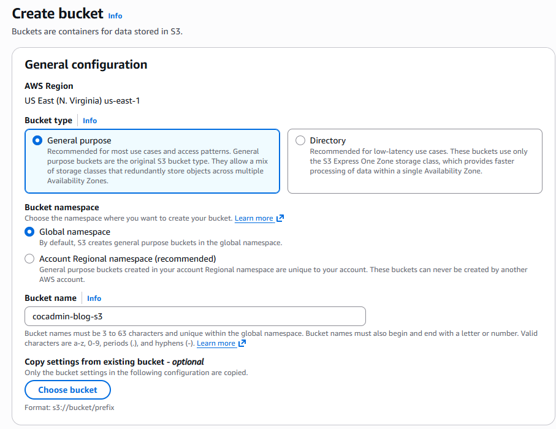

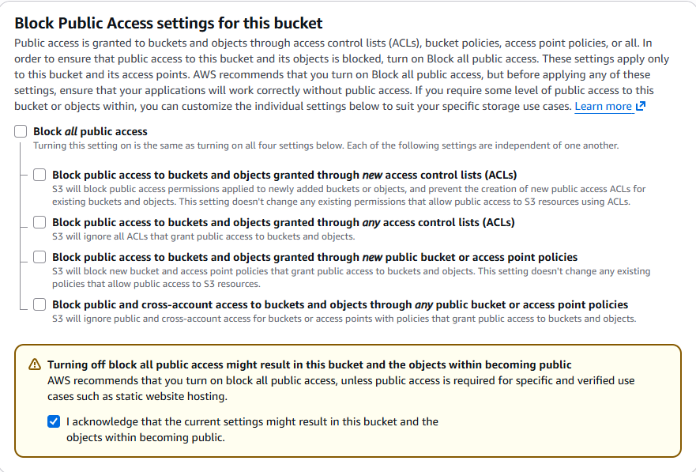

> Note : les données stockées dans S3 sont chiffrées au repos par défaut.

Le bucket est désormais créé :

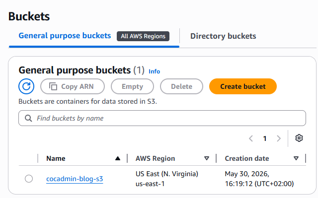

L'ensemble des fichiers du site (cocadmin) y est ensuite uploadé :

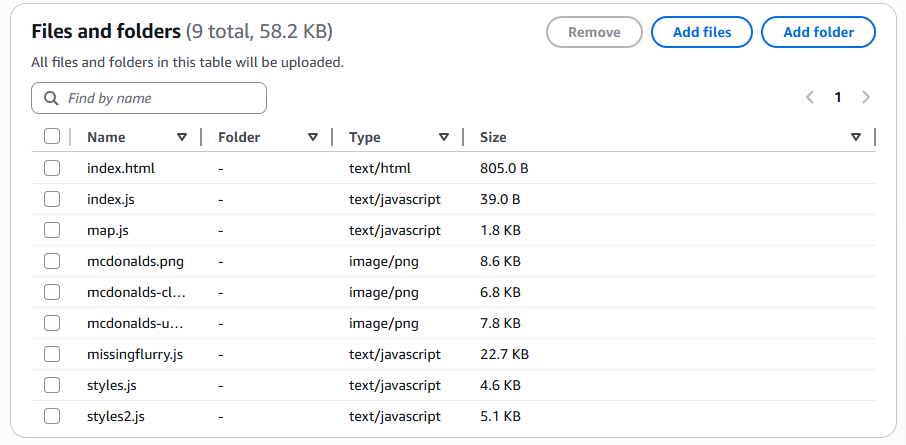

L'autorisation de lecture publique est activée sur les objets uploadés :

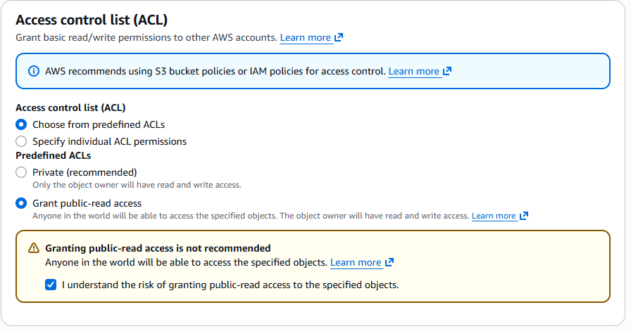

Une clé de chiffrement personnalisée est mise en place :

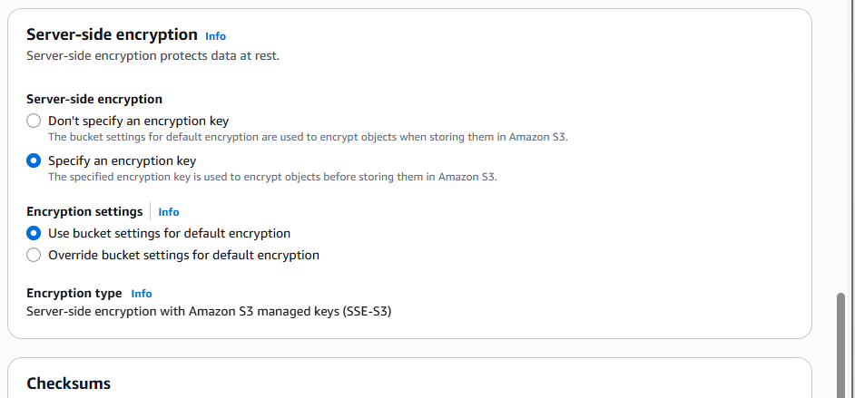

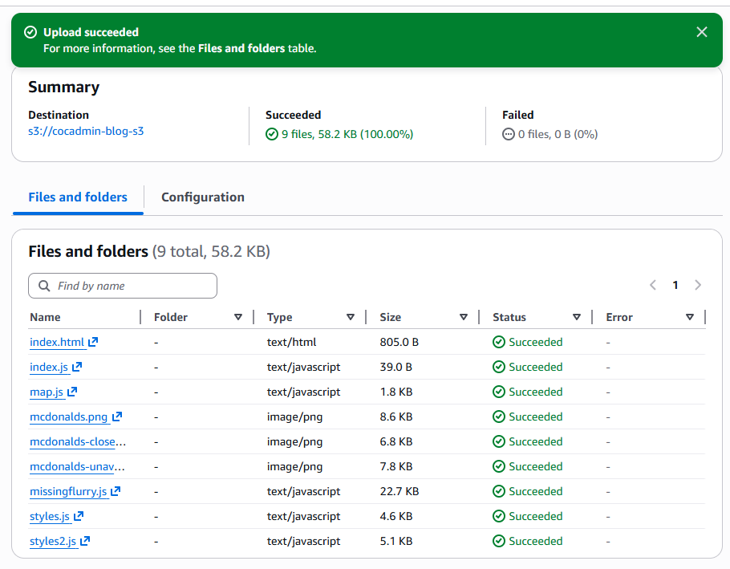

Vérification : tout le monde dispose désormais d'un droit de lecture sur cet objet :

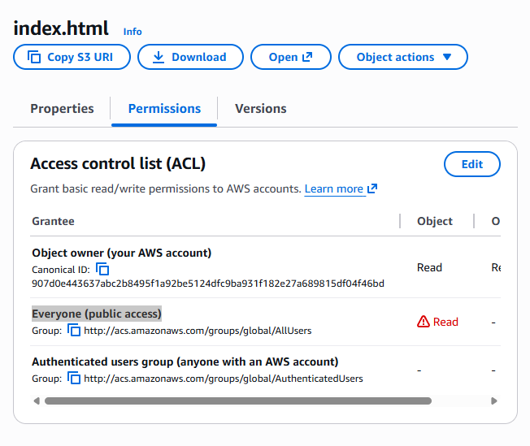

En accédant au lien public (`https://cocadmin-blog-s3.s3.us-east-1.amazonaws.com/index.html`), la page s'affiche correctement pour n'importe quel visiteur :

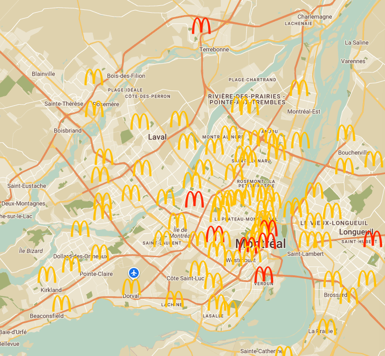

> À ce stade, la requête HTTP se comporte plus comme un appel d'API que comme une requête vers un serveur web classique, avec les autorisations appliquées par défaut. Par exemple, l'endpoint `https://cocadmin-blog-s3.s3.us-east-1.amazonaws.com/posts` n'est volontairement pas accessible :

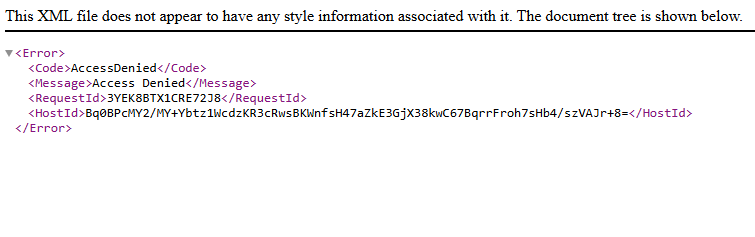

> Le message renvoyé est "Access denied", alors qu'en réalité l'objet n'existe simplement pas à cet endroit. Ce comportement peut prêter à confusion.

Le bucket est ensuite transformé en site web statique :

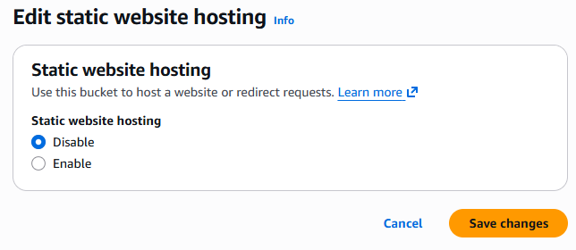

Une nouvelle URL est alors générée : `http://cocadmin-blog-s3.s3-website-us-east-1.amazonaws.com/` et le site et la ressource est désormais accessible ;)

#### 2. Mise en place de CloudFront (via la console)

Le mode "site web" de S3 ne permet pas de choisir librement son propre nom de domaine ; CloudFront est donc utilisé pour résoudre ce problème. N'importe quel domaine peut y être associé, par exemple `cocadmin-blog-mcflurry` :

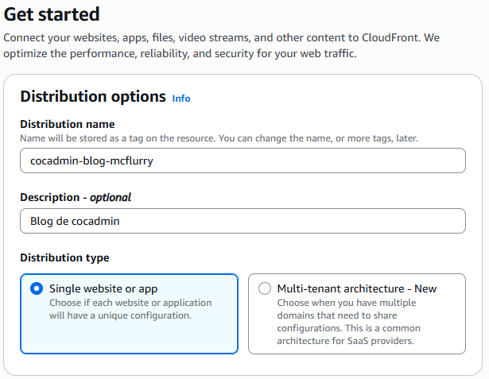

Récapitulatif global de la configuration avant déploiement :

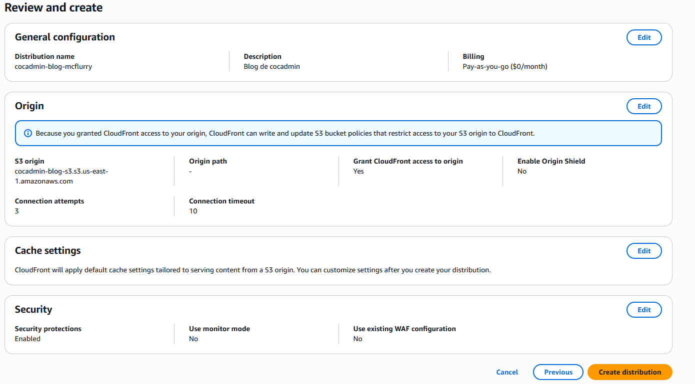

Le déploiement démarre. Il prend un certain temps car la configuration doit être propagée à travers l'ensemble des points de présence CloudFront dans le monde, à peu près 150 serveurs répartis ! :

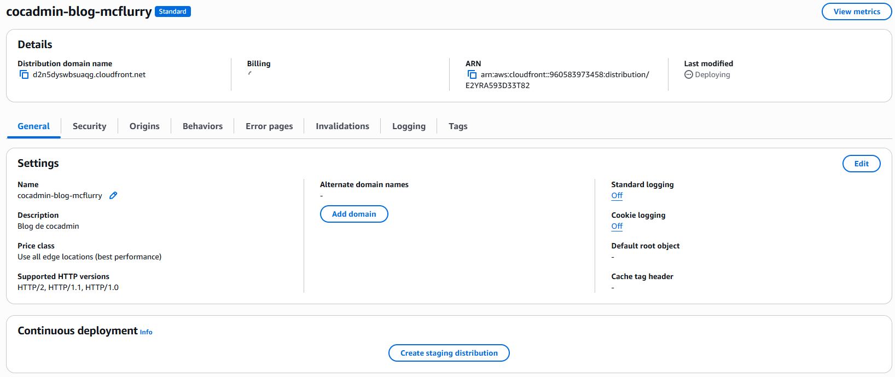

> Une erreur a été rencontrée lorsque le nom d'origine (origin) n'était pas défini de façon statique ; le choix par défaut a donc été conservé.

On configure ensuite le nom alternatif du CDN (CNAME) avec le certificat associé :

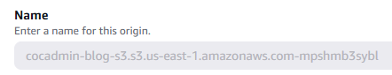

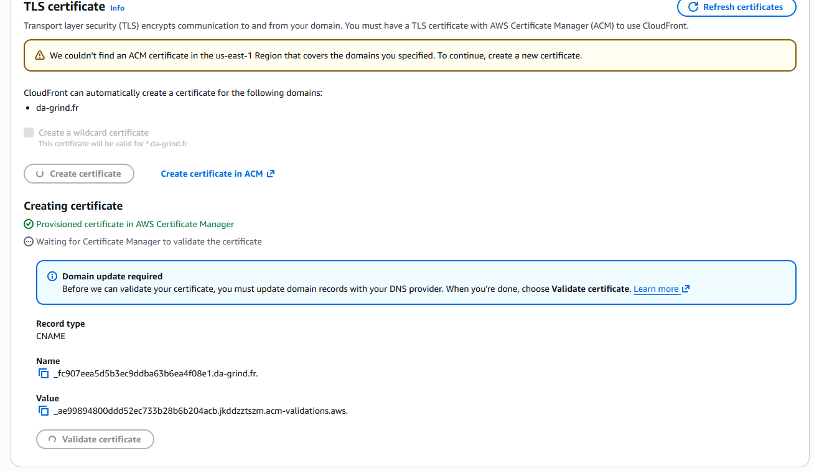

On renseigne ensuite `index.html` comme **default root object** :

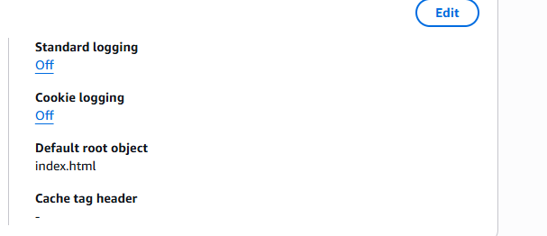

Un nom de domaine de distribution est désormais disponible et accessible : `https://d2n5dyswbsuaqg.cloudfront.net`

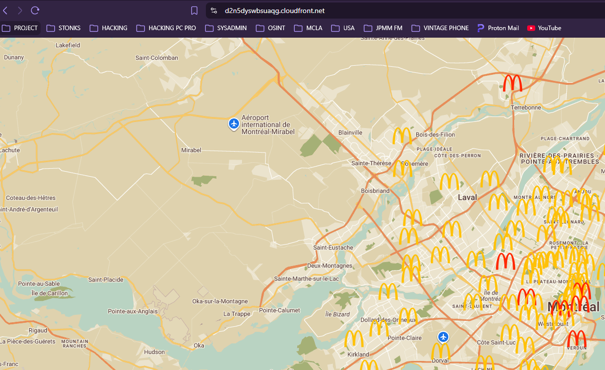

#### 3. Reproduction en ligne de commande

La même chose peut être faite via CLI de la façon suivante. On se connecte d'abord un profil et des identifiants dédiés :

```bash
jpmm@kos-boss:~/Documents/aws-formation$ aws login --profile myProfile
Attempting to open your default browser. If the browser does not open, open the following URL.
If you are unable to open the URL on this device, run this command again with the '--remote' option.

https://us-east-1.signin.aws.amazon.com/v1/authorize?[...]
```

La validation se fait ensuite côté navigateur, avec authentification multi-facteurs (MFA) :

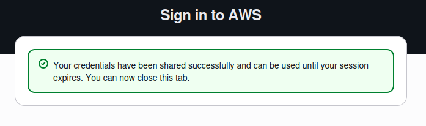

On récupère ensuite le code source du site :

```bash
git clone https://gitlab.com/ttwthomas/mcflurry
Clonage dans 'mcflurry'...
warning: redirection vers https://gitlab.com/ttwthomas/mcflurry.git/
remote: Enumerating objects: 156, done.
remote: Total 156 (delta 0), reused 0 (delta 0), pack-reused 156 (from 1)
Réception d'objets: 100% (156/156), 51.24 Kio | 17.08 Mio/s, fait.
Résolution des deltas: 100% (81/81), fait.
```

Puis on créé le bucket S3 dédié à :

```bash
jpmm@kos-boss:~/Documents/aws-formation/mcflurry/static$ aws s3 website s3://mcflurry-kostan

$ aws s3 ls --profile myProfile
2026-06-02 20:10:03 mcflurry-kostan
```

Le bucket est ensuite passé en mode "site web", avec spécification de la région et du fichier d'index :

```bash
$ aws s3 website s3://mcflurry-kostan --index-document index.html --region eu-west-3
```

Puis on désactive les ACL nécessaires avant de pouvoir uploader des fichiers publiquement lisibles :

> Note : Cela serait en revanche dangereux avec des données sensibles (fichiers privés, données utilisateurs), mais ne pose pas de problème ici puisqu'il s'agit uniquement de HTML/CSS/images destinés à être publics.

```bash
jpmm@kos-boss:~/Documents/aws-formation/mcflurry/static$ aws s3api put-bucket-ownership-controls \
  --bucket mcflurry-kostan \
  --ownership-controls Rules=[{ObjectOwnership=BucketOwnerPreferred}] \
  --profile myProfile \
  --region eu-west-3

jpmm@kos-boss:~/Documents/aws-formation/mcflurry/static$ aws s3api put-public-access-block \
  --bucket mcflurry-kostan \
  --public-access-block-configuration "BlockPublicAcls=false,IgnorePublicAcls=false,BlockPublicPolicy=false,RestrictPublicBuckets=false" \
  --profile myProfile \
  --region eu-west-3
```

Et on upload :

```bash
jpmm@kos-boss:~/Documents/aws-formation/mcflurry/static$ aws s3 sync --acl public-read . s3://mcflurry-kostan/ --region eu-west-3
upload: ./index.html to s3://mcflurry-kostan/index.html          
upload: ./styles.js to s3://mcflurry-kostan/styles.js            
upload: ./mcdonalds-closed.png to s3://mcflurry-kostan/mcdonalds-closed.png
upload: ./index.js to s3://mcflurry-kostan/index.js              
upload: ./styles2.js to s3://mcflurry-kostan/styles2.js          
upload: ./map.js to s3://mcflurry-kostan/map.js                  
upload: ./mcdonalds-unavail.png to s3://mcflurry-kostan/mcdonalds-unavail.png
upload: ./mcdonalds.png to s3://mcflurry-kostan/mcdonalds.png     
upload: ./missingflurry.js to s3://mcflurry-kostan/missingflurry.js
```

Puis on vérifie les buckets existants pour récupérer l'URI et la région du bucket :

> La première tentative échoue faute d'avoir précisé le profil (`--profile myProfile`), ce qui empêche la CLI de résoudre correctement l'endpoint régional.

```bash
$ aws s3api list-buckets --profile myProfile
{
    "Buckets": [
        {
            "Name": "mcflurry-kostan",
            "CreationDate": "2026-06-03T15:59:00+00:00",
            "BucketArn": "arn:aws:s3:::mcflurry-kostan"
        }
    ],
    "Owner": {
        "ID": "907d0e443637abc2b8495f1a92be5124dfc9ba931f182e27a689815df04f46bd"
    }
}

jpmm@kos-boss:~/Documents/aws-formation/mcflurry/static$ aws s3api get-bucket-location --bucket mcflurry-kostan
aws: [ERROR]: Could not connect to the endpoint URL: "https://s3.eu-west3.amazonaws.com/mcflurry-kostan?location"

jpmm@kos-boss:~/Documents/aws-formation/mcflurry/static$ aws s3api get-bucket-location --bucket mcflurry-kostan --profile myProfile
{
    "LocationConstraint": "eu-west-3"
}
```

**Format standard d'une URL de site web S3** :

```html
http://<BUCKET_NAME>.s3-website.<REGION>.amazonaws.com
```

Ce qui donne, dans ce cas précis :

```html
http://mcflurry-kostan.s3-website.eu-west-3.amazonaws.com
```

Le site répond correctement à cette adresse :

```bash
ping mcflurry-kostan.s3-website.eu-west-3.amazonaws.com
PING s3-website.eu-west-3.amazonaws.com (3.5.204.88) 56(84) bytes of data.
64 bytes from 3.5.204.88: icmp_seq=1 ttl=255 time=31.7 ms
64 bytes from 3.5.204.88: icmp_seq=2 ttl=255 time=32.7 ms
```

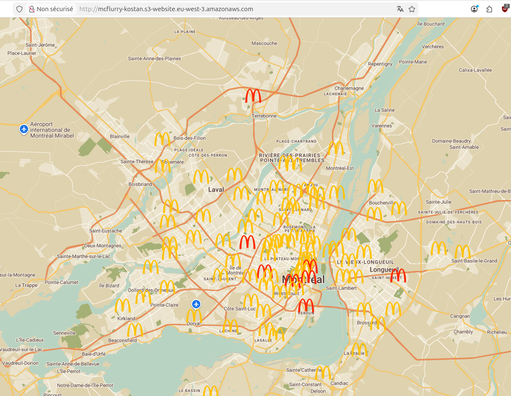

> Il est également possible d'accéder au site via l'URL "brute" du bucket (sans le mode website), à condition de préciser explicitement `index.html` dans l'URL : `http://mcflurry-kostan.s3.amazonaws.com/index.html`. Ce point pourrait être amélioré, mais n'a pas été creusé davantage ici.

On peut passer à la création de la distribution CloudFront :

```bash
aws cloudfront create-distribution \
    --origin-domain-name mcflurry-kostan.s3-website.eu-west-3.amazonaws.com \
    --default-root-object index.html
{
    "Location": "https://cloudfront.amazonaws.com/2020-05-31/distribution/EKNOL67BI2LBP",
    "ETag": "E23ZP02F085DFQ",
    "Distribution": {
        "Id": "EKNOL67BI2LBP",
        "ARN": "arn:aws:cloudfront::960583973458:distribution/EKNOL67BI2LBP",
        "Status": "InProgress",
        "DomainName": "d28afch530uznb.cloudfront.net",
        "ActiveTrustedSigners": {
            "Enabled": false,
            "Quantity": 0
        }
    }
}
```

Le nouveau domaine CloudFront (`d28afch530uznb.cloudfront.net`) donne désormais accès au site, avec certificat HTTPS délivré par AWS ;) :

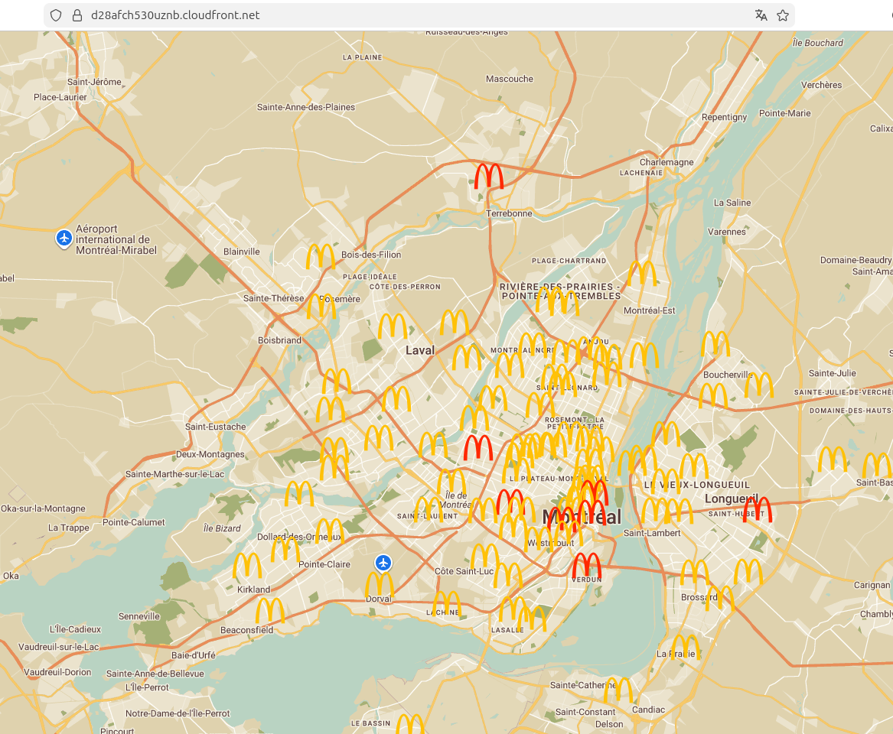

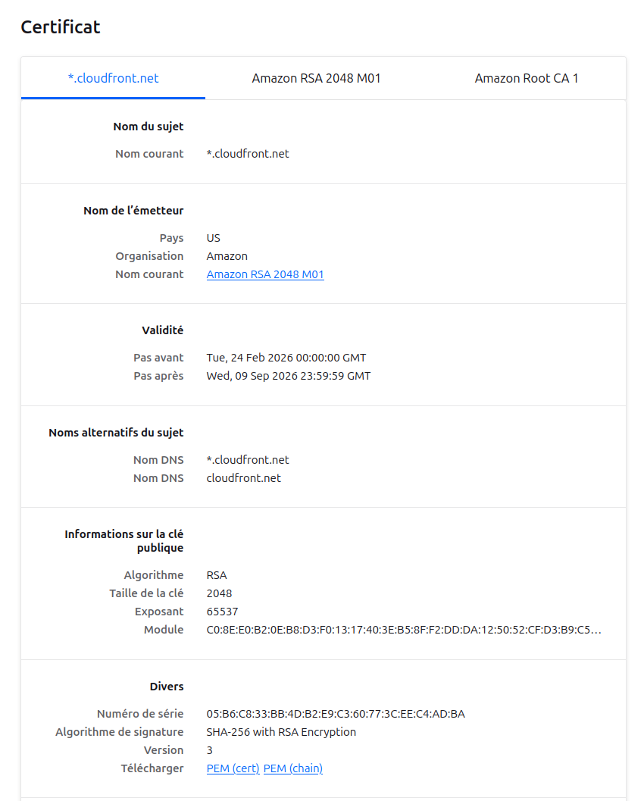

> La propagation DNS à travers le monde prend un peu de temps, le temps que la configuration se diffuse sur l'ensemble des serveurs AWS. Un outil comme [whatsmydns.net](https://www.whatsmydns.net/) permet de suivre cette propagation depuis différents points du globe.

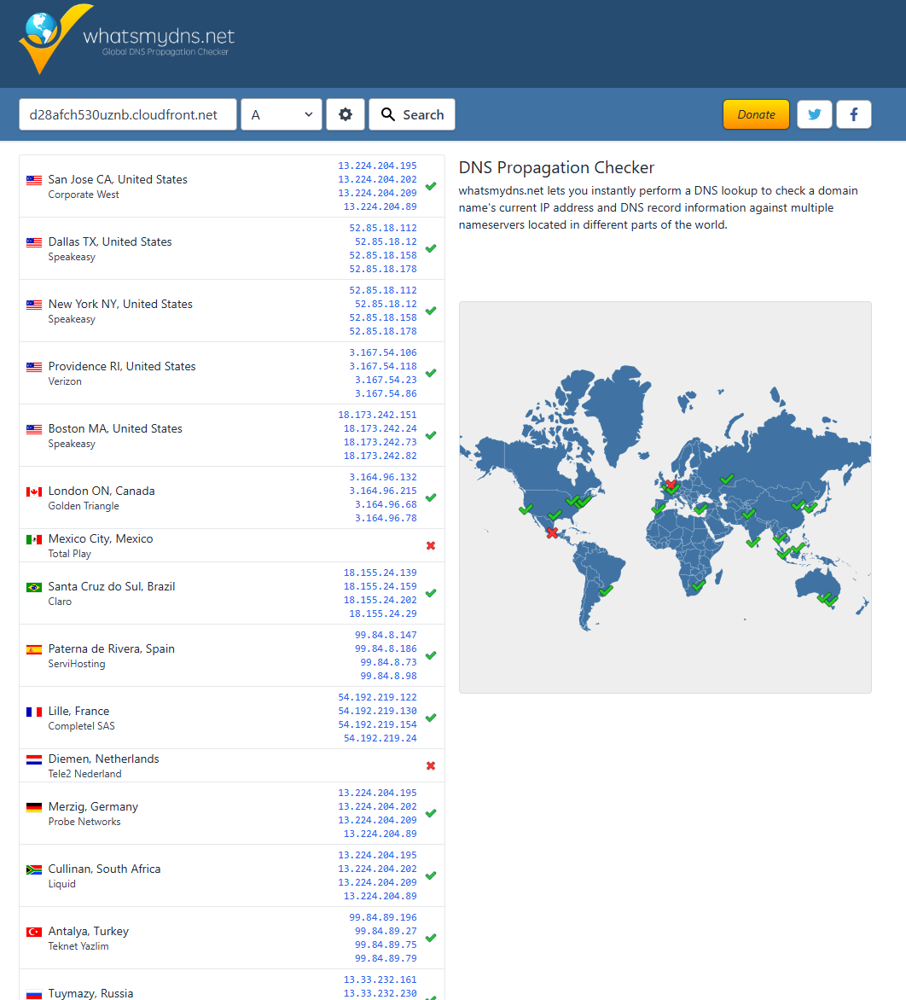

#### 4. Test de l'invalidation de cache CloudFront

Pour vérifier que CloudFront fonctionne correctement, une modification est apportée au fichier `map.js` du site : l'import de `styles.js` en première ligne est remplacé par `styles2.js`, ce qui a pour effet d'activer un mode sombre sur le site.

```js
$ head map.js 
import { styles } from './styles.js';
---> import { styles } from './styles2.js';
import { restaurants } from './missingflurry.js'

export class Map {
  constructor() {
    const montreal = { lat: 45.54, lng: -73.7 };
    this.map = new google.maps.Map(document.getElementById('map'), {
      center: montreal,
      disableDefaultUI: true,
      zoom: 11,
```

Une fois ce fichier ré-uploadé sur le bucket, le changement est visible sur l'URL directe du bucket S3, mais **pas** sur l'adresse CloudFront. C'est un comportement attendu : CloudFront conserve en cache l'ancienne version du site, ce qui est précisément son rôle. Une **invalidation** est donc nécessaire pour forcer la prise en compte du changement.

Le fichier modifié est d'abord copié vers le bucket :

```bash
aws s3 cp --acl public-read map.js s3://mcflurry-kostan --profile myProfile
upload: ./map.js to s3://mcflurry-kostan/map.js           
```

Le mode sombre est bien actif sur l'URL directe du bucket S3 :

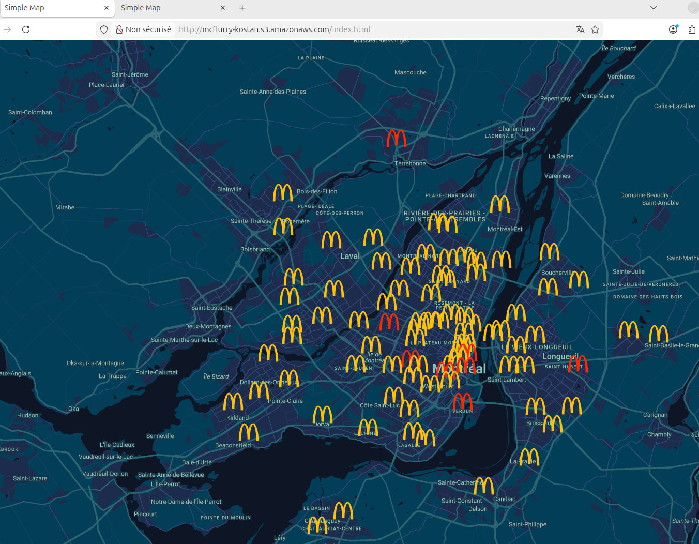

Mais pas encore sur l'adresse CloudFront :

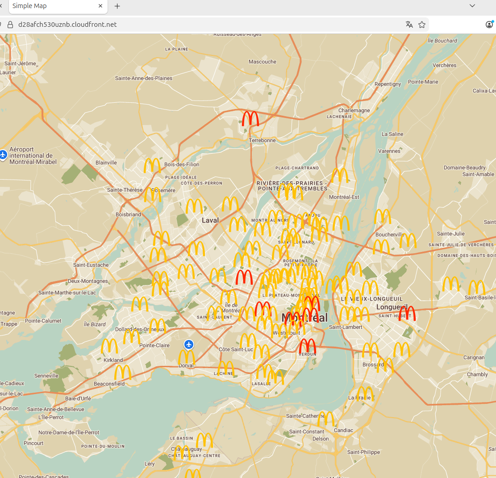

Une invalidation est alors créée, en ciblant l'ID de la distribution CloudFront concernée :

```bash
aws cloudfront create-invalidation --distribution-id EKNOL67BI2LBP --path "/maps.js" --profile myProfile
{
    "Location": "https://cloudfront.amazonaws.com/2020-05-31/distribution/EKNOL67BI2LBP/invalidation/IDOAWU9DGA3Q7KK2QTZ69DOA3O",
    "Invalidation": {
        "Id": "IDOAWU9DGA3Q7KK2QTZ69DOA3O",
        "Status": "InProgress",
        "InvalidationBatch": {
            "Paths": {
                "Quantity": 1,
                "Items": ["/maps.js"]
            },
            "CallerReference": "cli-1780510001-830617"
        }
    }
}
```

L'invalidation passe par un statut "**InProgress**" avant d'être appliquée. Après un court instant d'attente, le mode sombre est bien visible sur la page d'accueil servie par CloudFront, confirmant que l'invalidation a fonctionné :

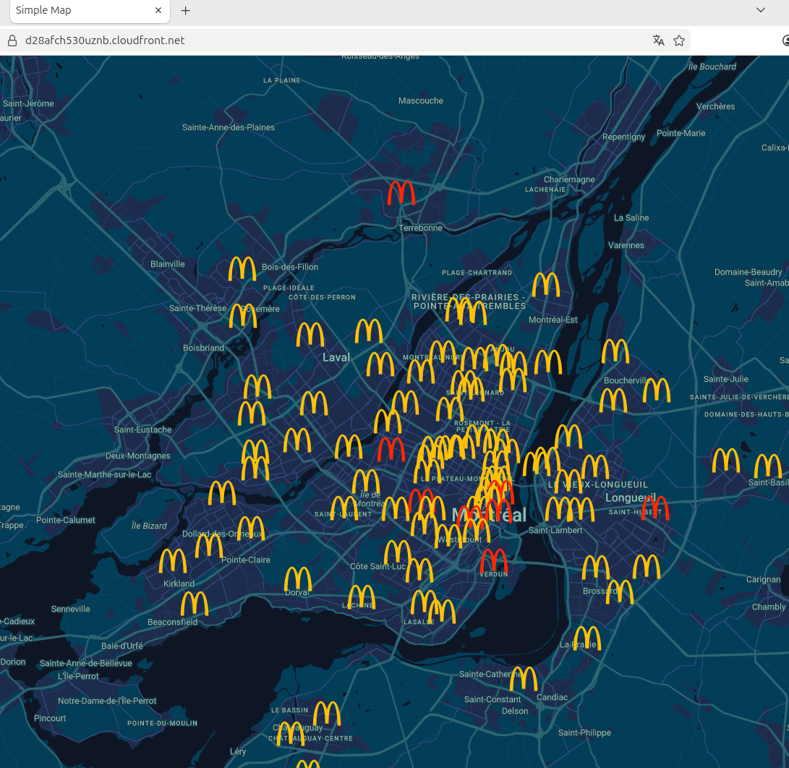
