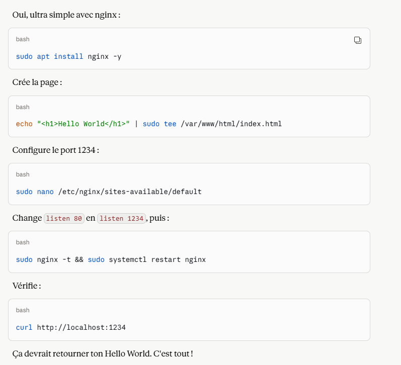
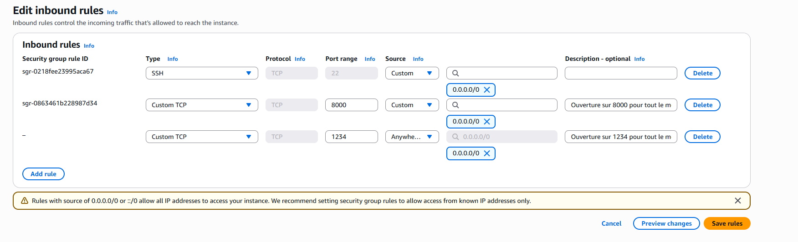
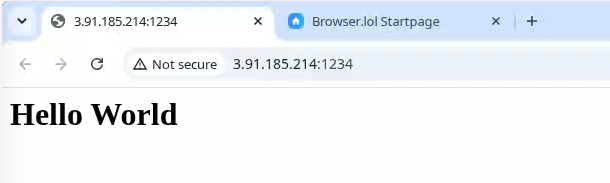
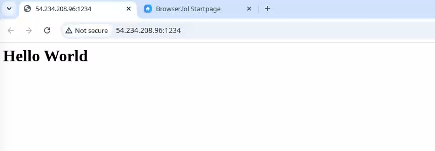

# Création d'une AMI custom avec userdata via l'AWS CLI

## Résumé rapide

Exercice pratique consistant à créer une instance EC2, y déployer une petite application web sur un port personnalisé, en faire une image AMI custom, puis relancer une instance à partir de cette AMI — le tout entièrement en ligne de commande avec l'AWS CLI. Passage ensuite à une approche plus générique via un script `userdata`, qui permet d'appliquer la même configuration à n'importe quelle AMI de base, sans avoir à créer une image custom à chaque fois.

### AMI custom vs userdata : deux approches complémentaires

- Une **AMI custom** embarque directement tout ce qui est nécessaire : le code de l'application, le service déjà configuré pour démarrer automatiquement, et le port applicatif déjà accessible. Elle est rapide à démarrer, mais doit être régénérée à chaque changement de configuration.
- Un script **userdata** permet, à l'inverse, d'appliquer la même configuration à une AMI générique (par exemple une image Ubuntu standard) au moment du démarrage de l'instance, ce qui la rend plus flexible et plus facile à maintenir, au prix d'un temps de démarrage un peu plus long.

---

### 1. Lister et supprimer les instances existantes

Avant de créer une nouvelle instance, les instances existantes sont listées :

```bash
aws ec2 describe-instances --profile myProfile | head -n 100
```

Un extrait de la sortie permet de retrouver, entre autres, l'ID d'instance, le type d'instance, le security group associé, ainsi que les tags :

```bash
$ aws ec2 describe-instances --profile myProfile | grep "Instance"
            "Instances": [
                        "InstanceMetadataTags": "disabled"
                    "UsageOperation": "RunInstances",
                    "CurrentInstanceBootMode": "uefi",
                    "InstanceId": "i-0b77656d60b46bab1",
                    "InstanceType": "t3.micro",
```

L'instance précédemment créée (id `i-0b77656d60b46bab1`) est ensuite terminée :

```bash
$ aws ec2 terminate-instances --profile myProfile --instance-ids i-0b77656d60b46bab1
{
    "TerminatingInstances": [
        {
            "InstanceId": "i-0b77656d60b46bab1",
            "CurrentState": {"Code": 32, "Name": "shutting-down"},
            "PreviousState": {"Code": 16, "Name": "running"}
        }
    ]
}
```

### 2. Création d'une nouvelle instance EC2 en CLI

Une nouvelle instance, nommée `mcflurry-kostan`, doit être créée à partir de la même AMI Ubuntu que précédemment (`ami-091138d0f0d41ff90`), dans le security group déjà configuré `sg-0cfd8e43809678d1b`. Le détail de ce security group peut être consulté avec :

```bash
$ aws --profile myProfile ec2 describe-security-groups
```

Extrait pertinent, montrant que le port 8000 est déjà ouvert à tous :

```bash
"VpcId": "vpc-02a9f67924e244fe1",
"SecurityGroupArn": "arn:aws:ec2:us-east-1:960583973458:security-group/sg-0cfd8e43809678d1b",
"GroupName": "launch-wizard-1",
"IpPermissions": [
    {
        "IpProtocol": "tcp",
        "FromPort": 8000,
        "ToPort": 8000,
        "IpRanges": [
            {
                "Description": "Ouverture sur 8000 pour tout le monde",
                "CidrIp": "0.0.0.0/0"
            }
        ]
    }
]
```

> **Point important** : un security group doit obligatoirement se trouver dans le **même VPC** que le subnet visé.

Les subnets disponibles dans le VPC concerné sont donc listés au préalable :

```bash
$ aws --profile myProfile ec2 describe-subnets \
  --filters 'Name=vpc-id,Values=vpc-02a9f67924e244fe1' \
  --query 'Subnets[*].[SubnetId,CidrBlock,AvailabilityZone,MapPublicIpOnLaunch]' \
  --output table
----------------------------------------------------------------------
|                           DescribeSubnets                          |
+---------------------------+------------------+-------------+-------+
|  subnet-098df6a2925d1fca8 |  172.31.16.0/20  |  us-east-1c |  True |
|  subnet-0008bd79a2ecf7a68 |  172.31.80.0/20  |  us-east-1b |  True |
|  subnet-0b1bbada0f21af10e |  172.31.64.0/20  |  us-east-1f |  True |
|  subnet-0f0b9308ad4d9d377 |  172.31.32.0/20  |  us-east-1d |  True |
|  subnet-09d09309039b4b997 |  172.31.48.0/20  |  us-east-1e |  True |
|  subnet-05388da4c4c8a241a |  172.31.0.0/20   |  us-east-1a |  True |
+---------------------------+------------------+-------------+-------+
```

Le premier subnet de la liste est retenu, ce qui donne la commande de création d'instance suivante (avec la clé SSH `mcflurry-kostan` préalablement créée depuis la console, et son fichier `.pem` importé sur la VM Ubuntu locale) :

```bash
aws --profile myProfile ec2 run-instances \
  --image-id "ami-091138d0f0d41ff90" \
  --instance-type t3.micro \
  --key-name mcflurry-kostan \
  --subnet-id subnet-098df6a2925d1fca8 \
  --security-group-ids sg-0cfd8e43809678d1b \
  --count 1
```

Après validation, l'instance apparaît bien dans la liste, à l'état "running" :

```bash
$ aws --profile myProfile ec2 describe-instances \
  --query 'Reservations[*].Instances[*].[InstanceId,PrivateIpAddress,PublicIpAddress,State.Name,InstanceType,Placement.AvailabilityZone,Tags[?Key=="Name"].Value[0]]' \
  --output text

i-0185cd42945adedf2     None    None    terminated      t3.micro        us-east-1c      None
i-0c43b9365ca050097     172.31.21.197   54.164.35.204   running t3.micro        us-east-1c      None
i-0ba4e0207fc7921c6     None    None    terminated      t3.micro        us-east-1c      None
```

→ instance retenue : `i-0c43b9365ca050097`

### 3. Connexion et déploiement de l'application

Connexion SSH à la nouvelle instance, puis clonage du dépôt :

```bash
$ ssh -i mcflurry-kostan.pem ubuntu@54.164.35.204
Welcome to Ubuntu 26.04 LTS (GNU/Linux 7.0.0-1004-aws x86_64)

ubuntu@ip-172-31-21-197:~$ git clone https://github.com/ttwthomas/mcflurry
Cloning into 'mcflurry'...
remote: Enumerating objects: 131, done.
remote: Counting objects: 100% (131/131), done.
remote: Compressing objects: 100% (116/116), done.
```

### 4. Blocage Cloudflare et contournement par une page statique

L'application rencontre une erreur 403 lors de ses appels API. Après investigation, la cause n'est pas un problème de token d'authentification, mais un blocage **Cloudflare** : le site source (SkipTheDishes) applique une protection anti-bot qui rejette les requêtes ne provenant pas d'un navigateur réel. Le token utilisé par l'application est probablement toujours valide, mais la requête est bloquée par Cloudflare avant même d'atteindre l'API.

Face à ce blocage, une simple page "hello world" en HTML est exposée sur le port 1234 via Nginx, en remplacement de l'application complète :



Une règle de pare-feu correspondante est configurée sur AWS :



> Une commande de création d'instance à partir d'une AMI a été notée à ce stade, mais son `--subnet-id` est resté vide dans les notes d'origine ; elle n'a donc pas été reprise comme étape à part entière ici (voir "Points à vérifier").

L'instance est finalement lancée avec Nginx configuré pour servir la page sur le port 1234, testée d'abord en local puis via l'IP publique :

```bash
ubuntu@ip-172-31-29-20:~/mcflurry$ curl http://localhost:1234
<h1>Hello World</h1> 
ubuntu@ip-172-31-29-20:~/mcflurry$ curl http://3.91.185.214:1234
<h1>Hello World</h1>
```

> Le réseau universitaire utilisé (eduroam) pour les tests bloquait le port exposé. Le site [browser.lol](https://browser.lol/), un navigateur dans un navigateur, permet dans ce cas de tester l'accès depuis un réseau extérieur, ce qui est très pratique pour ce genre de vérification.



### 5. Création d'une AMI à partir de l'instance configurée

L'ID de l'instance à transformer en image est d'abord récupéré :

```bash
aws --profile myProfile ec2 describe-instances \
  --query 'Reservations[*].Instances[*].[InstanceId,PrivateIpAddress,PublicIpAddress,State.Name,InstanceType,Placement.AvailabilityZone,Tags[?Key=="Name"].Value[0]]' \
  --output text

i-05baafd242242ec4b     172.31.29.20    3.91.185.214    running t3.micro        us-east-1c    None
```

L'image est ensuite créée à partir de cette instance :

```bash
aws --profile myProfile ec2 create-image \
  --instance-id i-05baafd242242ec4b \
  --name "AMI-McFlurry-2026-06-11" \
  --description "AMI McFlurry"
```

→ AMI obtenue : `ami-0727c7aa82635c7c6`

La progression de la création de l'image peut être suivie en consultant le snapshot EBS sous-jacent :

```bash
# 1. Récupérer les snapshots liés à l'AMI
aws --profile myProfile ec2 describe-images \
  --image-ids ami-0727c7aa82635c7c6 \
  --query 'Images[0].BlockDeviceMappings[*].Ebs.SnapshotId'
[
    "snap-039038f544198a2ef"
]

# 2. Vérifier l'état du snapshot
aws --profile myProfile ec2 describe-snapshots \
  --snapshot-ids snap-039038f544198a2ef \
  --query 'Snapshots[0].{State:State, Progress:Progress}'
{
    "State": "completed",
    "Progress": "100%"
}
```

### 6. Relance d'une instance à partir de l'AMI custom

L'instance ayant servi à créer l'image est d'abord terminée :

```bash
aws --profile myProfile ec2 terminate-instances --instance-ids i-05baafd242242ec4b
```

Une nouvelle instance est ensuite créée directement à partir de l'AMI custom, avec la clé SSH pour s'y connecter si besoin :

```bash
aws --profile myProfile ec2 run-instances \
  --image-id ami-0727c7aa82635c7c6 \
  --instance-type t3.micro \
  --count 1 \
  --key-name mcflurry-kostan \
  --security-group-ids sg-0cfd8e43809678d1b \
  --tag-specifications 'ResourceType=instance,Tags=[{Key=Name,Value=mcflurry-instance}]'
```

L'adresse IP de la nouvelle instance est récupérée :

```bash
i-0f662bc75b1c1e4b9     None    None    terminated      t3.micro        us-east-1c
i-01fec26f5dc98e17d     172.31.30.79    54.234.208.96   running t3.micro        us-east-1c
```

Le site est bien accessible directement, sans aucune configuration manuelle supplémentaire, puisque tout est déjà embarqué dans l'AMI custom :



### 7. Généralisation avec un script userdata

L'AMI custom fonctionne bien, mais elle doit être régénérée à chaque changement. L'objectif est donc de déplacer toute la configuration dans un script `userdata`, applicable à n'importe quelle AMI générique :

```bash
#!/bin/bash

# Mise à jour des paquets
apt update -y

# Installation de nginx
apt install nginx -y

# Changement du port 80 en 1234
sed -i 's/listen 80/listen 1234/g' /etc/nginx/sites-available/default
sed -i 's/listen \[::\]:80/listen [::]:1234/g' /etc/nginx/sites-available/default

# Création de la page HTML
echo "<h1>Hello World!</h1>" | tee /var/www/html/index.html

# Test de la config et redémarrage nginx
nginx -t && systemctl restart nginx

# Vérification que le site répond
curl http://localhost:1234 > /home/ubuntu/site-state.html
```

Une nouvelle instance est lancée en passant ce script via l'option `--user-data` :

```bash
aws --profile myProfile ec2 run-instances \
  --image-id ami-0727c7aa82635c7c6 \
  --instance-type t3.micro \
  --count 1 \
  --key-name mcflurry-kostan \
  --user-data file:///home/jpmm/Documents/aws-formation/ec2/userdata.sh \
  --security-group-ids sg-0cfd8e43809678d1b \
  --tag-specifications 'ResourceType=instance,Tags=[{Key=Name,Value=mcflurry-instance}]'
```

### 8. via le CLI (création du security group inclus)

Création d'un security group dédié depuis zéro :

```bash
aws ec2 create-security-group --group-name mcflurry --description "mcflurry"
```

Ouverture des ports 22 (SSH) et 1234 (application) :

```bash
aws ec2 authorize-security-group-ingress --group-id sg-090e568fe9800aed2 \
  --protocol tcp --port 1234 --cidr 0.0.0.0/0
aws ec2 authorize-security-group-ingress --group-id sg-090e568fe9800aed2 \
  --protocol tcp --port 22 --cidr 0.0.0.0/0
```

> Il n'est pas possible de pinger la machine par défaut, car le protocole ICMP n'est pas ouvert automatiquement, même lorsque d'autres ports le sont. Il faut ajouter explicitement une règle ICMP personnalisée pour autoriser le ping.

### Logs utiles en cas de debug

En cas de problème avec un script userdata, les logs se trouvent dans :

```bash
/var/log/cloud-init.log
```

