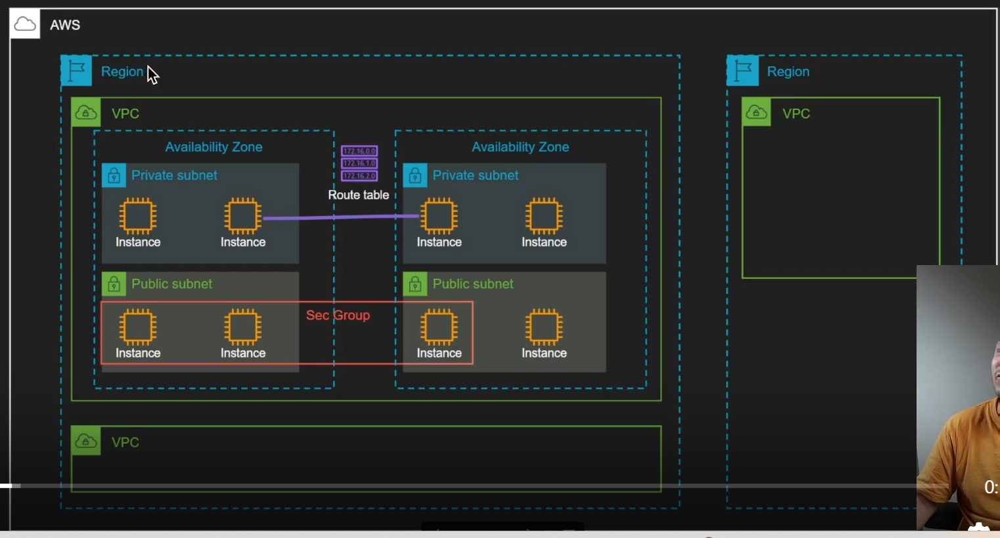
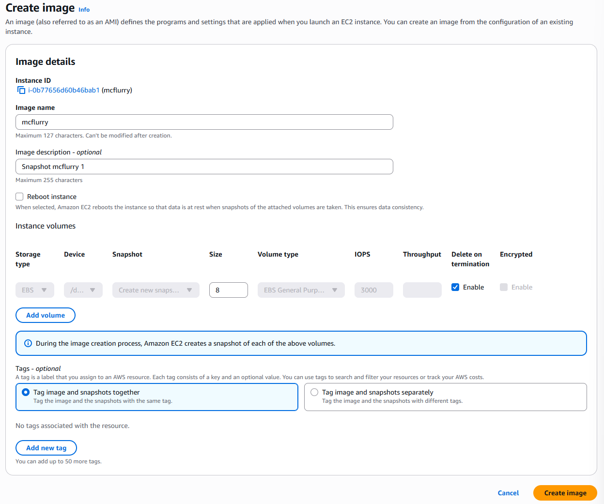
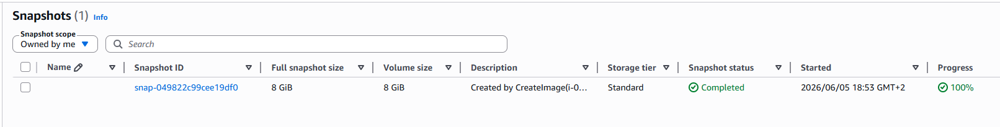

# 3 - EC2 & VPC

#### VPC (Virtual Private Cloud)

Un VPC est un réseau **privé virtuel** : **privé** car isolé, **virtuel** car il coexiste avec ceux de tous les autres clients AWS. Un VPC est découpé en **subnets**, eux-mêmes rattachés à des **zones de disponibilité** (Availability Zones, abrégé "**AZ**"), qui correspondent à un ou plusieurs data centers d'une région donnée (ex. `eu-west-3a`, `eu-west-3b`, `eu-west-3c`).

Une **région** regroupe **AZ**, réparties sur différents data centers. Deux VPC sont totalement isolés les uns des autres : un VPC de développement n'affecte en rien un VPC de production. On distingue deux types de subnets :&#x20;

\- les **subnet public** : doivent être accessible depuis Internet, comme un serveur web

\- les **subnet privé** : ne doivent pas être accessible depuis Internet, par exemple une base de données.

Il est possible de configurer le firewall pour qu'une application accède à des ressources situées dans un subnet privé, sans exposer ce subnet directement sur Internet.



#### EC2 (Elastic Compute Cloud)

**EC2** est utile pour tout ce qui n'existe pas déjà "**as a service**" chez AWS, comme une application, un conteneur, un serveur applicatif Python, etc. D'autres services AWS dédiés sont généralement préférables à EC2, à l'inverse, pour des besoins déjà couverts par un service managé (comme une base de données).

EC2 repose sur le principe du "**stateless**" : Si une machine pose problème, on la supprime et on la recrée plutôt que de la réparer. Cette philosophie permet une infrastructure entièrement automatisée, reproductible, et permet un déploiement plus rapide.

#### Images (AMI : Amazon Machine Image)

Une **AMI** est un snapshot d'une machine. Certaines sont parfois officielles (par ex. Ubuntu) avec sa maintenance assurée par l'éditeur, prêtes à être lancées immédiatement.

Il est également possible d'utiliser des images personnalisées ou d'en créer une à partir de rien. Cela permet par exemple de migrer une machine existante vers le cloud. Sur le Marketplace AWS, le coût de certaines AMI se partage entre l'éditeur et l'utilisateur final.

#### Instances

Une instance correspond à une machine virtuelle EC2. Le prix peut différer selon les caractéristiques. Par exemple, deux instances peuvent avoir le même nombre de cœurs avec de la RAM différente, le tout pour le même prix. Le choix doit donc être adapté aux besoins réels de l'application (conso de RAM, CPU, etc.).

Il existe également des instances dites **"burstables"**, dont les performances sont limitées en temps normal mais peuvent être dépassées temporairement.

Exemple : le CPU peut être poussé à 100 % pendant une limite du temps. Si l'instance utilise moins de sa capacité nominale pendant un temps, elle accumule des crédits lui permettant ensuite de dépasser ses limites plus tard.

> Un site très utile pour comparer l'ensemble des types d'instances disponibles en fonction des besoins à couvrir : [instances.vantage.sh](https://instances.vantage.sh/)

#### Volumes EBS (Elastic Block Store)

Certaines instances ont stockage local persistant, d'autres non. Pour pallier à cela et prolonger le cycle de vie de l'instance, AWS propose **EBS (Elastic Block Store)**, qui permet de déplacer des volumes de stockage d'une instance à l'autre.

Les volumes EBS se basent sur du SSD, facturé au besoin des capacités de stockage, d'autres pour les IOPS. Un volume EBS est détachable et rattachable à une autre instance.

> Attention : le volume est facturé dans son intégralité, même si l'espace alloué n'est pas entièrement utilisé.

#### Security group (SG)

Un **security group** est comme un pare-feu partagé par un groupe d'instances. Il agit au niveau réseau, et non au niveau de l'instance elle-même. La conf applicable dessus est évidemment changeables, et son usage est gratuit (avec des limites imposés).

Il est cross-AZ pour couvrir plusieurs zones tout en restant limité à un seul VPC (intra-VPC) : des instances dans d'autres AZ peuvent appartenir au même security group.

Les règles d'un **SG** peuvent s'autoriser soit via une plage d'adresses IP (CIDR), soit via un autre **SG**, ce qui est conseillé.

Exemple : le SG d'une base de données peut n'autoriser le port 3306 qu'aux machines appartenant au SG des serveurs web, ce qui est plus fiable comme approche qu'une liste d'adresses IP fixes.

#### Elastic IP

Une Elastic IP permet d'avoir IP publique pour une machine, afin d'éviter qu'elle change à chaque reboot. Ce service devient payant si l'IP n'est pas utilisée, il vise en effet à décourager la réservation inutile d'adresses dans le pool IPv4 mondiale. Aujourd'hui, quasiment toutes les IPv4 sur AWS sont désormais payantes.

#### Userdata

Il s'agit d'un script bash exécuté automatiquement au démarrage de la machine, ce qui est très utile pour automatiser une config initiale. À cause de la limite de taille sur le texte, ce script est souvent encodé en Base64, et s'exécute avec les droits roots.

#### Key pair

Il s'agit ici des pairs de clés SSH. On peut importer sa clé publique, qui sera ensuite injectée dans la machine au démarrage, avec le user par défaut cette dernière.

#### Snapshot EBS

Un snapshot visa figer l'état d'un volume EBS à un instant T. Les volumes EBS sont rattachés aux instances EC2. Les snapshots sont sauvegardés en tant qu'**AMI** qui sont des images, à partir desquelles de nouvelles instances peuvent être démarrées.

#### ENI (Elastic Network Interface)

Une **ENI** est une interface réseau qui peut être attachée/détachée d'une instance. Une instance peut avoir plusieurs interfaces réseau, pour augmenter la bande passante, sans limite du nombre d'interfaces.

Cela offre une forme de "**failover**" : une adresse IP est rattachée à une carte réseau donnée, en cas de problème sur cette carte, il est possible de basculer vers une autre. Cela implique par contre un downtime pendant la bascule.

#### Les instances spot

* Les **instances spot** correspondent à la capacité de calcul qu'AWS n'utilise pas à un instant donné et qu'il propose donc à prix réduit. Revers de la médaille, AWS peut reprendre ces instances à tout moment dès qu'il en a besoin !
* Exemple : sur un besoin de 10 serveurs web, il est possible de n'utiliser que 5 instances spot pour réduire les coûts. Lorsqu'AWS reprend une instance spot, il ne facture pas la dernière heure d'utilisation. Le taux de reprise constaté est de l'ordre de 5 % en fin de mois, ce qui reste relativement rare sur un grand nombre d'instances.

### Procédure : mise en pratique et exercice

#### 1. Lancement d'une instance EC2

Une instance est lancée sur une AMI Ubuntu :


Le type d'instance sélectionné est `t2.micro`, afin d'utiliser pleinement les ressources CPU disponibles sur cette offre.

On créé une key pair pour la connexion SSH :


L'instance est ensuite créée, et son adresse IP publique devient visible :


Elle est bien présente dans le subnet attendu :


#### 2. Connexion SSH à l'instance

La connexion se fait avec la clé `.pem` générée précédemment, sur l'utilisateur par défaut `ubuntu` (qui peut changer selon l'AMI utilisée) :

```bash
ssh ubuntu@52.207.223.54 -i cocadmin2.pem 
The authenticity of host '52.207.223.54 (52.207.223.54)' can't be established.
ED25519 key fingerprint is SHA256:HN/vOGjYe9c+zmuz/b7WOusO6NPn0Bu9eCtAgYw3WXQ.
This key is not known by any other names.
Are you sure you want to continue connecting (yes/no/[fingerprint])? yes
Warning: Permanently added '52.207.223.54' (ED25519) to the list of known hosts.
Welcome to Ubuntu 26.04 LTS (GNU/Linux 7.0.0-1004-aws x86_64)

 System information as of Fri Jun  5 16:06:19 UTC 2026

  System load:  0.0               Temperature:           -273.1 C
  Usage of /:   30.4% of 6.61GB   Processes:             116
  Memory usage: 25%               Users logged in:       0
  Swap usage:   0%                IPv4 address for ens5: 172.31.34.9

ubuntu@ip-172-31-34-9:~$ 
```

#### 3. Ouverture d'un port applicatif dans le security group

Pour rendre l'application accessible sur le port 8000, il faut d'abord identifier le SG associé à l'instance :


Le security group concerné est ici `launch-wizard-1` :


Les règles de firewall sont ensuite éditées pour autoriser ce port.

> Bien qu'il soit préférable d'autoriser l'accès sur des SG plutôt qu'à une plage d'IPs, dans le cadre de cet exercice, l'approche la plus simple demeure l'ouverture via CIDR pour l'ensemble des adresses :


#### 4. Déploiement de l'application sur l'instance

Le dépôt de l'application (projet "**mcflurry**") est cloné sur la VM :

```bash
ubuntu@ip-172-31-34-9:~$ git clone https://github.com/ttwthomas/mcflurry
Cloning into 'mcflurry'...
remote: Enumerating objects: 131, done.
remote: Counting objects: 100% (131/131), done.
remote: Compressing objects: 100% (116/116), done.
remote: Total 131 (delta 69), reused 36 (delta 14), pack-reused 0 (from 0)
Receiving objects: 100% (131/131), 5.13 MiB | 44.91 MiB/s, done.
Resolving deltas: 100% (69/69), done.
```

Contenu du projet une fois cloné :

```bash
ubuntu@ip-172-31-34-9:~/mcflurry$ ll
total 96
-rw-rw-r-- 1 ubuntu ubuntu    84 Jun  5 16:27 .env
-rw-rw-r-- 1 ubuntu ubuntu   945 Jun  5 16:27 index.html
-rw-rw-r-- 1 ubuntu ubuntu    39 Jun  5 16:27 index.js
drwxrwxr-x 2 ubuntu ubuntu  4096 Jun  5 16:27 lambda/
-rw-rw-r-- 1 ubuntu ubuntu 10473 Jun  5 16:27 main.py
-rw-rw-r-- 1 ubuntu ubuntu  1791 Jun  5 16:27 map.js
-rw-rw-r-- 1 ubuntu ubuntu  6948 Jun  5 16:27 mcdonalds-closed.png
-rw-rw-r-- 1 ubuntu ubuntu  8031 Jun  5 16:27 mcdonalds-unavail.png
-rw-rw-r-- 1 ubuntu ubuntu  8811 Jun  5 16:27 mcdonalds.png
-rw-rw-r-- 1 ubuntu ubuntu  1446 Jun  5 16:27 postgres.py
-rw-rw-r-- 1 ubuntu ubuntu   714 Jun  5 16:27 readme.md
-rw-rw-r-- 1 ubuntu ubuntu   147 Jun  5 16:27 requirements.txt
-rw-rw-r-- 1 ubuntu ubuntu  1439 Jun  5 16:27 server.py
-rw-rw-r-- 1 ubuntu ubuntu  5173 Jun  5 16:27 styles.js
```

> L'adresse IP locale de la machine (`ip-172-31-34-9`) lui permet de communiquer avec les autres instances du VPC et d'être identifiée par elles.

Le lancement de l'application échoue avec une erreur `KeyError: 'data'` :

```bash
ubuntu@ip-172-31-34-9:~/mcflurry$ PORT=8000 python3 main.py 
Traceback (most recent call last):
  File "/home/ubuntu/mcflurry/main.py", line 109, in <module>
    restaurants = load_restaurants()
  File "/home/ubuntu/mcflurry/main.py", line 82, in load_restaurants
    restaurants = get_restaurants()
  File "/home/ubuntu/mcflurry/main.py", line 49, in get_restaurants
    for restaurant in req.json()["data"]["restaurantsList"]["openRestaurants"] :
                      ~~~~~~~~~~^^^^^^^^
KeyError: 'data'
```

Cette erreur provient d'une clé d'API codé en dur dans le code, datant de 2023 (date de la formation) et n'étant plus valide aujourd'hui.

À défaut de résoudre ce point et pouvoir avancer sans être bloqué, j'ai choisi une soluce plus simple où j'expose une simple page via Nginx ou Apache, pour faire office de POC, pour voir si l'IP publique et le port exposé répondent.

#### 5. Création d'un snapshot et d'une AMI

Un snapshot est créé, puis une image AMI, pour illustrer le mécanisme de sauvegarde :


On créé ensuite l'image ici :



Avec le snapshot apparaît ensuite dans la liste correspondante :



Il devient alors possible de démarrer de nouvelles instances directement à partir de ce snapshot. Une AMI créée à partir d'une machine déjà configurée permet de skip toute la phase de configuration nécessaire au boot d'une nouvelle instance.

> Note d'Infrastructure as Code (IaC) : Ansible peut être utilisé pour créer directement une image, et l'outil Packer permet, combiné à Ansible, d'automatiser entièrement la création d'une instance AWS, d'une AMI, d'une image et d'un snapshot.
