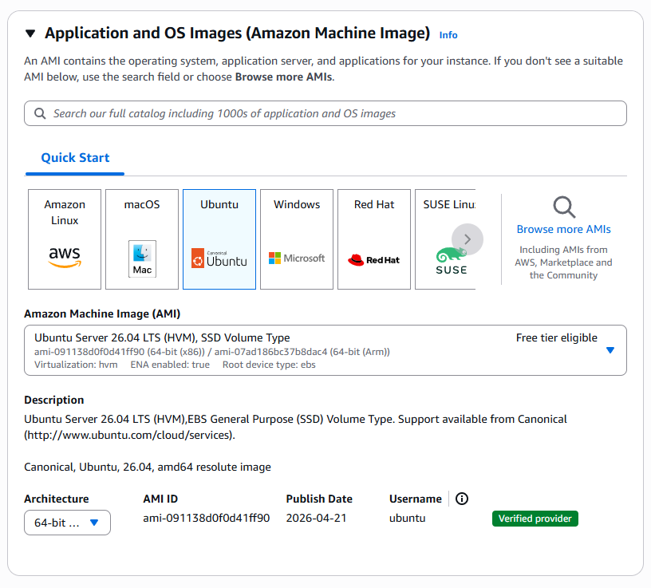
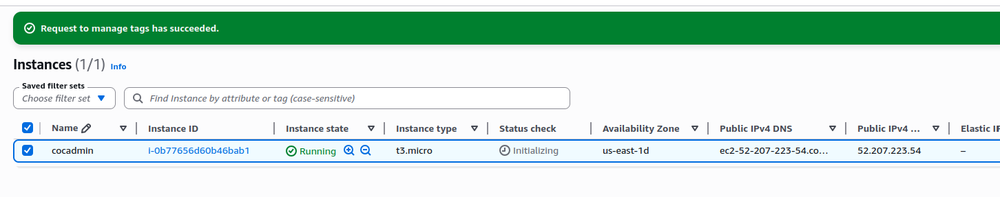
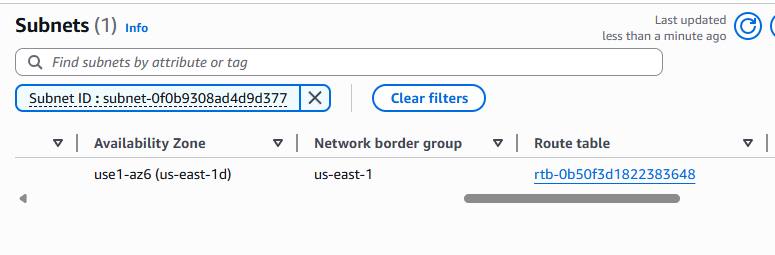
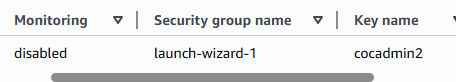
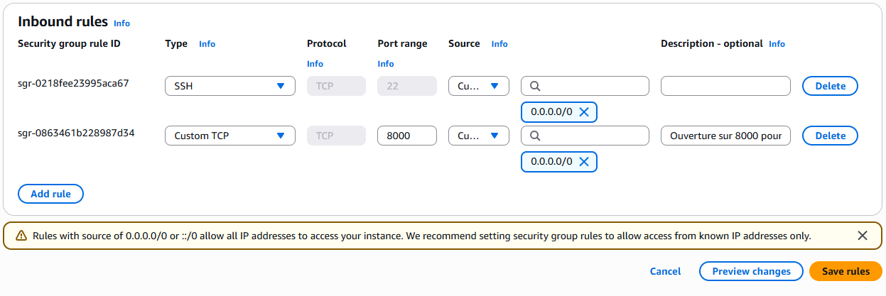
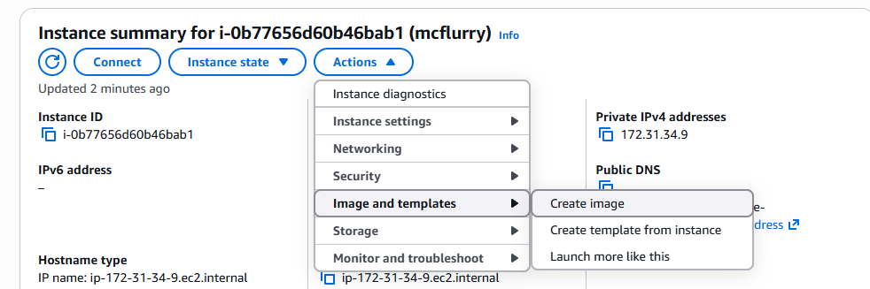

### VPC (Virtual Private Cloud)

Un VPC est un réseau privé virtuel : privé car isolé, virtuel car il coexiste avec ceux de tous les autres clients AWS sur la même infrastructure physique. Un VPC est découpé en **subnets**, eux-mêmes rattachés à des **zones de disponibilité** (Availability Zones), qui correspondent chacune à un ou plusieurs data centers d'une région donnée (ex. `eu-west-3a`, `eu-west-3b`, `eu-west-3c`).

Une **région** regroupe plusieurs zones de disponibilité, réparties sur différents data centers. Deux VPC sont totalement isolés l'un de l'autre : un VPC de développement n'affecte en rien un VPC de production.  On distingue deux types de subnets :
    - **subnet public** : nécessaire pour tout ce qui doit être accessible depuis Internet, par exemple un serveur web ;
    - **subnet privé** : non accessible directement depuis Internet, par exemple une base de données.

Il est possible de configurer le firewall pour qu'une application accède à des ressources situées dans un subnet privé, sans exposer ce subnet directement sur Internet.


### EC2 (Elastic Compute Cloud)

EC2 est utile pour tout ce qui n'existe pas déjà "**as a service**" chez AWS : une application, un conteneur, un serveur applicatif (par exemple en Python), etc. À l'inverse, pour des besoins déjà couverts par un service managé (comme une base de données), d'autres services AWS dédiés sont généralement préférables à EC2.

EC2 repose sur le principe du "**stateless**" : Si une machine pose problème, on la supprime et on la recrée plutôt que de la réparer. Cette philosophie, bien que déroutante au premier abord, permet une infrastructure entièrement automatisée et un déploiement beaucoup plus rapide.
### Images (AMI : Amazon Machine Image)

Une AMI est un snapshot d'une machine, comparable à une image Docker : parfois officielles (par exemple Ubuntu) dont la maintenance est assurée par l'éditeur, prêtes à être lancées immédiatement.

Il est également possible d'utiliser des images personnalisées ou d'en créer une à partir de rien. Cela permet par exemple de migrer une machine existante vers le cloud, bit à bit. Sur le Marketplace AWS, le coût de certaines images est partagé entre l'éditeur de l'image et l'utilisateur final.
### Instances

Une instance correspond à une machine virtuelle EC2. Sa taille détermine ses caractéristiques (nombre de cœurs CPU, quantité de RAM, espace disque, etc.). Deux instances peuvent avoir un nombre de cœurs identique pour un prix identique tout en ayant des quantités de RAM très différentes : le choix du type d'instance doit donc être adapté aux besoins réels de l'application (consommation de RAM, de CPU, etc.).

Il existe également des **instances "burstables"** , dont les performances sont limitées en temps normal mais peuvent être dépassées temporairement.

Exemple : le CPU peut être poussé à 100 % pendant une portion limitée du temps. Si l'instance consomme moins que sa capacité nominale pendant un certain temps, elle accumule des crédits qui lui permettent ensuite de dépasser ses limites habituelles plus tard.

> Un site très utile pour comparer l'ensemble des types d'instances disponibles en fonction des besoins à couvrir : [instances.vantage.sh](https://instances.vantage.sh/)

### Volumes EBS (Elastic Block Store)

Certaines instances disposent d'un stockage local persistant, d'autres non. Pour découpler le stockage du cycle de vie de l'instance, AWS propose EBS (Elastic Block Store), qui permet de déplacer des volumes de stockage d'une instance à une autre.

Les volumes EBS reposent sur du SSD, facturé selon les besoins : certaines offres sont optimisées pour la capacité de stockage, d'autres pour les IOPS. Un volume EBS est détachable et peut être rattaché à une autre instance.

> Attention : le volume est facturé dans son intégralité, même si l'espace alloué n'est pas entièrement utilisé.

### Security group

Un security group agit comme un pare-feu partagé par un groupe d'instances qui appliquent les mêmes règles de trafic entrant et sortant. Il n'est pas défini au niveau de l'instance elle-même, mais au niveau du réseau. Sa configuration est entièrement personnalisable selon les besoins, et son usage est gratuit (certaines limites sont toutefois imposés).

Il (cross-AZ) pour couvrir plusieurs zones tout en restant limité à un seul VPC (intra-VPC) : des instances situées dans des zones de disponibilité différentes peuvent donc appartenir au même security group.

Les règles d'un security group peuvent autoriser le trafic soit via une plage d'adresses IP (CIDR), soit via un autre security group. Il est généralement recommandé de préférer l'autorisation par security group plutôt que par adresse IP. 

**Exemple : **, le security group d'une base de données peut n'autoriser le port 3306 qu'aux machines appartenant au security group des serveurs web, ce qui est plus robuste et plus maintenable qu'une liste d'adresses IP fixes.

### Elastic IP

Une Elastic IP permet de fixer une adresse IP publique pour une machine, afin d'éviter qu'elle ne change à chaque redémarrage. Ce service devient payant si l'adresse IP n'est pas activement utilisée, ce qui vise à décourager la réservation inutile d'adresses IPv4. De façon plus générale, toutes les adresses IPv4 sur AWS sont désormais payantes.

### Userdata

Il s'agit d'un script bash exécuté automatiquement au démarrage de la machine, ce qui est très utile pour automatiser sa configuration initiale. Ce script est souvent encodé en base64, en raison de limites de taille sur le texte transmis, et s'exécute avec les droits roots.

### Key pair

Une key pair correspond à une paire de clés SSH. Sur AWS, il est possible d'importer sa propre clé publique, qui sera automatiquement injectée dans la machine au démarrage, sur l'utilisateur par défaut de l'image utilisée. Ce mécanisme fonctionne également pour les machines Windows.

### Snapshot EBS

Un snapshot peut être créé à tout moment pour figer l'état d'un volume EBS à un instant T. Les volumes EBS sont rattachés aux instances EC2.

- Un **snapshot** est une copie de l'état d'un volume à un moment donné.
- Une **AMI** peut être vue comme un snapshot sauvegardé sous forme d'image de machine complète, à partir de laquelle une nouvelle instance peut être démarrée.

### ENI (Elastic Network Interface)

Une ENI est une interface réseau qui peut être attachée ou détachée d'une instance. Une même instance peut disposer de plusieurs interfaces réseau, ce qui permet notamment d'augmenter la bande passante disponible, sans limite particulière côté nombre d'interfaces.

Ce mécanisme permet également une forme de "**failover**" basique : une adresse IP est rattachée à une carte réseau donnée, et en cas de problème sur cette carte, il est possible de basculer vers une autre. Cela implique par contre un downtime pendant la bascule.

### Les instances spot

- Les **instances spot** correspondent à la capacité de calcul qu'AWS n'utilise pas à un instant donné et qu'il propose donc à prix réduit. En contrepartie, AWS peut reprendre ces instances à tout moment dès qu'il en a besoin. 

- Exemple : sur un besoin de 10 serveurs web, il est possible de n'utiliser que 5 instances spot pour réduire les coûts ; lorsqu'AWS reprend une instance spot, il ne facture pas la dernière heure d'utilisation. Le taux de reprise constaté est de l'ordre de 5 % en fin de mois, ce qui reste relativement rare sur un grand nombre d'instances.

---

## Procédure : mise en pratique et exercice

### 1. Lancement d'une instance EC2

Une instance est lancée en cohérence avec la stack technique visée. Ici, une AMI Ubuntu est choisie :



Le type d'instance sélectionné est `t2.micro`, afin d'utiliser pleinement les ressources CPU disponibles sur cette offre.

Création d'une key pair pour la connexion SSH :


L'instance est ensuite créée, et son adresse IP publique devient visible :



Elle est bien présente dans le subnet attendu :



### 2. Connexion SSH à l'instance

La connexion se fait avec la clé `.pem` générée précédemment, sur l'utilisateur par défaut `ubuntu` (cet utilisateur peut varier selon l'AMI utilisée) :

```bash
ssh ubuntu@52.207.223.54 -i cocadmin2.pem 
The authenticity of host '52.207.223.54 (52.207.223.54)' can't be established.
ED25519 key fingerprint is SHA256:HN/vOGjYe9c+zmuz/b7WOusO6NPn0Bu9eCtAgYw3WXQ.
This key is not known by any other names.
Are you sure you want to continue connecting (yes/no/[fingerprint])? yes
Warning: Permanently added '52.207.223.54' (ED25519) to the list of known hosts.
Welcome to Ubuntu 26.04 LTS (GNU/Linux 7.0.0-1004-aws x86_64)

 System information as of Fri Jun  5 16:06:19 UTC 2026

  System load:  0.0               Temperature:           -273.1 C
  Usage of /:   30.4% of 6.61GB   Processes:             116
  Memory usage: 25%               Users logged in:       0
  Swap usage:   0%                IPv4 address for ens5: 172.31.34.9

ubuntu@ip-172-31-34-9:~$ 
```

### 3. Ouverture d'un port applicatif dans le security group

Pour rendre l'application accessible sur le port 8000, il faut d'abord identifier le security group associé à l'instance :



Le security group concerné est ici `launch-wizard-1` :


Les règles de firewall entrantes/sortantes sont ensuite éditées pour autoriser ce port.

> Il est préférable, en bonne pratique, d'autoriser l'accès à d'autres security groups plutôt qu'à une plage d'adresses CIDR ouverte à tous. Dans le cadre de cet exercice, l'approche la plus simple et la plus globale a été retenue, à savoir l'ouverture via CIDR pour l'ensemble des adresses :



### 4. Déploiement de l'application sur l'instance

Le dépôt de l'application (projet "mcflurry") est cloné sur la VM :

```bash
ubuntu@ip-172-31-34-9:~$ git clone https://github.com/ttwthomas/mcflurry
Cloning into 'mcflurry'...
remote: Enumerating objects: 131, done.
remote: Counting objects: 100% (131/131), done.
remote: Compressing objects: 100% (116/116), done.
remote: Total 131 (delta 69), reused 36 (delta 14), pack-reused 0 (from 0)
Receiving objects: 100% (131/131), 5.13 MiB | 44.91 MiB/s, done.
Resolving deltas: 100% (69/69), done.
```

Contenu du projet une fois cloné :

```bash
ubuntu@ip-172-31-34-9:~/mcflurry$ ll
total 96
-rw-rw-r-- 1 ubuntu ubuntu    84 Jun  5 16:27 .env
-rw-rw-r-- 1 ubuntu ubuntu   945 Jun  5 16:27 index.html
-rw-rw-r-- 1 ubuntu ubuntu    39 Jun  5 16:27 index.js
drwxrwxr-x 2 ubuntu ubuntu  4096 Jun  5 16:27 lambda/
-rw-rw-r-- 1 ubuntu ubuntu 10473 Jun  5 16:27 main.py
-rw-rw-r-- 1 ubuntu ubuntu  1791 Jun  5 16:27 map.js
-rw-rw-r-- 1 ubuntu ubuntu  6948 Jun  5 16:27 mcdonalds-closed.png
-rw-rw-r-- 1 ubuntu ubuntu  8031 Jun  5 16:27 mcdonalds-unavail.png
-rw-rw-r-- 1 ubuntu ubuntu  8811 Jun  5 16:27 mcdonalds.png
-rw-rw-r-- 1 ubuntu ubuntu  1446 Jun  5 16:27 postgres.py
-rw-rw-r-- 1 ubuntu ubuntu   714 Jun  5 16:27 readme.md
-rw-rw-r-- 1 ubuntu ubuntu   147 Jun  5 16:27 requirements.txt
-rw-rw-r-- 1 ubuntu ubuntu  1439 Jun  5 16:27 server.py
-rw-rw-r-- 1 ubuntu ubuntu  5173 Jun  5 16:27 styles.js
```

> L'adresse IP locale de la machine (`ip-172-31-34-9`) lui permet de communiquer avec les autres instances du VPC et d'être identifiée par elles.

Le lancement de l'application échoue avec une erreur `KeyError: 'data'` :

```bash
ubuntu@ip-172-31-34-9:~/mcflurry$ PORT=8000 python3 main.py 
Traceback (most recent call last):
  File "/home/ubuntu/mcflurry/main.py", line 109, in <module>
    restaurants = load_restaurants()
  File "/home/ubuntu/mcflurry/main.py", line 82, in load_restaurants
    restaurants = get_restaurants()
  File "/home/ubuntu/mcflurry/main.py", line 49, in get_restaurants
    for restaurant in req.json()["data"]["restaurantsList"]["openRestaurants"] :
                      ~~~~~~~~~~^^^^^^^^
KeyError: 'data'
```

> Cette erreur provient d'un token d'API codé en dur dans le code, datant vraisemblablement de 2023 (date de la formation) et n'étant plus valide aujourd'hui suite à des changements côté API externe. 
> 
> À défaut de résoudre ce point dans l'immédiat, j'ai choisie une alternative où j'expose une simple page statique via Nginx ou Apache, pour faire office de POC, afin de vérifier que l'IP publique et le port exposé répondent correctement.

### 5. Création d'un snapshot et d'une AMI

Un snapshot est créé, puis une image AMI, pour illustrer le mécanisme de sauvegarde :



Interface de création d'une image :


Le snapshot apparaît ensuite dans la liste correspondante :


Il devient alors possible de démarrer de nouvelles instances directement à partir de ce snapshot. Une AMI créée à partir d'une machine déjà configurée permet de s'affranchir de toute la phase d'installation et de configuration habituellement nécessaire au démarrage d'une nouvelle instance.

> Piste d'Infrastructure as Code (IaC) mentionnée : Ansible peut être utilisé pour créer directement une image, et l'outil Packer permet, combiné à Ansible, d'automatiser entièrement la création d'une instance AWS, d'une AMI, d'une image et d'un snapshot.