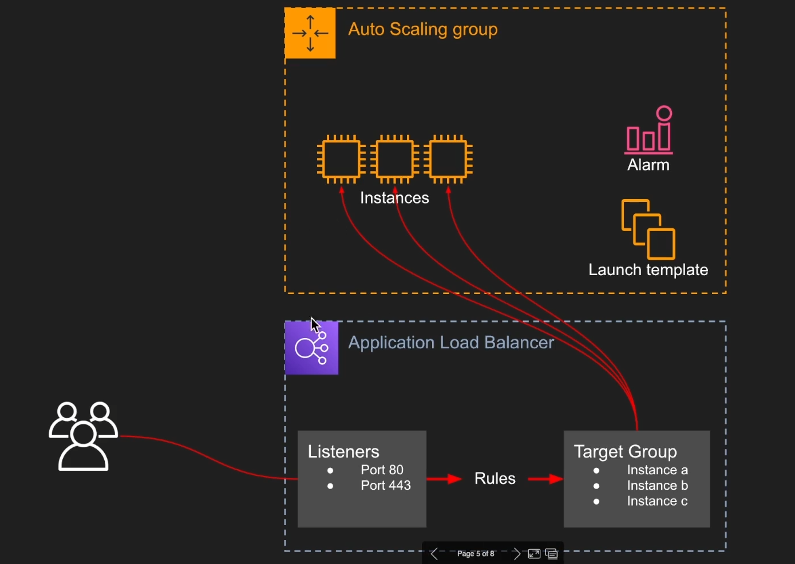
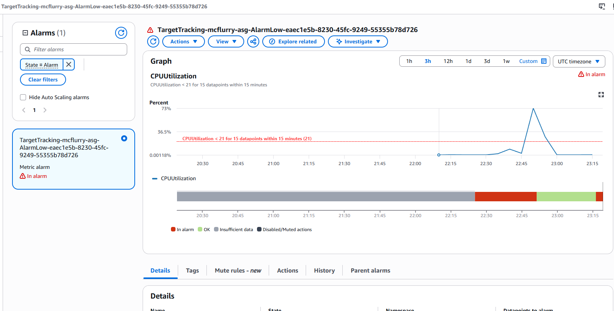

# AWS — Auto Scaling Group (ASG) & Elastic Load Balancer (ELB)

### ASG (Auto Scaling Group)

Dans une infrastructure composée d'un frontend et d'un backend, les services doivent être **stateless** pour pouvoir être répliqués sans contrainte. C'est ce qui permet de gérer un groupe de machines plutôt qu'une seule. 

Un ASG va s'occuper de créer des règles de mise à l'échelle : par exemple, ajouter une machine lorsqu'un certain seuil de CPU est dépassé, et en retirer lorsque la charge redescend (scaling / descaling automatique). Si le service ASG en lui-même est gratuit, les ressources qu'il déploie (instances, etc.) sont facturées.

L'ASG surveille en permanence l'état de santé des machines : si une instance est en erreur, elle est détruite et automatiquement remplacée par une nouvelle. Cette mécanique permet, dans une large mesure, de ne plus se soucier des pannes individuelles d'infrastructure, puisqu'une machine défaillante est simplement recréée. On garantit alors la **disponibilité** globale du service. 

Enfin, les instances peuvent être réparties sur différentes zones de disponibilité : en cas de panne d'un data center entier, de nouvelles instances peuvent démarrer dans une autre zone.

### Concepts liés à l'ASG

- **Un Launch Template** définit précisément le type d'instance à lancer (AMI, type d'instance, clé SSH, security groups, etc.). C'est ce modèle que l'ASG utilise à chaque fois qu'il doit créer une nouvelle instance.
- **Une Scaling policy** détermine sous quelles conditions des machines doivent être ajoutées ou retirées (par exemple, un seuil d'utilisation CPU ou de stockage).


*"Et une de plus... ;)"*

> Il faut rester vigilant sur le nombre de règles de scaling définies : des règles trop nombreuses ou mal pensées peuvent entrer en conflit entre elles.

### ELB (Elastic Load Balancer)

L'ELB (Elastic Load Balancer) répartit le trafic entrant entre plusieurs instances EC2, pour éviter qu'une seule machine encaisse toute la charge. Il en existe deux types :

- **ALB (Application Load Balancer)** : un niveau au-dessus du NLB, opérant au niveau applicatif (HTTP/HTTPS) plutôt qu'au simple niveau TCP. Il permet des règles de routage plus fines, par exemple rediriger une requête vers un service différent selon l'URL demandée.

- **NLB (Network Load Balancer)** : le point central qui reçoit l'ensemble des requêtes des utilisateurs. Il est dit "élastique" car il s'adapte automatiquement au volume de trafic, qu'il s'agisse d'un million ou de plusieurs millions de requêtes. Il redirige le trafic reçu sur un port donné vers l'Auto Scaling Group correspondant.
### ALB : le plus utilisé

ALB demeure le plus utilisé, on va se contenter d'utiliser ce dernier ;). En voici les caractéristiques :

- **Listener** : définit sur quel port le load balancer écoute les requêtes entrantes.
- **Target group** : définit vers quelles instances (ou groupes d'instance) rediriger les requêtes reçues.
- **Rules** : règles de routage plus fines, style rediriger vers un service différent selon le domaine d'origine de la requête.
- **Tarification** : coût fixe, de l'ordre de 16 $/mois.

Un ELB est généralement associé à une seule application. Il est possible de mutualiser un même ELB entre plusieurs environnements (par exemple dev et prod), mais cela peut poser problème en cas d'incident, puisqu'un souci sur un environnement pourrait alors affecter l'autre.

Schéma d'ensemble de l'architecture :



Cette combinaison ASG + ELB rend l'infrastructure autosuffisante, capable de s'adapter à la charge et de se réparer elle-même en cas de panne d'une instance :


---

## Procédure : exercice pratique en AWS CLI

L'exercice suivant sera réalisé directement en ligne de commande :


**Ordre des opérations à respecter**, chaque étape dépendant souvent de l'ARN (identifiant de ressource) généré par l'étape précédente :

```
1. Launch Template
2. Load Balancer      → récupérer son ARN
3. Target Group       → récupérer son ARN
4. Listener            → utilise ARN LB + ARN TG
5. ASG                  → utilise ARN TG
6. Scaling Policy      → utilise le nom de l'ASG
```

### 1. Création du Launch Template

Le launch template définit la configuration des instances qui seront lancées par l'ASG :

```bash
aws --profile myProfile ec2 create-launch-template \
  --launch-template-name mcflurry-lt \
  --version-description "v1" \
  --launch-template-data '{
    "ImageId": "ami-0727c7aa82635c7c6",
    "InstanceType": "t3.micro",
    "KeyName": "mcflurry-kostan",
    "SecurityGroupIds": ["sg-0cfd8e43809678d1b"]
  }'
```

### 2. Création du Load Balancer (ALB)

Le load balancer doit être créé avant le listener. Les subnets disponibles dans chaque zone de disponibilité sont d'abord récupérés :

```bash
$ aws --profile myProfile ec2 describe-subnets \
  --query 'Subnets[*].{ID:SubnetId, AZ:AvailabilityZone, CIDR:CidrBlock}' \
  --output table
--------------------------------------------------------------
|                       DescribeSubnets                      |
+------------+------------------+----------------------------+
|     AZ     |      CIDR        |            ID              |
+------------+------------------+----------------------------+
|  us-east-1c|  172.31.16.0/20  |  subnet-098df6a2925d1fca8  |
|  us-east-1b|  172.31.80.0/20  |  subnet-0008bd79a2ecf7a68  |
|  us-east-1f|  172.31.64.0/20  |  subnet-0b1bbada0f21af10e  |
|  us-east-1d|  172.31.32.0/20  |  subnet-0f0b9308ad4d9d377  |
|  us-east-1e|  172.31.48.0/20  |  subnet-09d09309039b4b997  |
|  us-east-1a|  172.31.0.0/20   |  subnet-05388da4c4c8a241a  |
+------------+------------------+----------------------------+
```

Le load balancer applicatif (ALB) est ensuite créé, réparti sur les subnets identifiés :

```bash
aws --profile myProfile elbv2 create-load-balancer \
  --name mcflurry-alb \
  --subnets subnet-098df6a2925d1fca8 subnet-0008bd79a2ecf7a68 subnet-0b1bbada0f21af10e subnet-0f0b9308ad4d9d377 subnet-0f0b9308ad4d9d377 subnet-09d09309039b4b997 subnet-05388da4c4c8a241a \
  --security-groups sg-0cfd8e43809678d1b \
  --scheme internet-facing \
  --type application
```

### 3. Création du Target Group

Le target group doit être créé avant le listener et avant l'ASG, puisque ces deux derniers ont besoin de son ARN :

```bash
aws --profile myProfile elbv2 create-target-group \
  --name mcflurry-tg \
  --protocol HTTP \
  --port 1234 \
  --vpc-id vpc-02a9f67924e244fe1 \
  --health-check-protocol HTTP \
  --health-check-port 1234 \
  --health-check-path /
```

L'ARN du target group est renvoyé en sortie :

```bash
"TargetGroupArn": "arn:aws:elasticloadbalancing:us-east-1:960583973458:targetgroup/mcflurry-tg/a02a4cce8d6a248f",
```

### 4. Création du Listener

Le listener relie le load balancer (via son ARN) au target group (via son ARN) sur un port donné :

```bash
aws --profile myProfile elbv2 create-listener \
  --load-balancer-arn arn:aws:elasticloadbalancing:us-east-1:960583973458:loadbalancer/app/mcflurry-alb/cf159c6b1ee5acd6 \
  --protocol HTTP \
  --port 8000 \
  --default-actions Type=forward,TargetGroupArn=arn:aws:elasticloadbalancing:us-east-1:960583973458:targetgroup/mcflurry-tg/a02a4cce8d6a248f
```

L'ARN du listener est renvoyé en sortie :

```bash
"ListenerArn": "arn:aws:elasticloadbalancing:us-east-1:960583973458:listener/app/mcflurry-alb/cf159c6b1ee5acd6/e0c2e25f6133a417",
```

### 5. Création de l'Auto Scaling Group

L'ASG est créé en référençant le launch template et l'ARN du target group :

```bash
aws --profile myProfile autoscaling create-auto-scaling-group \
  --auto-scaling-group-name mcflurry-asg \
  --launch-template LaunchTemplateName=mcflurry-lt,Version='$Latest' \
  --min-size 1 \
  --max-size 3 \
  --desired-capacity 2 \
  --vpc-zone-identifier "subnet-098df6a2925d1fca8,subnet-0008bd79a2ecf7a68,subnet-0b1bbada0f21af10e,subnet-0f0b9308ad4d9d377,subnet-09d09309039b4b997,subnet-05388da4c4c8a241a" \
  --target-group-arns arn:aws:elasticloadbalancing:us-east-1:960583973458:targetgroup/mcflurry-tg/a02a4cce8d6a248f
```

Vérification que l'ASG est bien rattaché au bon target group :

```bash
aws --profile myProfile autoscaling describe-auto-scaling-groups \
  --auto-scaling-group-name mcflurry-asg \
  --query 'AutoScalingGroups[0].TargetGroupARNs'
[
    "arn:aws:elasticloadbalancing:us-east-1:960583973458:targetgroup/mcflurry-tg/a02a4cce8d6a248f"
]
```

### 6. Création de la politique de scaling

Une politique de scaling est créée, ciblant un taux d'utilisation CPU moyen de 30 % sur l'ensemble de l'ASG :

```bash
aws --profile myProfile autoscaling put-scaling-policy \
  --auto-scaling-group-name mcflurry-asg \
  --policy-name mcflurry-cpu-policy \
  --policy-type TargetTrackingScaling \
  --target-tracking-configuration '{
    "PredefinedMetricSpecification": {
      "PredefinedMetricType": "ASGAverageCPUUtilization"
    },
    "TargetValue": 30.0
  }'
```

Cette commande crée automatiquement deux alarmes CloudWatch associées (seuil haut et seuil bas) :

```json
{
    "PolicyARN": "arn:aws:autoscaling:us-east-1:960583973458:scalingPolicy:9c231a32-a027-43b5-b84e-309658987196:autoScalingGroupName/mcflurry-asg:policyName/mcflurry-cpu-policy",
    "Alarms": [
        {
            "AlarmName": "TargetTracking-mcflurry-asg-AlarmHigh-6ed14898-cf35-4940-a797-68093e46fc5d",
            "AlarmARN": "arn:aws:cloudwatch:us-east-1:960583973458:alarm:TargetTracking-mcflurry-asg-AlarmHigh-6ed14898-cf35-4940-a797-68093e46fc5d"
        },
        {
            "AlarmName": "TargetTracking-mcflurry-asg-AlarmLow-eaec1e5b-8230-45fc-9249-55355b78d726",
            "AlarmARN": "arn:aws:cloudwatch:us-east-1:960583973458:alarm:TargetTracking-mcflurry-asg-AlarmLow-eaec1e5b-8230-45fc-9249-55355b78d726"
        }
    ]
}
```

Politique bien créée côté console :


Le load balancer est désormais actif sur le port 8000, et sert bien la page de l'application :

```bash
curl http://mcflurry-alb-8475791.us-east-1.elb.amazonaws.com:8000/
<h1>Hello World</h1>
```

### 7. Test de la montée en charge automatique

**Problème rencontré** : Nginx, qui se contente de servir une simple page HTML statique, consomme très peu de CPU. Même avec un grand nombre de requêtes, le taux d'utilisation CPU risque donc de rester bas et de ne jamais déclencher la politique de scaling.

**Solution retenue** : stresser directement le CPU des instances en parallèle, à l'aide de l'outil `stress` (à installer au préalable avec `sudo apt install stress -y`) :

```bash
ssh -i mcflurry-kostan.pem ubuntu@35.168.112.58 "sudo apt install stress -y && stress --cpu 4 --timeout 300"

No VM guests are running outdated hypervisor (qemu) binaries on this host.
stress: info: [1552] dispatching hogs: 4 cpu, 0 io, 0 vm, 0 hdd

stress: info: [1552] successful run completed in 300s
```

En parallèle, un second terminal permet d'observer en direct l'apparition de nouvelles instances dans l'ASG :

```bash
Toutes les 10,0s: aws --profile myProfile autoscalin...  kos-boss: Sun Jun 14 00:54:55 2026

[
    {
        "ID": "i-0314092b550775c01",
        "State": "InService"
    }
]
```

Au bout de 5 minutes de charge CPU soutenue, deux nouvelles instances sont bien apparues, portant le total à trois instances actives :

```bash
Toutes les 10,0s: aws --profile myProfile autoscalin...  kos-boss: Sun Jun 14 00:54:55 2026

[
    {
        "ID": "i-0314092b550775c01",
        "State": "InService"
    },
    {
        "ID": "i-040c8e6681848a597",
        "State": "InService"
    },
    {
        "ID": "i-08d82f6f3e803a1c0",
        "State": "InService"
    }
]
```

La politique de scaling fonctionne donc comme attendu, avec un scaling automatique déclenché par la charge CPU réelle :


