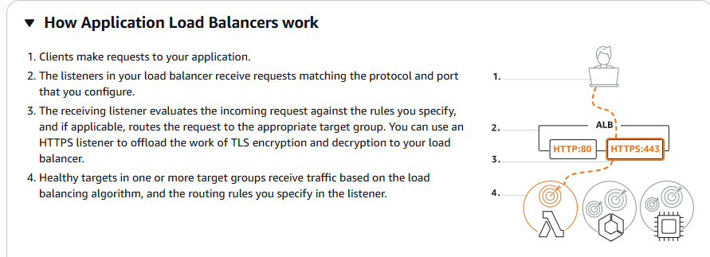
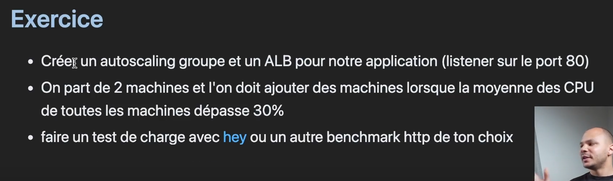
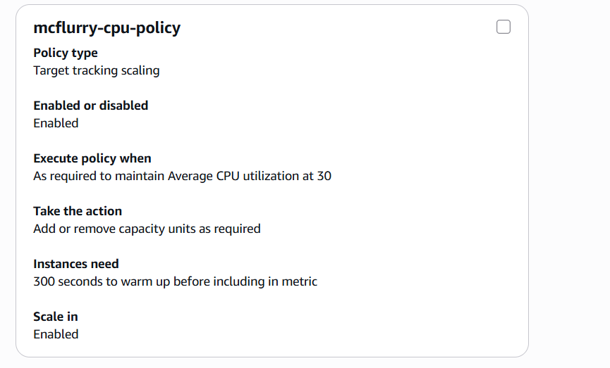

# 4 - ASG & ELB

### ASG (Auto Scaling Group)

Un ASG va s'occuper de créer des règles de mise à l'échelle : par exemple, ajouter une machine lorsqu'un certain seuil de CPU est dépassé, et en retirer lorsque la charge redescend (scaling / descaling automatique). Si le service ASG en lui-même est gratuit, les ressources qu'il déploie (instances, etc.) sont facturées. Cela nous permet de garder une infra **stateless** et réplicable sans contraintes, en gérant un groupe de machines plutôt qu'une seule.

L'ASG monitor H24 l'état des machines, si une instance est en erreur, elle est détruite et automatiquement remplacée par une nouvelle. Cette mécanique permet de ne plus avoir à se soucier des pannes solo d'infra, puisqu'une machine cassée est recréée d'office. On garantit alors la **disponibilité** du service.

Enfin, les instances peuvent être réparties sur différentes AZ : en cas de panne d'un data center dedans, d'autres instances démarreront dans une autre zone.

### Concepts liés à l'ASG

* **Un Launch Template** : définit le type d'instance à lancer (AMI, EC2, SG...) que l'ASG utilise lorsqu'il doit créer une nouvelle instance.
* **La Scaling policy** : définit les conditions qui s'activent pour ajouter ou retirer des machines (par exemple, un seuil d'utilisation CPU ou de stockage).


_"Et une de plus... ;)"_

> Attention : vigilance avec le nombre de règles de scaling définies. Des règles trop nombreuses ou mal pensées peuvent entrer en conflit entre elles.

### ELB (Elastic Load Balancer)

L'ELB répartit le trafic entrant entre plusieurs instances EC2, pour éviter qu'une seule machine encaisse toute la charge. Un ELB est dit "élastique" car il s'adapte en fonction du volume de trafic, peu importe qu'il s'agisse d'un million ou de plusieurs millions de requêtes. Il redirige le trafic reçu sur un port donné vers l'ASG correspondant. Il existe en deux types :

* **NLB (Network Load Balancer)** : le point central qui reçoit l'ensemble des requêtes des utilisateurs.&#x20;
* **ALB (Application Load Balancer)** : il opère au niveau applicatif (gérant le traffic HTTP/HTTPS) au lieu du niveau TCP. Il permet des gérer plus finement des règles de routages, comme forwarder une requête vers un service différent selon l'URL demandée par exemple.

### ALB : le plus utilisé

ALB demeure le plus utilisé, on va se contenter d'utiliser ce dernier. Il s'appuie sur 4 éléments :

* **Listener** : le port d'écoute du load balancer.
* **Target group** : définit vers quel groupes d'instances rediriger les requêtes reçues.
* **Rules** : les règles de routage&#x20;
* **Tarification** : l'ALB possède un coût fixe, de l'ordre de 16 $/mois.

Un ELB est en générale associé à une seule application. Il est possible de mutualiser un même ELB entre plusieurs environnements (par exemple dev et prod), mais ça pourrait poser problème, un environnement pourrait alors affecter l'autre.

Schéma d'ensemble de l'architecture :


Le combo ASG + ELB rend l'infrastructure suffisante à elle même, en s'adaptant à la charge et avec hotfix en cas de panne d'une instance :



## Exercice pratique en AWS CLI

L'exercice suivant sera réalisé directement en ligne de commande :



**L'ordre des opérations à respecter est le suivant**, chaque étape dépendra parfois de l'ARN (identifiant de ressource) généré par l'étape précédente :

```
1. Launch Template
2. Load Balancer      → récupérer son ARN
3. Target Group       → récupérer son ARN
4. Listener            → utilise ARN LB + ARN TG
5. ASG                  → utilise ARN TG
6. Scaling Policy      → utilise le nom de l'ASG
```

### 1. Création du Launch Template

Comme vu précédemment, il définit la configuration des instances qui seront lancées par l'ASG :

```bash
aws --profile myProfile ec2 create-launch-template \
  --launch-template-name mcflurry-lt \
  --version-description "v1" \
  --launch-template-data '{
    "ImageId": "ami-0727c7aa82635c7c6",
    "InstanceType": "t3.micro",
    "KeyName": "mcflurry-kostan",
    "SecurityGroupIds": ["sg-0cfd8e43809678d1b"]
  }'
```

Avec les éléments dedans :

`--launch-template-name mcflurry-lt` : nom du template

`--version-description "v1"` : versionning du LT, pour identifier ou rollback en cas de pépins. Ici on part sur la v1.

Puis dans `launch-template-data` :

* `ImageId` : l'AMI utilisée, sur laquelle on démarre chaque instance
* `InstanceType: t3.micro` : type d'instance, ici la **t3.micro** qui comporte 2 vCPU, 1 Go de RAM. Un truc léger et idéal pour du test.
* `KeyName` : la paire de clés SSH à associer aux instances, pour s'y connecter après
* `SecurityGroupIds` : SG concernés, et donc les règles de firewall qui vont avec&#x20;

### 2. Création du Load Balancer (ALB)

Le load balancer doit être créé avant le listener. Les subnets disponibles dans chaque AZ sont d'abord récupérés :

```bash
$ aws --profile myProfile ec2 describe-subnets \
  --query 'Subnets[*].{ID:SubnetId, AZ:AvailabilityZone, CIDR:CidrBlock}' \
  --output table
--------------------------------------------------------------
|                       DescribeSubnets                      |
+------------+------------------+----------------------------+
|     AZ     |      CIDR        |            ID              |
+------------+------------------+----------------------------+
|  us-east-1c|  172.31.16.0/20  |  subnet-098df6a2925d1fca8  |
|  us-east-1b|  172.31.80.0/20  |  subnet-0008bd79a2ecf7a68  |
|  us-east-1f|  172.31.64.0/20  |  subnet-0b1bbada0f21af10e  |
|  us-east-1d|  172.31.32.0/20  |  subnet-0f0b9308ad4d9d377  |
|  us-east-1e|  172.31.48.0/20  |  subnet-09d09309039b4b997  |
|  us-east-1a|  172.31.0.0/20   |  subnet-05388da4c4c8a241a  |
+------------+------------------+----------------------------+
```

L'ALB est ensuite créé, réparti sur ces dits-subnets :

```bash
aws --profile myProfile elbv2 create-load-balancer \
  --name mcflurry-alb \
  --subnets subnet-098df6a2925d1fca8 subnet-0008bd79a2ecf7a68 subnet-0b1bbada0f21af10e subnet-0f0b9308ad4d9d377 subnet-0f0b9308ad4d9d377 subnet-09d09309039b4b997 subnet-05388da4c4c8a241a \
  --security-groups sg-0cfd8e43809678d1b \
  --scheme internet-facing \
  --type application
```

### 3. Création du Target Group

Le target group doit être créé avant le listener et avant l'ASG, puisque ces deux derniers ont besoin de son ARN :

```bash
aws --profile myProfile elbv2 create-target-group \
  --name mcflurry-tg \
  --protocol HTTP \
  --port 1234 \
  --vpc-id vpc-02a9f67924e244fe1 \
  --health-check-protocol HTTP \
  --health-check-port 1234 \
  --health-check-path /
```

Que l'on finit par avoir en sortie :

```bash
"TargetGroupArn": "arn:aws:elasticloadbalancing:us-east-1:960583973458:targetgroup/mcflurry-tg/a02a4cce8d6a248f",
```

### 4. Création du Listener

Le listener relie le load balancer via son ARN au target group, là aussi via son ARN, sur un port donné :

```bash
aws --profile myProfile elbv2 create-listener \
  --load-balancer-arn arn:aws:elasticloadbalancing:us-east-1:960583973458:loadbalancer/app/mcflurry-alb/cf159c6b1ee5acd6 \
  --protocol HTTP \
  --port 8000 \
  --default-actions Type=forward,TargetGroupArn=arn:aws:elasticloadbalancing:us-east-1:960583973458:targetgroup/mcflurry-tg/a02a4cce8d6a248f
```

```bash
"ListenerArn": "arn:aws:elasticloadbalancing:us-east-1:960583973458:listener/app/mcflurry-alb/cf159c6b1ee5acd6/e0c2e25f6133a417",
```

### 5. Création de l'Auto Scaling Group

On créé l'ASG y mettant le launch template et l'ARN du target group dans la commande suivante :

```bash
aws --profile myProfile autoscaling create-auto-scaling-group \
  --auto-scaling-group-name mcflurry-asg \
  --launch-template LaunchTemplateName=mcflurry-lt,Version='$Latest' \
  --min-size 1 \
  --max-size 3 \
  --desired-capacity 2 \
  --vpc-zone-identifier "subnet-098df6a2925d1fca8,subnet-0008bd79a2ecf7a68,subnet-0b1bbada0f21af10e,subnet-0f0b9308ad4d9d377,subnet-09d09309039b4b997,subnet-05388da4c4c8a241a" \
  --target-group-arns arn:aws:elasticloadbalancing:us-east-1:960583973458:targetgroup/mcflurry-tg/a02a4cce8d6a248f
```

Puis on regarde si l'ASG est bien rattaché au bon target group défini :

```bash
aws --profile myProfile autoscaling describe-auto-scaling-groups \
  --auto-scaling-group-name mcflurry-asg \
  --query 'AutoScalingGroups[0].TargetGroupARNs'
[
    "arn:aws:elasticloadbalancing:us-east-1:960583973458:targetgroup/mcflurry-tg/a02a4cce8d6a248f"
]
```

### 6. Création de la politique de scaling

On créé ensuite une politique de scaling, en choisissant un taux d'utilisation du CPU moyen de 30 % sur l'ensemble de l'ASG :

```bash
aws --profile myProfile autoscaling put-scaling-policy \
  --auto-scaling-group-name mcflurry-asg \
  --policy-name mcflurry-cpu-policy \
  --policy-type TargetTrackingScaling \
  --target-tracking-configuration '{
    "PredefinedMetricSpecification": {
      "PredefinedMetricType": "ASGAverageCPUUtilization"
    },
    "TargetValue": 30.0
  }'
```

Cette commande crée automatiquement deux alarmes CloudWatch associées (seuil haut et seuil bas) :

```json
{
    "PolicyARN": "arn:aws:autoscaling:us-east-1:960583973458:scalingPolicy:9c231a32-a027-43b5-b84e-309658987196:autoScalingGroupName/mcflurry-asg:policyName/mcflurry-cpu-policy",
    "Alarms": [
        {
            "AlarmName": "TargetTracking-mcflurry-asg-AlarmHigh-6ed14898-cf35-4940-a797-68093e46fc5d",
            "AlarmARN": "arn:aws:cloudwatch:us-east-1:960583973458:alarm:TargetTracking-mcflurry-asg-AlarmHigh-6ed14898-cf35-4940-a797-68093e46fc5d"
        },
        {
            "AlarmName": "TargetTracking-mcflurry-asg-AlarmLow-eaec1e5b-8230-45fc-9249-55355b78d726",
            "AlarmARN": "arn:aws:cloudwatch:us-east-1:960583973458:alarm:TargetTracking-mcflurry-asg-AlarmLow-eaec1e5b-8230-45fc-9249-55355b78d726"
        }
    ]
}
```

On voit ensuite que la politique est bien créée côté console :



Le load balancer est désormais actif sur le port 8000, et sert bien la page de l'application :

```bash
curl http://mcflurry-alb-8475791.us-east-1.elb.amazonaws.com:8000/
<h1>Hello World</h1>
```

### 7. Test de la montée en charge automatique

**Problème rencontré** : Nginx sur mes serveurs se contente de servir une simple page HTML, ce qui ne consomme que très peu de CPU. Même en lançant un grand nombre de requêtes, le taux d'utilisation CPU risque de rester bas, et donc ne déclenchera pas la politique de scaling.

**La solutio ?** Stresser directement le CPU des instances, à l'aide de l'outil `stress` (à au préalable) qui va faire augmenter la charge de lui-même, pour voir si la policy s'exécute et créé les nouvelles machines :

```bash
ssh -i mcflurry-kostan.pem ubuntu@35.168.112.58 "sudo apt install stress -y && stress --cpu 4 --timeout 300"

No VM guests are running outdated hypervisor (qemu) binaries on this host.
stress: info: [1552] dispatching hogs: 4 cpu, 0 io, 0 vm, 0 hdd

stress: info: [1552] successful run completed in 300s
```

On ouvre un autre terminal pour regarder ça en direct :

```bash
Toutes les 10,0s: aws --profile myProfile autoscalin...  kos-boss: Sun Jun 14 00:54:55 2026

[
    {
        "ID": "i-0314092b550775c01",
        "State": "InService"
    }
]
```

Au bout de 5 minutes de charge, on peut voir que deux nouvelles instances sont bien apparues ! On dispose désormais de trois instances actives :

```bash
Toutes les 10,0s: aws --profile myProfile autoscalin...  kos-boss: Sun Jun 14 00:54:55 2026

[
    {
        "ID": "i-0314092b550775c01",
        "State": "InService"
    },
    {
        "ID": "i-040c8e6681848a597",
        "State": "InService"
    },
    {
        "ID": "i-08d82f6f3e803a1c0",
        "State": "InService"
    }
]
```

La politique de scaling fonctionne donc comme attendu. On peut d'ailleurs observer le graphique d'usage CPU du groupe qui affiche la montée en charge de ce dernier :


