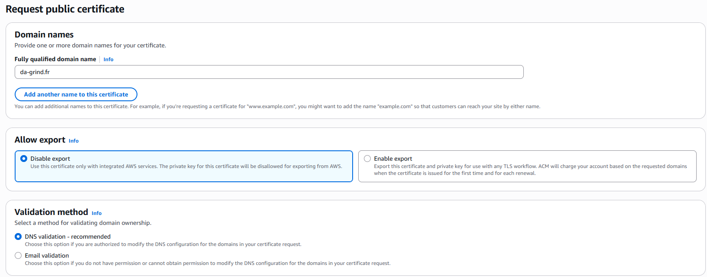
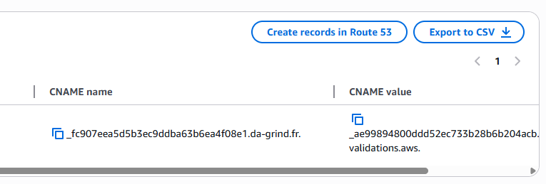
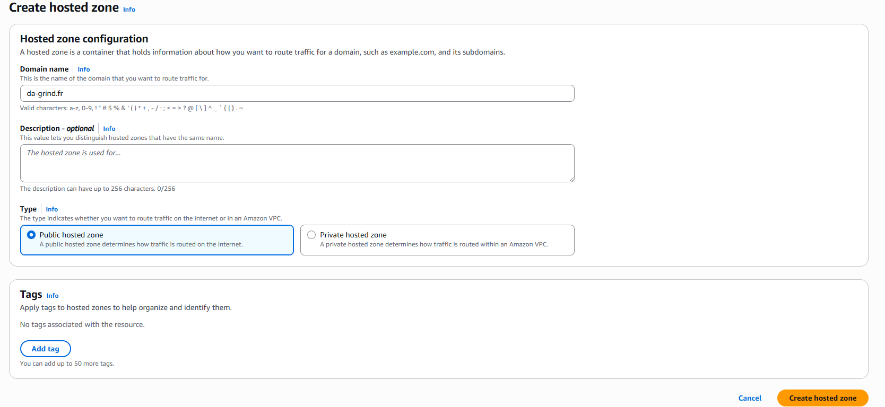
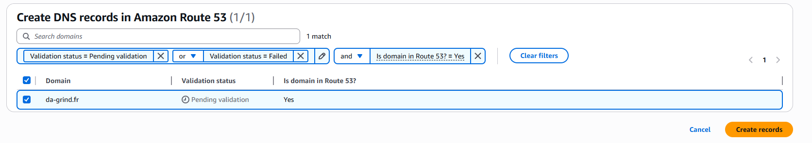
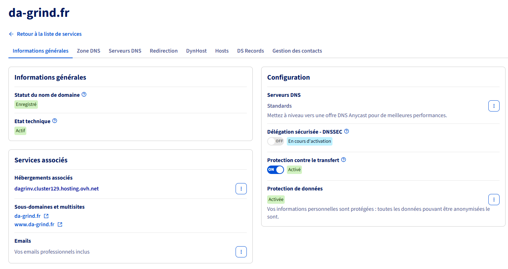
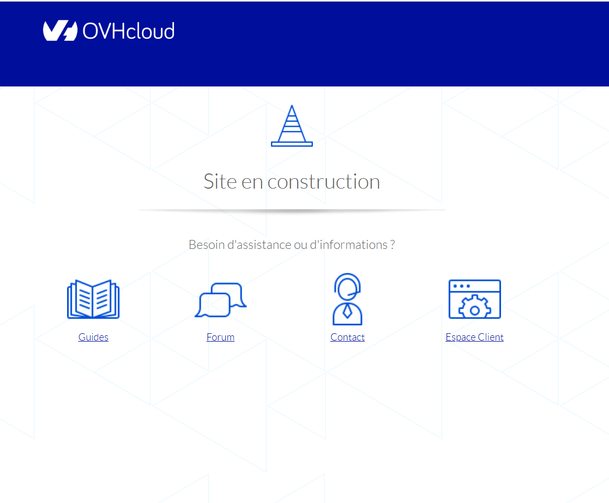
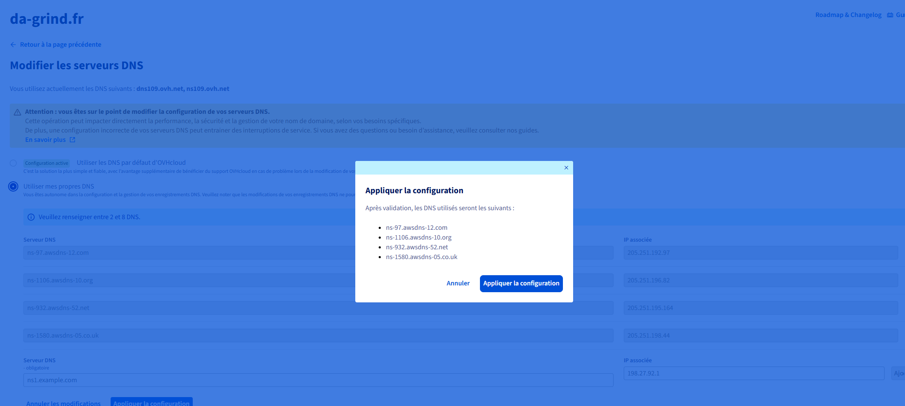

# Bonus - Création d'un nom de domaine

Lorsqu'une **Hosted Zone** est créée dans Route 53 pour un domaine, AWS génère automatiquement deux enregistrements obligatoires, qui ne peuvent pas être supprimés :

| Type                         | Rôle                                                                                    |
| ---------------------------- | --------------------------------------------------------------------------------------- |
| **NS** (Nameserver)          | Indique les 4 serveurs de noms de Route 53 à utiliser pour le domaine                   |
| **SOA** (Start of Authority) | Informations d'autorité DNS de la zone (maître de zone, paramètres de rafraîchissement) |

Pour valider un certificat SSL via DNS (avec ACM sur AWS), il est nécessaire d'ajouter un enregistrement CNAME dans la zone DNS du domaine. Tant que ce CNAME n'est pas présent, le certificat reste en statut "**pending validation**". Et donc, les ressources qui dépendent de ce certificat (comme une distri CloudFront pointant vers un bucket S3) ne peuvent pas être finalisées tant que le certificat n'est pas validé.

On va donc créer un nom de domaine afin de ne plus être embêté avec un certificat non valide.

## Procédure

On peut déjà essayer via la console de créer un certificat SSL pour le domaine `da-grind.fr` :



> La validation par email est à éviter au profit de la validation par DNS.

L'enregistrement correspondant doit ensuite être créé côté route/S3 pour prouver la propriété du domaine :



Sauf que... la validation reste bloquée : les enregistrements DNS apparaissent grisés. La route ne peut pas être créée tant qu'un enregistrement DNS n'a pas été créé dans Route 53, on arrange donc ça :



Une **Hosted Zone** Route 53 pour `da-grind.fr` crée automatiquement les enregistrements NS et SOA mentionnés plus haut. L'enregistrement de validation DNS pour le certificat ACM est ensuite créé à son tour :



Trois enregistrements DNS sont désormais présents dans Route 53 :

| Enregistrement                                  | Type      | Rôle                                                    |
| ----------------------------------------------- | --------- | ------------------------------------------------------- |
| `da-grind.fr`                                   | **NS**    | Nameservers de Route 53 pour le domaine                 |
| `_fc907eea5d5b3ec9ddba63b6ea4f08e1.da-grind.fr` | **CNAME** | Validation DNS pour le certificat ACM                   |
| `da-grind.fr`                                   | **SOA**   | Autorité de la zone (obligatoire, créé automatiquement) |

### 2. Achat du domaine chez OVH

En suivant la formation, le formateur (cocadmin) utilisait un nom de domaine personnel, ce qui a conduit à une erreur : une tentative de génération de certificat a été faite pour un domaine qui n'était en réalité pas enregistré. J'ai donc acheté le domaine `da-grind.fr` OVH pour qu'il existe :



Coût : environ 4 €/mois, engagement d'un an.

**Vérification avant achat**, le domaine n'existe pas encore (`NXDOMAIN`) :

```bash
dig da-grind.fr

;; ->>HEADER<<- opcode: QUERY, status: NXDOMAIN, id: 62083
;; QUESTION SECTION:
;da-grind.fr.			IN	A

;; AUTHORITY SECTION:
fr.			270	IN	SOA	a.nic.fr. dnsmaster.afnic.fr. 2245363674 3600 1800 1209600 600
```

**Vérification après achat**, le domaine répond désormais correctement avec une adresse IP :

```bash
dig www.da-grind.fr

;; ->>HEADER<<- opcode: QUERY, status: NOERROR, id: 8454
;; QUESTION SECTION:
;www.da-grind.fr.		IN	A

;; ANSWER SECTION:
www.da-grind.fr.	3561	IN	A	51.91.236.255
```

Le site affiche pour l'instant une page "en construction", fournie par défaut par OVH :



### 3. Connexion à AWS en CLI

Connexion avec un profil dédié nommé `myProfile` :

```bash
jpmm@kos-boss:~/Documents/aws-formation$ aws login --profile myProfile
No AWS region has been configured. The AWS region is the geographic location of your AWS resources.

https://us-east-1.signin.aws.amazon.com/v1/authorize?[...]

Updated profile myProfile to use arn:aws:iam::960583973458:user/negrospies-777 credentials.
Use "--profile myProfile" to use the new credentials, such as "aws sts get-caller-identity --profile myProfile"
```

Après authentification via le navigateur, l'identité du profil est vérifiée :

```bash
$ aws sts get-caller-identity --profile myProfile
{
    "UserId": "AIDA57J2EHJJGGICHP6LM",
    "Account": "960583973458",
    "Arn": "arn:aws:iam::960583973458:user/negrospies-777"
}
```

Les buckets S3 accessibles avec ce profil sont listés :

```bash
$ aws s3 ls --profile myProfile
2026-05-30 16:19:12 cocadmin-blog-s3
```

Le contenu du bucket concerné est également consultable :

```bash
$ aws s3 ls cocadmin-blog-s3 --profile myProfile

2026-05-30 16:44:47        805 index.html
2026-05-30 16:44:47         39 index.js
2026-05-30 16:44:48       1793 map.js
2026-05-30 16:44:48       6948 mcdonalds-closed.png
2026-05-30 16:44:48       8031 mcdonalds-unavail.png
2026-05-30 16:44:48       8811 mcdonalds.png
2026-05-30 16:44:49      23204 missingflurry.js
2026-05-30 16:44:49       4742 styles.js
2026-05-30 16:44:50       5173 styles2.js
```

### 4. Rattachement du domaine OVH aux serveurs de noms AWS

Le domaine ayant été acheté chez OVH, ses serveurs de noms (DNS) doivent être remplacés par ceux fournis par la Hosted Zone Route 53, afin qu'AWS devienne responsable de la résolution DNS du domaine.

Les adresses IP des serveurs de noms Route 53 sont d'abord récupérées via une boucle `nslookup` :

```bash
for SITE in ns-97.awsdns-12.com ns-1106.awsdns-10.org ns-932.awsdns-52.net ns-1580.awsdns-05.co.uk
do 
    echo "----- $SITE -----"
    nslookup "$SITE"
done
```

Résultat pour chacun des quatre serveurs de noms (adresse IPv4 et IPv6) :

```bash
----- ns-97.awsdns-12.com -----
Name:	ns-97.awsdns-12.com
Address: 205.251.192.97
Name:	ns-97.awsdns-12.com
Address: 2600:9000:5300:6100::1

----- ns-1106.awsdns-10.org -----
Name:	ns-1106.awsdns-10.org
Address: 205.251.196.82
Name:	ns-1106.awsdns-10.org
Address: 2600:9000:5304:5200::1

----- ns-932.awsdns-52.net -----
Name:	ns-932.awsdns-52.net
Address: 205.251.195.164
Name:	ns-932.awsdns-52.net
Address: 2600:9000:5303:a400::1

----- ns-1580.awsdns-05.co.uk -----
Name:	ns-1580.awsdns-05.co.uk
Address: 205.251.198.44
Name:	ns-1580.awsdns-05.co.uk
Address: 2600:9000:5306:2c00::1
```

Ces quatre serveurs de noms sont ensuite renseignés côté interface OVH, à la place des serveurs de noms par défaut d'OVH, afin de déléguer la gestion DNS du domaine à Route 53 :



NOTE : non terminé, à finaliser plus tard.
