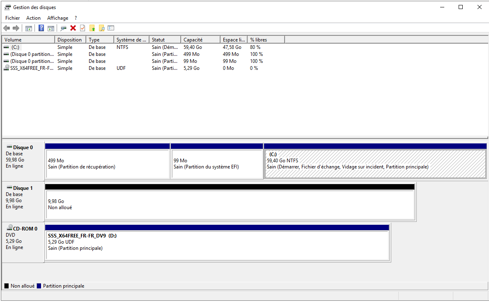

# 1 - Installation and configuration

First, I install Windows Server 2019 locally on my machine. I chose VMware as the hypervisor: I find it makes creating separate subnets easier, and it handles resources more efficiently 🙂

We start by downloading the Windows Server 2019 ISO: [https://www.microsoft.com/en-us/evalcenter/download-windows-server-2019](https://www.microsoft.com/en-us/evalcenter/download-windows-server-2019)

Then we install it in a new virtual machine:

<figure><figcaption></figcaption></figure>

Once VMware Tools is installed and fullscreen works, we now have our Windows Server up and running:

<figure><figcaption></figcaption></figure>

We rename the server to "**mesmots**", with the description "Serveur AD MesMots":

<figure><figcaption></figcaption></figure>

### Creating the domain:

The first step, before creating the Active Directory domain, is to install the "**ADDS**" role: **Active Directory Domain Services**. This role is what makes it possible to create an Active Directory domain:

<figure><figcaption></figcaption></figure>

We then promote the server to a DC, with the domain name "**mesmots.local**":

<figure><figcaption></figcaption></figure>

**Note:** the NetBIOS domain name will be **MESMOTS0**

### Creating the OUs:

Once the domain is created, we can start creating the requested OUs, with the following tree:

<figure><figcaption></figcaption></figure>

We end up with the following OUs, each containing the members of its group:

```rust
mesmots.local
├── Domain Controllers
└── OU MesMots
    ├── OU CODIR
    ├── OU IT
    ├── OU Administratif
    ├── OU Pédagogique
    │   └── OU Professeurs
    └── OU Ordinateurs
```

Here is the complete tree, with each user belonging to a group named "**GRP\_CODIR**", "**GRP\_ADMIN**"... depending on the name of the OU:

```rust
mesmots.local
├── OU Domain Controllers
│   └── DN : OU=Domain Controllers,DC=mesmots,DC=local
│
├── OU MesMots
│   ├── OU CODIR
│   │   └── DN : OU=CODIR,OU=MesMots,DC=mesmots,DC=local
│   │       ├── DirGen (dirgen)  → GRP_CODIR
│   │       ├── DirPed (dirped)  → GRP_CODIR
│   │       └── DirAdm (diradm)  → GRP_CODIR
│   │
│   ├── OU IT
│   │   └── DN : OU=IT,OU=MesMots,DC=mesmots,DC=local
│   │       └── SysAdmin (sysadmin) → GRP_IT
│   │
│   ├── OU Administratif
│   │   └── DN : OU=Administratif,OU=MesMots,DC=mesmots,DC=local
│   │       ├── Alice Martin (amartin)       → GRP_ADMIN
│   │       ├── Bernard Dupont (bdupon)      → GRP_ADMIN
│   │       ├── Camille Laurent (claurent)   → GRP_ADMIN
│   │       ├── Dylan Moreau (dmoreau)       → GRP_ADMIN
│   │       ├── Eva Rousseau (erousse)       → GRP_ADMIN
│   │       ├── Fabien Garnier (fgarnie)     → GRP_ADMIN
│   │       ├── Gaëlle Marchal (gmarc)       → GRP_ADMIN
│   │       ├── Hugo Peyre (hpeyre)          → GRP_ADMIN
│   │       ├── Inès Chambon (ichamb)        → GRP_ADMIN
│   │       ├── Julien Blanchet (jblanch)    → GRP_ADMIN
│   │       ├── Karine Lemoine (klemon)      → GRP_ADMIN
│   │       ├── Luc Morel (lmorel)           → GRP_ADMIN
│   │       ├── Mélanie Aubert (maubert)     → GRP_ADMIN
│   │       ├── Nathan Roy (nroy)            → GRP_ADMIN
│   │       └── Olivia Dufour (odufour)      → GRP_ADMIN
│   │
│   ├── OU Pedagogique
│   │   └── DN : OU=Pedagogique,OU=MesMots,DC=mesmots,DC=local
│   │       └── OU Professeurs
│   │           └── DN : OU=Professeurs,OU=Pedagogique,OU=MesMots,DC=mesmots,DC=local
│   │               ├── Prof_Lettre_01 (pflettre01) → GRP_PROFS
│   │               ├── Prof_Lettre_02 (pflettre02) → GRP_PROFS
│   │               ├── Prof_Lettre_03 (pflettre03) → GRP_PROFS
│   │               ├── Prof_Lettre_04 (pflettre04) → GRP_PROFS
│   │               └── Prof_Lettre_05 (pflettre05) → GRP_PROFS
│   │
│   └── OU Ordinateurs
│       └── DN : OU=Ordinateurs,OU=MesMots,DC=mesmots,DC=local
```

### Creating the shared disk

When I tried to create the folder hierarchy on the "**D:**" drive, I realized the server didn't have one. So I had to add a dedicated partition on a new virtual hard disk.

I created a "**.vmdk**" virtual disk in VMware, named "**partage\_commun.vmdk**":

<figure><figcaption></figcaption></figure>

Once the disk is created, we open "**diskmgmt.msc**" on the AD server, and the disk shows up:

<figure><figcaption></figcaption></figure>

The disk is then mounted as **D:/**. We create a folder named "**Partages**" on it, then build a folder structure mirroring the OUs. Here is the directory listing:

```powershell
PS C:\Users\Administrateur> cd D:\Partages
PS D:\Partages> ls


    Répertoire : D:\Partages


Mode                LastWriteTime         Length Name
----                -------------         ------ ----
d-----       15/04/2026     20:02                ADMINISTRATIF
d-----       15/04/2026     20:02                COMMUN
d-----       15/04/2026     20:02                DIRECTION
d-----       15/04/2026     20:02                INFORMATIQUE
d-----       15/04/2026     20:20                PEDAGOGIQUE

PS D:\Partages> ls .\PEDAGOGIQUE\


    Répertoire : D:\Partages\PEDAGOGIQUE


Mode                LastWriteTime         Length Name
----                -------------         ------ ----
d-----       15/04/2026     20:20                Profs
```

The lab refers to **X:**, **P:**, etc. as drives mapped on the clients. Following that model, I assigned the following letters:

* **X:** = SMB share pointing to "**D:\Partages**" (root)
* **P:** = SMB share pointing to "**D:\Users{Username}**"

### Creating the share:

First, we can see that the File Server role is already installed on the DC:

<figure><figcaption></figcaption></figure>

In the file share creation wizard, we can point the share to "**D:/Partages**":

<figure><figcaption></figcaption></figure>

The share is created, and is now visible in the list of shares:

<figure><figcaption></figcaption></figure>

_Note: permissions were left at their defaults, as they will be changed later using the AGLP method_

### Defining the share permissions:

The lab came with a permissions matrix defining who can access what, for each group. Here are some extracts:

<figure><figcaption></figcaption></figure>

And for the other groups:

<figure><figcaption></figcaption></figure>

<figure><figcaption></figcaption></figure>

Important detail: each user is the owner (OWN) of their own folder only. IT keeps Read+Write on all folders for maintenance.

First, I create a global group "**GG\_GRP\_ALL\_USERS**" that contains all the other user groups:

<figure><figcaption></figcaption></figure>

Then we grant this group read access on the "**D:/Partages**" folder created earlier. This grants effective SMB access, which is then refined with NTFS permissions:

<figure><figcaption></figcaption></figure>

NTFS permissions can be set by right-clicking a subfolder of the "**D:/Partages**" share. For example, to set the right permission on the "COMMUN" subfolder, we right-click > Properties > Advanced at the bottom right:

<figure><figcaption></figcaption></figure>

Then we can apply the NTFS permissions by adding each desired group and ticking the permission boxes:

<figure><figcaption></figcaption></figure>

<figure><figcaption></figcaption></figure>

We then set the required permissions for each group on each folder. Here is the resulting PowerShell listing ;) :

```ps1
# Dossier : ADMINISTRATIF
Utilisateur            Droits                       Hérité
-----------            ------                       ------
GG_GRP_ADMIN           Modify                       False
GG_GRP_CODIR           ReadAndExecute               False
GG_GRP_IT              Modify                       False

# Dossier : COMMUN
Utilisateur            Droits                       Hérité
-----------            ------                       ------
GG_GRP_ADMIN           Modify                       False
GG_GRP_CODIR           Modify                       False
GG_GRP_IT              Modify                       False
GG_GRP_PROFS           Modify                       False

# Dossier : DIRECTION
Utilisateur            Droits                       Hérité
-----------            ------                       ------
GG_GRP_CODIR           FullControl                  False
GG_GRP_IT              Modify                       False

# Dossier : INFORMATIQUE
Utilisateur            Droits                       Hérité
-----------            ------                       ------
GG_GRP_CODIR           ReadAndExecute               False
GG_GRP_IT              FullControl                  False

# Dossier : PEDAGOGIQUE
Utilisateur            Droits                       Hérité
-----------            ------                       ------
GG_GRP_ADMIN           ReadAndExecute               False
GG_GRP_CODIR           ReadAndExecute               False
GG_GRP_IT              Modify                       False
GG_GRP_PROFS           Modify                 
```

Each group now has exactly the permissions it needs on each folder, at a granular level, matching the permissions matrix.

### Configuring the Windows 11 client VM and the network

Now that the server and the share are in place, we can create a Windows 11 VM on the same local network to simulate a client workstation.

_Note: to be able to join the AD domain, it is essential to choose the "Pro" edition._

Once the VM is installed, I debloat Windows using [Sophia Script](https://github.com/farag2/Sophia-Script-for-Windows) to free up resources on my machine and get a lighter system:

<figure><figcaption></figcaption></figure>

We then set the AD server's address, **192.168.1.100**, as the DNS server, which is required for the client to communicate with the domain:

<figure><figcaption></figcaption></figure>

Next, we configure a virtual network _**vmnet1**_ in VMware to set up a bridged connection between the Active Directory server and a Windows 11 VM, with a DHCP range from **192.168.1.100 to 192.168.1.254**:

<figure><figcaption></figcaption></figure>

Then we install the DHCP server, following this guide (in French):

[https://www.it-connect.fr/installer-et-configurer-un-serveur-dhcp-sous-windows-server-2019/](https://www.it-connect.fr/installer-et-configurer-un-serveur-dhcp-sous-windows-server-2019/)

We can then see that 2 users have been added to the group:

<figure><figcaption></figcaption></figure>

We then create a DHCP pool. In this example, the AD server has the IP address "**192.168.1.100**", configured statically. We will create a scope that distributes IP addresses from **192.168.1.100** to **124**, i.e. 24 IPv4 addresses, which is the number of employees of the fictional company!

We name it "**LAN\_MesMots**":

<figure><figcaption></figcaption></figure>

We then set the DHCP lease to 8 days, which is realistic for a corporate network:

<figure><figcaption></figcaption></figure>

We can confirm it worked by checking the DHCP logs on the server, in "**C:\Windows\System32\dhcp**":

```powershell
55,04/26/26,16:53:39,Autorisé (en service),,mesmots.local,,,0,6,,,,,,,,,0
10,04/26/26,17:17:52,Assigner,192.168.1.101,WIN11-HOME-LAB.mesmots.local,000C29A1D0A3,,4172766725,0,,,,0x4D53465420352E30,MSFT 5.0,,,,0
```

To go all the way, we can also reserve the IP of the Windows 11 PC:

<figure><figcaption></figcaption></figure>

Our **WIN-11** machine does get an IP address and the domain's DNS suffix:

```powershell
PS C:\WINDOWS\system32> ipconfig /all

Configuration IP de Windows

   Nom de l’hôte . . . . . . . . . . : WIN11-HOME-LAB
   Suffixe DNS principal . . . . . . : mesmots.local

Carte Ethernet Ethernet0 :

   Suffixe DNS propre à la connexion. . . : mesmots.local
   Adresse IPv4. . . . . . . . . . . . . .: 192.168.1.101(préféré)
   Masque de sous-réseau. . . . . . . . . : 255.255.255.0
   Bail obtenu. . . . . . . . . . . . . . : dimanche 26 avril 2026 17:17:52
   Bail expirant. . . . . . . . . . . . . : lundi 4 mai 2026 17:17:52
   Passerelle par défaut. . . . . . . . . : 192.168.1.254
   Serveur DHCP . . . . . . . . . . . . . : 192.168.1.100
   Serveurs DNS. . .  . . . . . . . . . . : 192.168.1.100
   NetBIOS sur Tcpip. . . . . . . . . . . : Activé
```

Both machines can reach each other, and the domain answers on 192.168.1.100:

```powershell
PS C:\> ping mesmots.local
```

```
Réponse de 192.168.1.100 : octets=32 temps<1ms TTL=128
Paquets : envoyés=4, reçus=4, perdus=0 (perte 0%)
```

Then the reverse DNS lookup:

```powershell
PS C:\> nslookup 192.168.1.100
```

```
Serveur : UnKnown
Address: 192.168.1.100
```

And AD authentication:

```powershell
PS C:\> nltest /dsgetdc:mesmots.local
```

```
Contrôleur de domaine : \\mesmots.mesmots.local
Adresse : \\192.168.1.100
Nom dom : mesmots.local
Indicateurs : PDC GC DS LDAP KDC TIMESERV ...
La commande a été correctement exécutée.
```

Our DC is detected and reachable! ✅