# 2 - S3 & CloudFront

#### S3 (Simple Storage Service)

S3 is an **object** storage service with an API to store and retrieve files. A **bucket** is the top-level container in which files and "folders" are stored. Bucket names live in a **global namespace**: a name must be unique across all of AWS, like a domain name. That's usually the first thing to check before creating a bucket.

S3 Standard is designed for **99.99%** availability, i.e. under one hour of downtime per year on average, and **99.999999999%** ("eleven nines") durability, meaning the probability of permanently losing a file over a year is extremely low. This durability relies on storing redundant copies across several data centers.

#### S3 pricing

* Uploading data into S3 is free. What you pay for is storage, outbound bandwidth and requests.
* Outbound bandwidth is usually the biggest cost, followed by the volume of data stored.
* Data can be classified by access frequency:
  * **hot** data: frequent access
  * **warm** data: occasional access (Infrequent Access classes), cheaper to store but with a retrieval cost
  * **cold** data: rare access, slower to retrieve but much cheaper per GB (the "Glacier" classes)
* **S3 Intelligent-Tiering** lets AWS automatically move each file to the most suitable storage class based on actual usage.

#### CloudFront (CDN)

**CloudFront** is a CDN (**Content Delivery Network**), i.e. a service that caches a website worldwide, comparable to Cloudflare or Fastly.

It greatly reduces the infrastructure work on the customer side, since AWS has a huge number of points of presence around the world dedicated to CloudFront, serving content close to users, over HTTPS.

#### Route 53

AWS's DNS service (the name refers to port 53, used by the DNS protocol). It works as "**DNS as a service**", available through an API, and costs about $0.50 per hosted zone per month.

#### AWS Certificate Manager (ACM)

ACM is the SSL/TLS certificate management service, fully manageable through the API or the CLI.

Certificate private keys are protected by AWS on dedicated hardware, which strengthens security against compromise attempts.

#### 1. Creating the S3 bucket (console)

We first create a bucket in the **us-east-1** region, with ACLs enabled to have full control over the objects, and public access allowed:

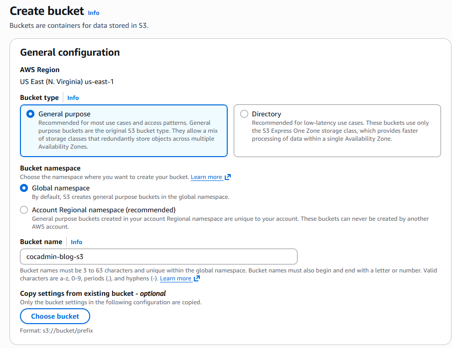

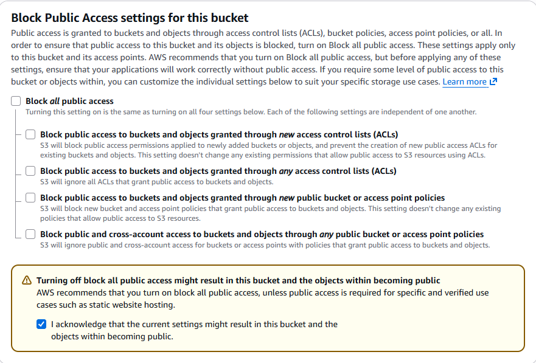

> Note: data stored in S3 is encrypted at rest by default.

The bucket is now created:

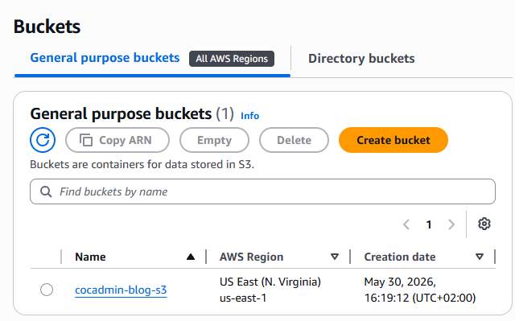

All the files of the course's example website are then uploaded:

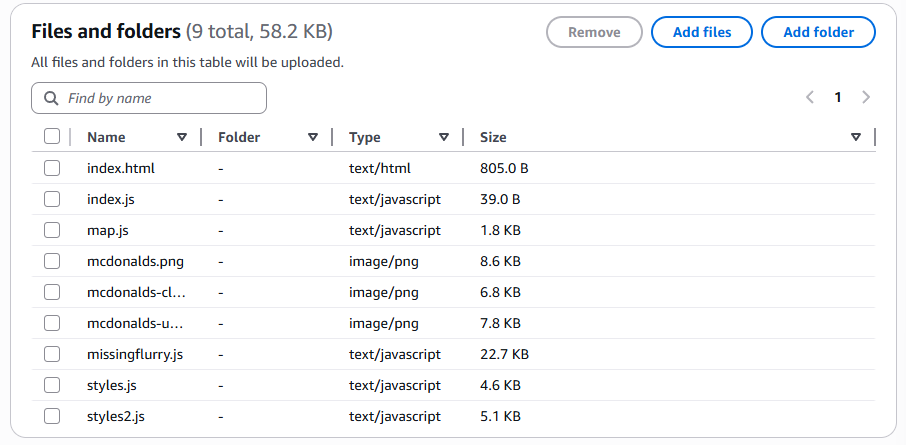

Public read access is enabled on the uploaded objects:

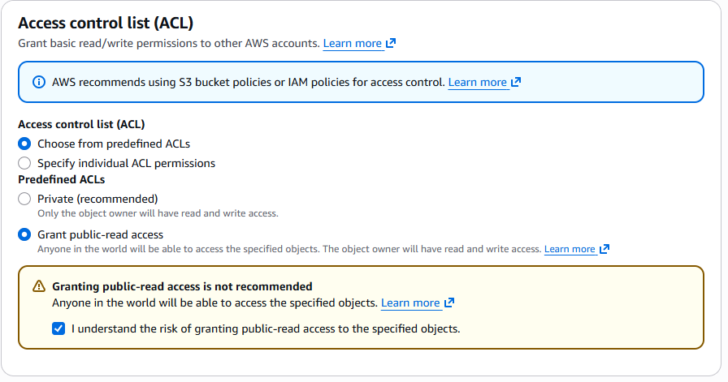

A custom encryption key is set up:

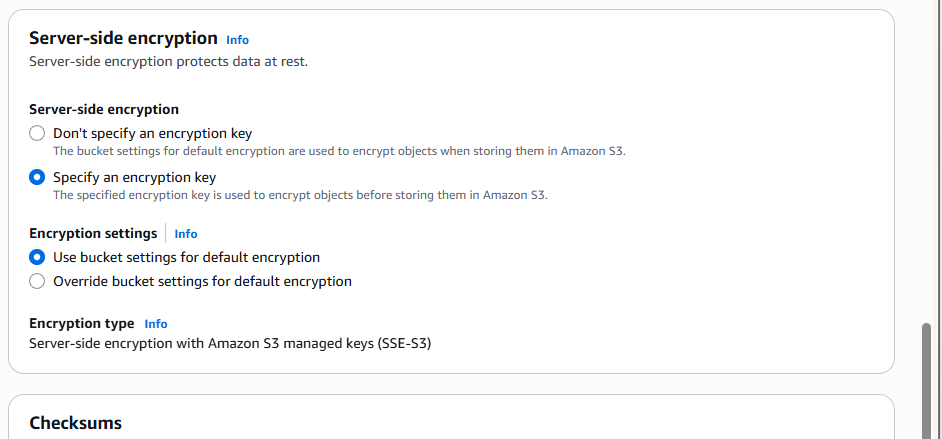

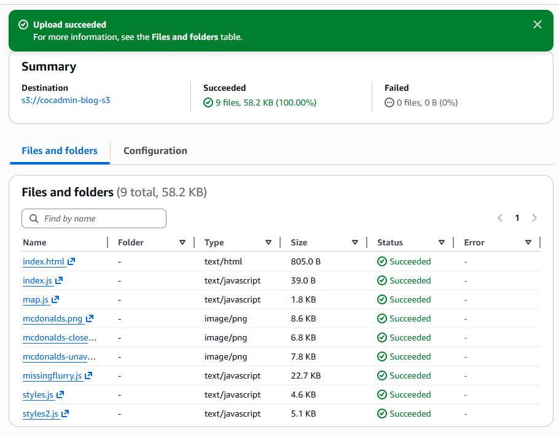

We check that everyone now has read access to the object:

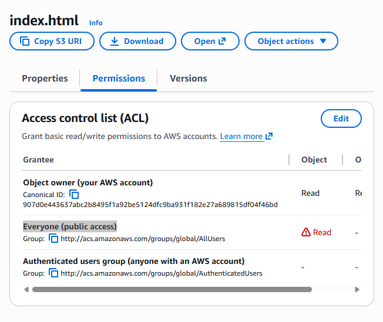

Opening the public link (`https://cocadmin-blog-s3.s3.us-east-1.amazonaws.com/index.html`), the page displays correctly for any visitor:

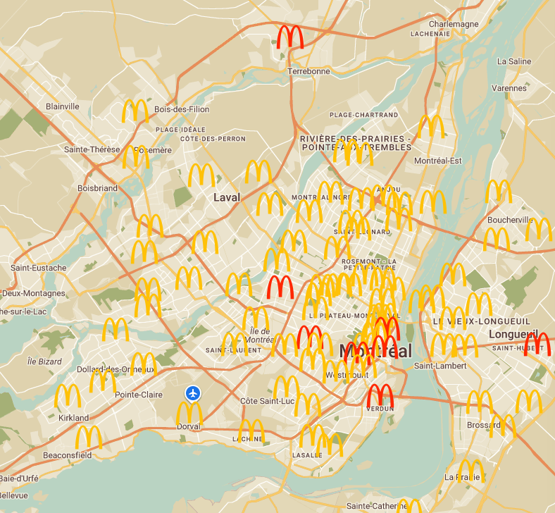

At this stage, an HTTP request behaves more like an API call than a request to a classic web server, with the default permissions applied. For example, the `https://cocadmin-blog-s3.s3.us-east-1.amazonaws.com/posts` endpoint is not accessible:

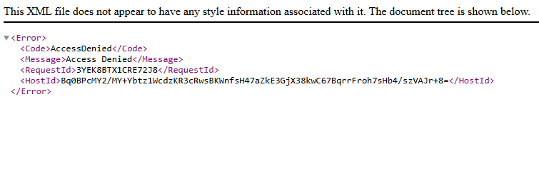

The response is "**Access denied**", even though the object simply doesn't exist at that path. This can be confusing: without list permissions, S3 returns 403 rather than 404, so as not to reveal which objects exist.

The bucket is then turned into a static website:

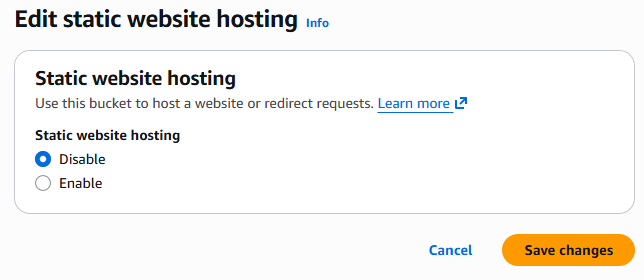

A new URL is generated: `http://cocadmin-blog-s3.s3-website-us-east-1.amazonaws.com/`, and the site is now accessible!

#### 2. Setting up CloudFront (console)

S3's "**website**" mode doesn't let you use your own domain name freely (nor HTTPS). CloudFront is used to solve this. Here we name the distribution `cocadmin-blog-mcflurry`:

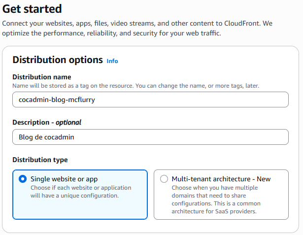

Overall configuration summary before deployment:

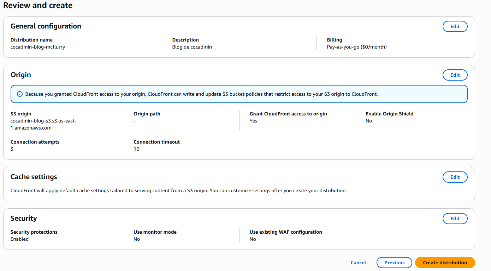

The deployment starts. It takes some time, since the configuration has to be propagated to all CloudFront points of presence around the world:

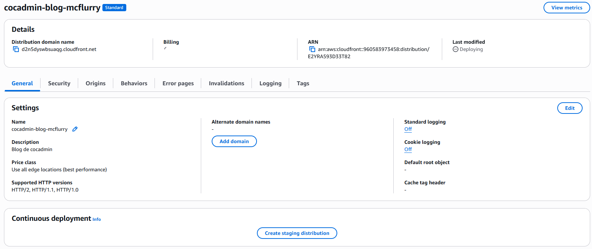

> An error came up when the origin name was not set statically, so the default choice was kept.

We then configure the CDN's alternate domain name (CNAME) with the associated certificate:

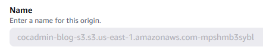

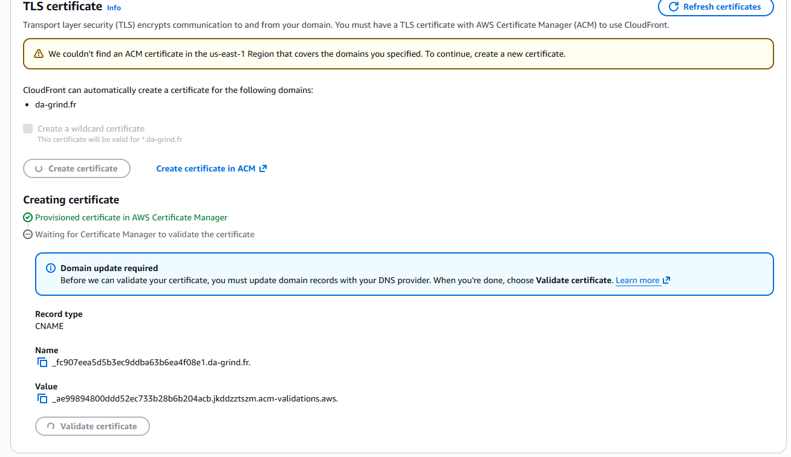

Then we set `index.html` as the **default root object**:

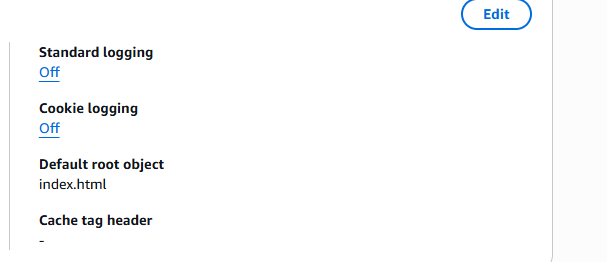

A distribution domain name is now available: `https://d2n5dyswbsuaqg.cloudfront.net`

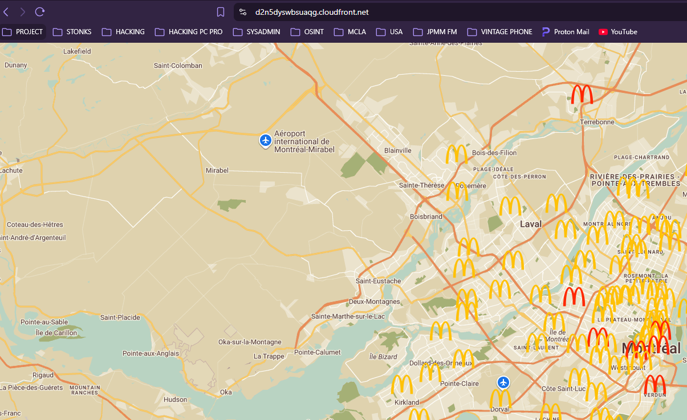

#### 3. Doing the same with the CLI

The same thing can be done from the command line. We first sign in with a dedicated profile:

```bash
jpmm@kos-boss:~/Documents/aws-formation$ aws login --profile myProfile
Attempting to open your default browser. If the browser does not open, open the following URL.
If you are unable to open the URL on this device, run this command again with the '--remote' option.

https://us-east-1.signin.aws.amazon.com/v1/authorize?[...]
```

Sign-in is then confirmed in the browser, with multi-factor authentication (MFA):

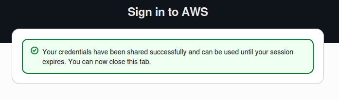

We fetch the source code of the course's example site:

```bash
git clone https://gitlab.com/ttwthomas/mcflurry
Clonage dans 'mcflurry'...
warning: redirection vers https://gitlab.com/ttwthomas/mcflurry.git/
remote: Enumerating objects: 156, done.
remote: Total 156 (delta 0), reused 0 (delta 0), pack-reused 156 (from 1)
Réception d'objets: 100% (156/156), 51.24 Kio | 17.08 Mio/s, fait.
Résolution des deltas: 100% (81/81), fait.
```

Then we create the dedicated S3 bucket:

```bash
jpmm@kos-boss:~/Documents/aws-formation/mcflurry/static$ aws s3 website s3://mcflurry-kostan

$ aws s3 ls --profile myProfile
2026-06-02 20:10:03 mcflurry-kostan
```

The bucket is switched to "website" mode, specifying the region and the index file:

```bash
$ aws s3 website s3://mcflurry-kostan --index-document index.html --region eu-west-3
```

Then we enable ACLs and lift the public access block, so that publicly readable files can be uploaded:

> Note: this would be dangerous with sensitive data (private files, user data), but it's fine here since the content is only HTML/CSS/images meant to be public.

```bash
jpmm@kos-boss:~/Documents/aws-formation/mcflurry/static$ aws s3api put-bucket-ownership-controls \
  --bucket mcflurry-kostan \
  --ownership-controls Rules=[{ObjectOwnership=BucketOwnerPreferred}] \
  --profile myProfile \
  --region eu-west-3

jpmm@kos-boss:~/Documents/aws-formation/mcflurry/static$ aws s3api put-public-access-block \
  --bucket mcflurry-kostan \
  --public-access-block-configuration "BlockPublicAcls=false,IgnorePublicAcls=false,BlockPublicPolicy=false,RestrictPublicBuckets=false" \
  --profile myProfile \
  --region eu-west-3
```

And we upload:

```bash
jpmm@kos-boss:~/Documents/aws-formation/mcflurry/static$ aws s3 sync --acl public-read . s3://mcflurry-kostan/ --region eu-west-3
upload: ./index.html to s3://mcflurry-kostan/index.html          
upload: ./styles.js to s3://mcflurry-kostan/styles.js            
upload: ./mcdonalds-closed.png to s3://mcflurry-kostan/mcdonalds-closed.png
upload: ./index.js to s3://mcflurry-kostan/index.js              
upload: ./styles2.js to s3://mcflurry-kostan/styles2.js          
upload: ./map.js to s3://mcflurry-kostan/map.js                  
upload: ./mcdonalds-unavail.png to s3://mcflurry-kostan/mcdonalds-unavail.png
upload: ./mcdonalds.png to s3://mcflurry-kostan/mcdonalds.png     
upload: ./missingflurry.js to s3://mcflurry-kostan/missingflurry.js
```

Then we list the existing buckets to get the bucket's URI and region.

The first attempt fails because the profile (`--profile myProfile`) wasn't specified, so the CLI can't resolve the regional endpoint correctly. Adding it fixes the problem:

```bash
$ aws s3api list-buckets --profile myProfile
{
    "Buckets": [
        {
            "Name": "mcflurry-kostan",
            "CreationDate": "2026-06-03T15:59:00+00:00",
            "BucketArn": "arn:aws:s3:::mcflurry-kostan"
        }
    ],
    "Owner": {
        "ID": "907d0e443637abc2b8495f1a92be5124dfc9ba931f182e27a689815df04f46bd"
    }
}

jpmm@kos-boss:~/Documents/aws-formation/mcflurry/static$ aws s3api get-bucket-location --bucket mcflurry-kostan
aws: [ERROR]: Could not connect to the endpoint URL: "https://s3.eu-west3.amazonaws.com/mcflurry-kostan?location"

jpmm@kos-boss:~/Documents/aws-formation/mcflurry/static$ aws s3api get-bucket-location --bucket mcflurry-kostan --profile myProfile
{
    "LocationConstraint": "eu-west-3"
}
```

**Standard format of an S3 website URL**:

```html
http://<BUCKET_NAME>.s3-website.<REGION>.amazonaws.com
```

Which gives, in this case:

```html
http://mcflurry-kostan.s3-website.eu-west-3.amazonaws.com
```

The site responds at this address:

```bash
ping mcflurry-kostan.s3-website.eu-west-3.amazonaws.com
PING s3-website.eu-west-3.amazonaws.com (3.5.204.88) 56(84) bytes of data.
64 bytes from 3.5.204.88: icmp_seq=1 ttl=255 time=31.7 ms
64 bytes from 3.5.204.88: icmp_seq=2 ttl=255 time=32.7 ms
```

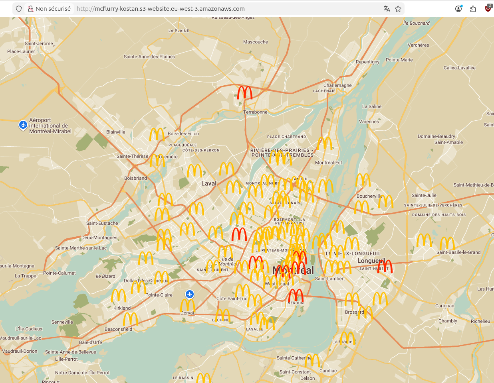

> The site can also be reached through the bucket's "raw" URL (without website mode), as long as `index.html` is explicitly included: `http://mcflurry-kostan.s3.amazonaws.com/index.html`. This could be improved, but I didn't dig further here.

Now let's create the CDN:

```bash
aws cloudfront create-distribution \
    --origin-domain-name mcflurry-kostan.s3-website.eu-west-3.amazonaws.com \
    --default-root-object index.html
{
    "Location": "https://cloudfront.amazonaws.com/2020-05-31/distribution/EKNOL67BI2LBP",
    "ETag": "E23ZP02F085DFQ",
    "Distribution": {
        "Id": "EKNOL67BI2LBP",
        "ARN": "arn:aws:cloudfront::960583973458:distribution/EKNOL67BI2LBP",
        "Status": "InProgress",
        "DomainName": "d28afch530uznb.cloudfront.net",
        "ActiveTrustedSigners": {
            "Enabled": false,
            "Quantity": 0
        }
    }
}
```

The new CloudFront domain (`d28afch530uznb.cloudfront.net`) now serves the site, with an HTTPS certificate provided by AWS ;) :

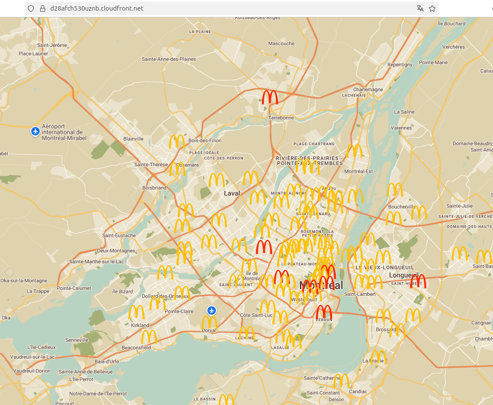

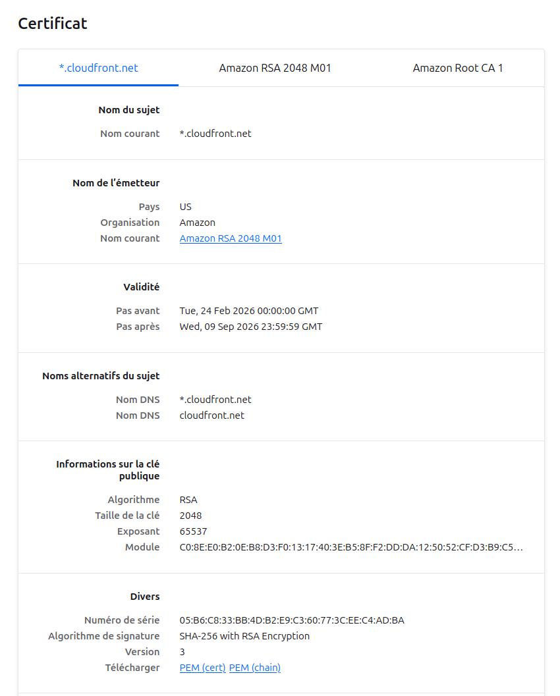

DNS propagation around the world takes a little while. A tool like [whatsmydns.net](https://www.whatsmydns.net/) lets you follow it from different locations.

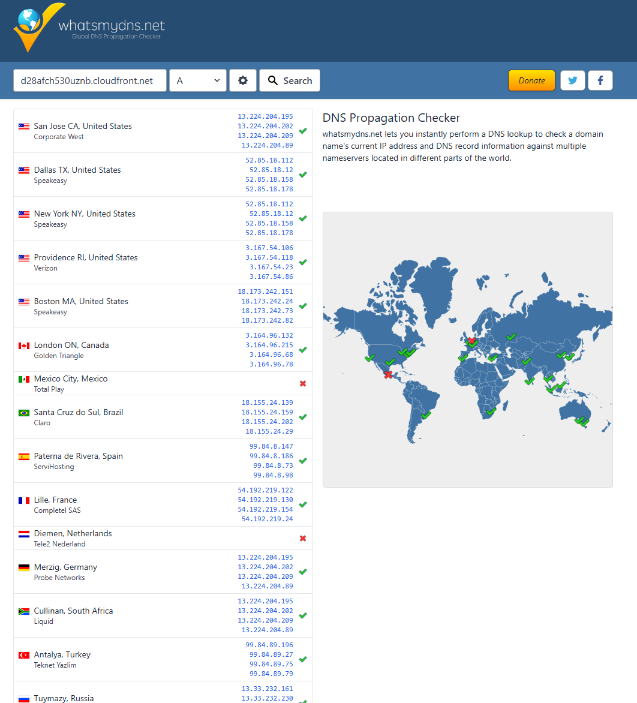

#### 4. Testing CloudFront cache invalidation

To check that CloudFront works as expected, we modify the site's `map.js` file: the import of `styles.js` on the first line is replaced with `styles2.js`, which enables a dark mode on the site.

```js
$ head map.js 
import { styles } from './styles.js';
---> import { styles } from './styles2.js';
import { restaurants } from './missingflurry.js'

export class Map {
  constructor() {
    const montreal = { lat: 45.54, lng: -73.7 };
    this.map = new google.maps.Map(document.getElementById('map'), {
      center: montreal,
      disableDefaultUI: true,
      zoom: 11,
```

Once the file is re-uploaded to the bucket:

```bash
aws s3 cp --acl public-read map.js s3://mcflurry-kostan --profile myProfile
upload: ./map.js to s3://mcflurry-kostan/map.js           
```

Dark mode is active on the bucket's direct URL:

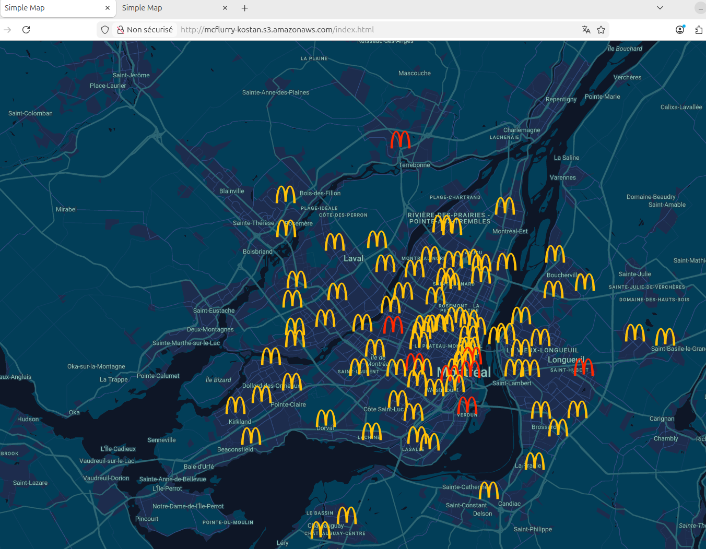

But not yet on the CloudFront address:

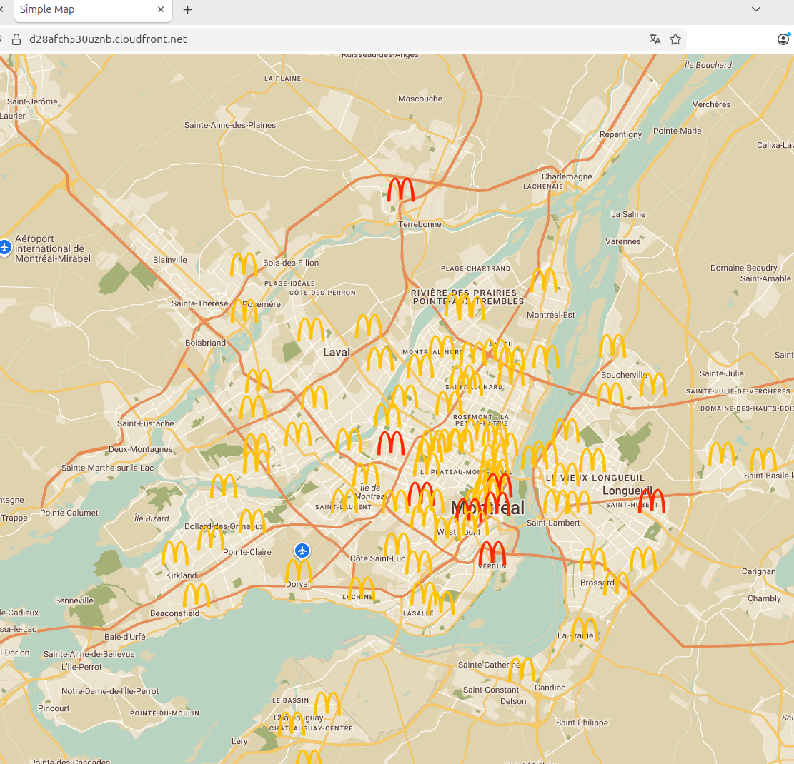

The change shows up on the S3 URL but **not** on CloudFront, which still serves the cached version. We need to create an **invalidation** to force the update, targeting the ID of the CloudFront distribution:

```bash
aws cloudfront create-invalidation --distribution-id EKNOL67BI2LBP --path "/maps.js" --profile myProfile
{
    "Location": "https://cloudfront.amazonaws.com/2020-05-31/distribution/EKNOL67BI2LBP/invalidation/IDOAWU9DGA3Q7KK2QTZ69DOA3O",
    "Invalidation": {
        "Id": "IDOAWU9DGA3Q7KK2QTZ69DOA3O",
        "Status": "InProgress",
        "InvalidationBatch": {
            "Paths": {
                "Quantity": 1,
                "Items": ["/maps.js"]
            },
            "CallerReference": "cli-1780510001-830617"
        }
    }
}
```

The invalidation goes through an "**InProgress**" status before being applied. After a short wait, dark mode shows up on the home page served by CloudFront:

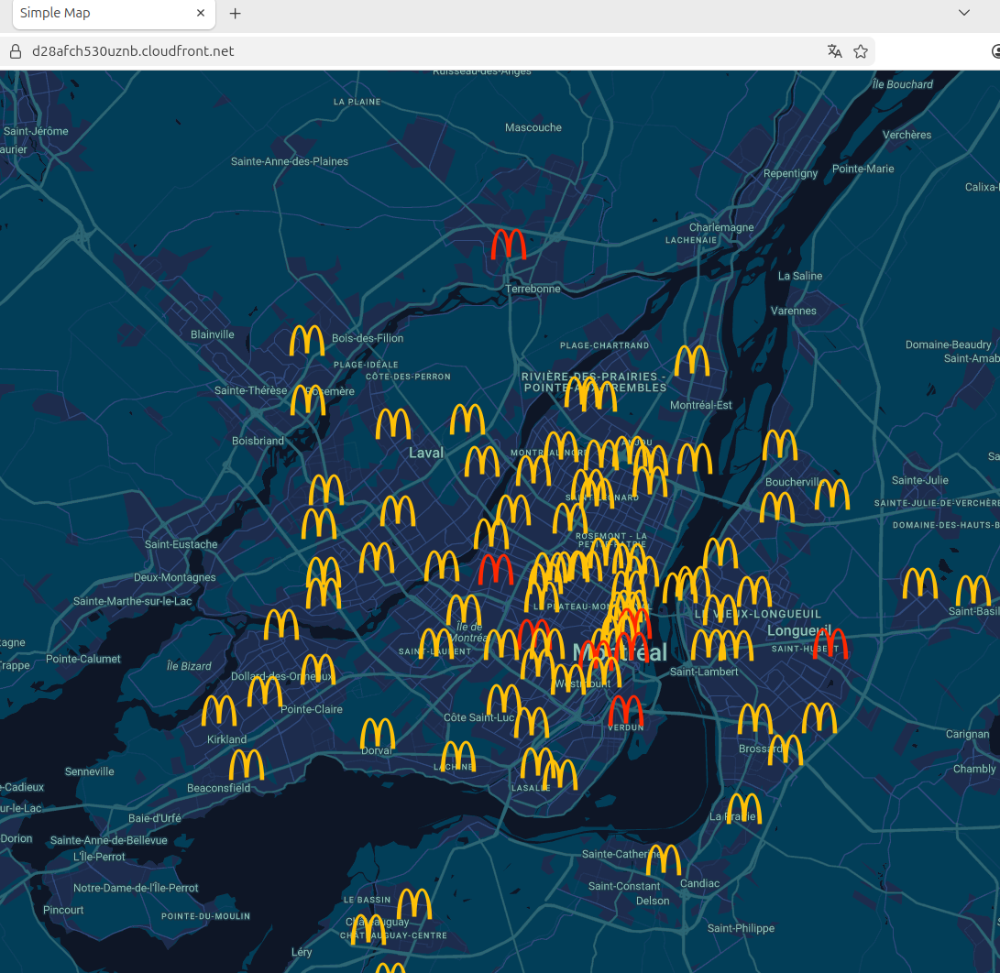