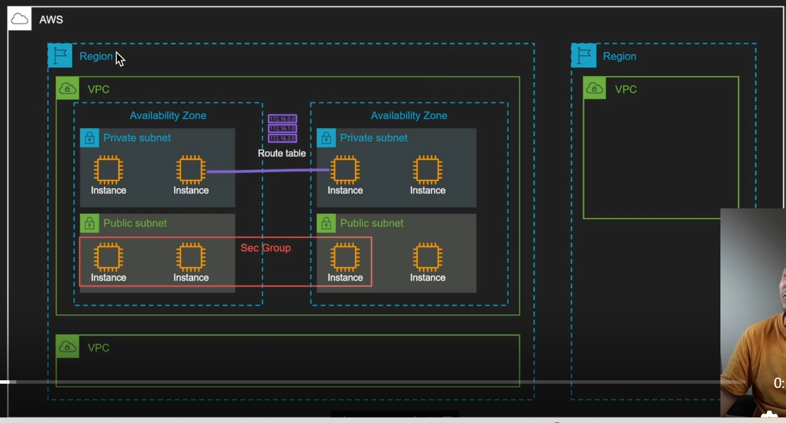
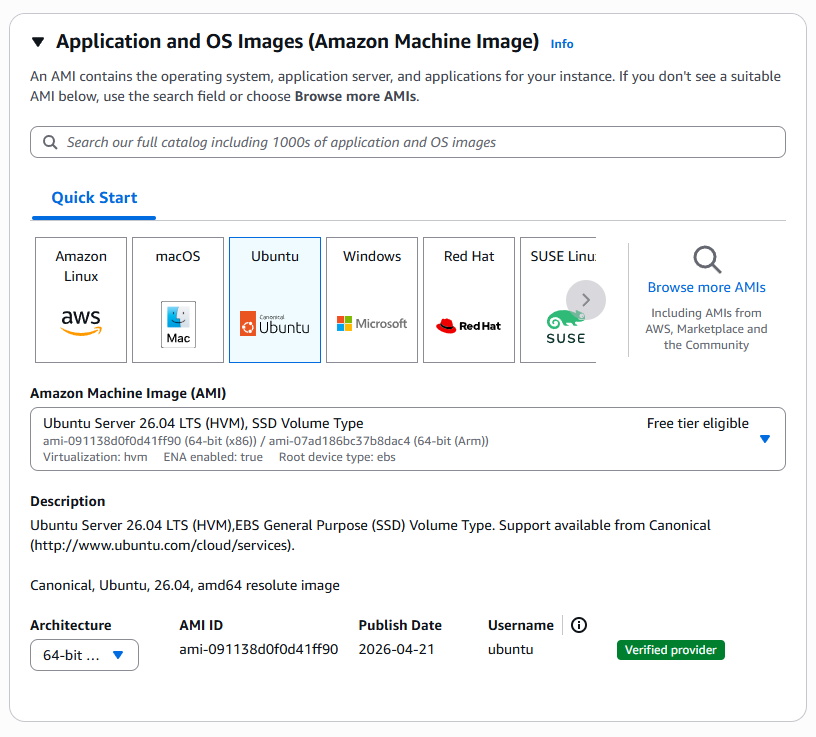
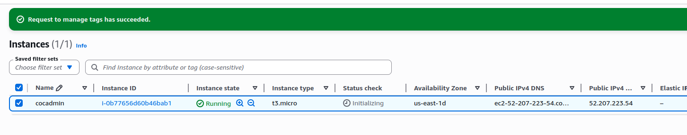
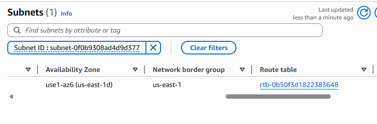
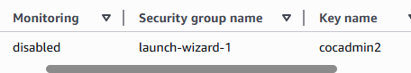
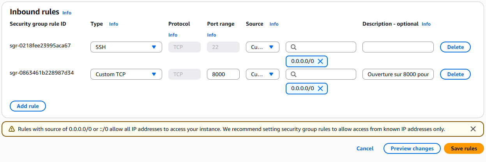
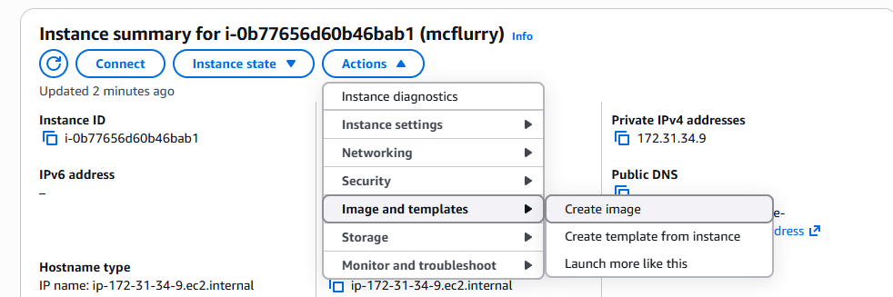
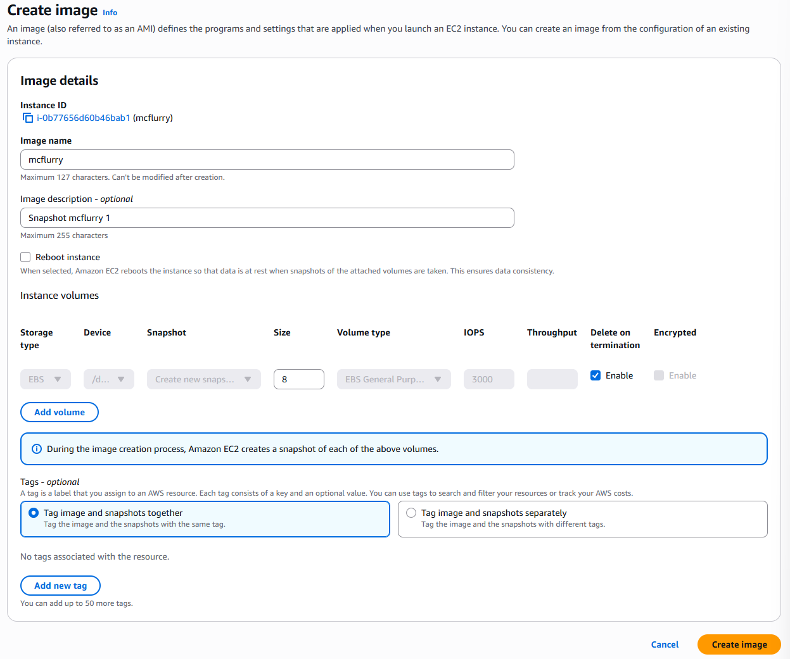
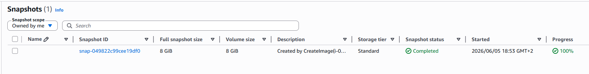

# 3 - EC2 & VPC

#### VPC (Virtual Private Cloud)

A VPC is a **virtual private** network: **private** because it is isolated, **virtual** because it coexists with those of every other AWS customer. A VPC is divided into **subnets**, each tied to an **Availability Zone** ("**AZ**"), which corresponds to one or more data centers in a given region (e.g. `eu-west-3a`, `eu-west-3b`, `eu-west-3c`).

A **region** contains several **AZs**, located in separate data centers. Two VPCs are fully isolated from each other: a development VPC has no impact on a production VPC. There are two kinds of subnets:&#x20;

\- **public subnets**: must be reachable from the Internet, like a web server

\- **private subnets**: must not be reachable from the Internet, like a database.

Network rules can let an application reach resources in a private subnet without exposing that subnet directly to the Internet.



#### EC2 (Elastic Compute Cloud)

**EC2** is useful for anything that doesn't already exist "**as a service**" on AWS, such as an application, a container, a Python application server, etc. Conversely, when a managed service already covers the need (like a database), it is usually preferable to EC2.

EC2 works best with **disposable**, stateless instances: if a machine has a problem, you delete it and recreate it rather than repairing it. This approach enables a fully automated, reproducible infrastructure and faster deployments.

#### Images (AMI: Amazon Machine Image)

An **AMI** is a template used to launch instances, built from snapshots of a machine's volumes. Some are official (e.g. Ubuntu), maintained by their publisher and ready to launch.

You can also use custom images or build your own, for example to migrate an existing machine to the cloud. On the AWS Marketplace, some AMIs are paid, with the cost going to the publisher on top of the instance price.

#### Instances

An instance is an EC2 virtual machine. Prices vary with the specs: for example, two instances can have the same number of cores but different amounts of RAM, sometimes for a similar price. The choice should therefore match the application's real needs (RAM, CPU usage, etc.).

There are also **"burstable"** instances, whose baseline performance is limited but can be exceeded temporarily.

Example: the CPU can run at 100% for a limited time. When the instance uses less than its baseline for a while, it accumulates CPU credits that let it exceed its baseline later.

> A very useful site to compare all available instance types for a given need: [instances.vantage.sh](https://instances.vantage.sh/)

#### EBS volumes (Elastic Block Store)

Some instance types come with local "instance store" disks, but that storage is ephemeral: it is lost when the instance stops. For persistent storage that outlives the instance, AWS offers **EBS (Elastic Block Store)**, network volumes that can be moved from one instance to another.

EBS volumes come in SSD and HDD types, billed by provisioned capacity, and for some types by provisioned IOPS. An EBS volume can be detached and attached to another instance.

> Note: you pay for the whole provisioned volume, even if the allocated space isn't fully used.

#### Security group (SG)

A **security group** is a stateful virtual firewall applied to instances (more precisely, to their network interfaces). Its rules can be changed at any time, and it is free to use (within quotas).

It spans AZs but is tied to a single VPC: instances in different AZs of the same VPC can share the same security group.

**SG** rules can allow traffic either from an IP range (CIDR) or from another **SG**, which is the recommended approach.

Example: a database SG can allow port 3306 only from instances in the web servers' SG, which is more reliable than a list of fixed IP addresses.

#### Elastic IP

An Elastic IP gives a machine a fixed public IP, so it doesn't change on every stop/start. It becomes billable when it isn't attached to a running instance, to discourage needlessly reserving addresses from the scarce global IPv4 pool. Today, virtually all public IPv4 addresses on AWS are billed.

#### Userdata

A script run automatically at the machine's first boot, which is very handy to automate initial configuration. It is passed to the API Base64-encoded, its size is limited (16 KB), and it runs as root.

#### Key pair

SSH key pairs. You can import your own public key, which is then injected into the machine at boot for the image's default user.

#### EBS snapshot

A snapshot captures the state of an EBS volume at a given point in time. Snapshots are stored by AWS and can be used to restore a volume, or to create an **AMI** from which new instances can be launched.

#### ENI (Elastic Network Interface)

An **ENI** is a network interface that can be attached to or detached from an instance. An instance can have several network interfaces, up to a limit that depends on its instance type.

This enables a form of **failover**: since an IP address is tied to a given interface, the interface can be moved to another instance if there's a problem. This does involve a short interruption during the switch.

#### Spot instances

* **Spot instances** use the compute capacity AWS isn't using at a given moment, offered at a steep discount. The catch: AWS can reclaim them at any time, with a two-minute warning, whenever it needs the capacity back!
* Example: for a need of 10 web servers, you could run 5 of them as spot instances to cut costs. According to the course, interruptions remain relatively rare across a large number of instances, which makes spot well suited to workloads that can tolerate losing a machine.

### Hands-on exercise

#### 1. Launching an EC2 instance

An instance is launched from an Ubuntu AMI:



The selected instance type is `t2.micro`, which is eligible for the Free Tier.

We create a key pair for the SSH connection:


The instance is then created, and its public IP address is displayed:



It is in the expected subnet:



#### 2. SSH connection to the instance

We connect with the `.pem` key generated earlier, as the default `ubuntu` user (which depends on the AMI):

```bash
ssh ubuntu@52.207.223.54 -i cocadmin2.pem 
The authenticity of host '52.207.223.54 (52.207.223.54)' can't be established.
ED25519 key fingerprint is SHA256:HN/vOGjYe9c+zmuz/b7WOusO6NPn0Bu9eCtAgYw3WXQ.
This key is not known by any other names.
Are you sure you want to continue connecting (yes/no/[fingerprint])? yes
Warning: Permanently added '52.207.223.54' (ED25519) to the list of known hosts.
Welcome to Ubuntu 26.04 LTS (GNU/Linux 7.0.0-1004-aws x86_64)

 System information as of Fri Jun  5 16:06:19 UTC 2026

  System load:  0.0               Temperature:           -273.1 C
  Usage of /:   30.4% of 6.61GB   Processes:             116
  Memory usage: 25%               Users logged in:       0
  Swap usage:   0%                IPv4 address for ens5: 172.31.34.9

ubuntu@ip-172-31-34-9:~$ 
```

#### 3. Opening an application port in the security group

To make the application reachable on port 8000, we first identify the SG attached to the instance:



The security group here is `launch-wizard-1`:


The firewall rules are then edited to allow that port.

> Although it's better to allow access from SGs rather than IP ranges, the simplest approach for this exercise is to open the port to all addresses via CIDR:



#### 4. Deploying the application on the instance

The repository of the course's example application ("**mcflurry**") is cloned on the VM:

```bash
ubuntu@ip-172-31-34-9:~$ git clone https://github.com/ttwthomas/mcflurry
Cloning into 'mcflurry'...
remote: Enumerating objects: 131, done.
remote: Counting objects: 100% (131/131), done.
remote: Compressing objects: 100% (116/116), done.
remote: Total 131 (delta 69), reused 36 (delta 14), pack-reused 0 (from 0)
Receiving objects: 100% (131/131), 5.13 MiB | 44.91 MiB/s, done.
Resolving deltas: 100% (69/69), done.
```

Project contents once cloned:

```bash
ubuntu@ip-172-31-34-9:~/mcflurry$ ll
total 96
-rw-rw-r-- 1 ubuntu ubuntu    84 Jun  5 16:27 .env
-rw-rw-r-- 1 ubuntu ubuntu   945 Jun  5 16:27 index.html
-rw-rw-r-- 1 ubuntu ubuntu    39 Jun  5 16:27 index.js
drwxrwxr-x 2 ubuntu ubuntu  4096 Jun  5 16:27 lambda/
-rw-rw-r-- 1 ubuntu ubuntu 10473 Jun  5 16:27 main.py
-rw-rw-r-- 1 ubuntu ubuntu  1791 Jun  5 16:27 map.js
-rw-rw-r-- 1 ubuntu ubuntu  6948 Jun  5 16:27 mcdonalds-closed.png
-rw-rw-r-- 1 ubuntu ubuntu  8031 Jun  5 16:27 mcdonalds-unavail.png
-rw-rw-r-- 1 ubuntu ubuntu  8811 Jun  5 16:27 mcdonalds.png
-rw-rw-r-- 1 ubuntu ubuntu  1446 Jun  5 16:27 postgres.py
-rw-rw-r-- 1 ubuntu ubuntu   714 Jun  5 16:27 readme.md
-rw-rw-r-- 1 ubuntu ubuntu   147 Jun  5 16:27 requirements.txt
-rw-rw-r-- 1 ubuntu ubuntu  1439 Jun  5 16:27 server.py
-rw-rw-r-- 1 ubuntu ubuntu  5173 Jun  5 16:27 styles.js
```

> The machine's private IP address (`ip-172-31-34-9`) lets it communicate with, and be identified by, the other instances in the VPC.

Starting the application fails with a `KeyError: 'data'` error:

```bash
ubuntu@ip-172-31-34-9:~/mcflurry$ PORT=8000 python3 main.py 
Traceback (most recent call last):
  File "/home/ubuntu/mcflurry/main.py", line 109, in <module>
    restaurants = load_restaurants()
  File "/home/ubuntu/mcflurry/main.py", line 82, in load_restaurants
    restaurants = get_restaurants()
  File "/home/ubuntu/mcflurry/main.py", line 49, in get_restaurants
    for restaurant in req.json()["data"]["restaurantsList"]["openRestaurants"] :
                      ~~~~~~~~~~^^^^^^^^
KeyError: 'data'
```

The error comes from an API key hardcoded in the application, dating from 2023 (when the course was recorded) and no longer valid.

Rather than getting stuck on this, I chose a simpler workaround: serving a basic page with Nginx or Apache as a proof of concept, to check that the public IP and the exposed port respond.

#### 5. Creating a snapshot and an AMI

A snapshot is created, then an AMI, to illustrate the backup mechanism:



Then we create the image here:



And the snapshot appears in the corresponding list:



New instances can now be launched directly from this image. An AMI created from an already configured machine skips the whole configuration phase when a new instance boots.

> Infrastructure as Code (IaC) note: Packer, combined with Ansible, can fully automate building an AMI: it launches a temporary instance, configures it, then creates the image and its snapshot.