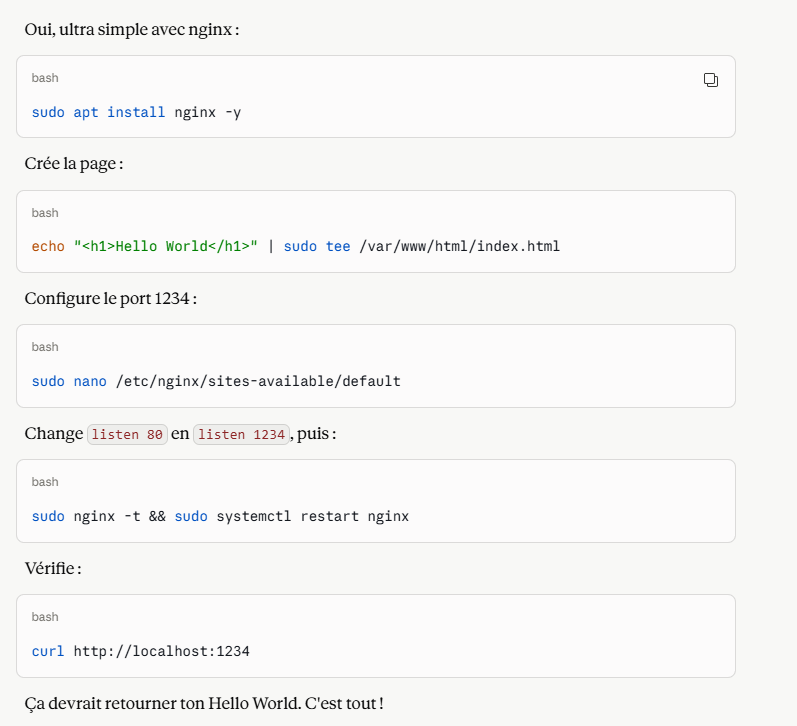
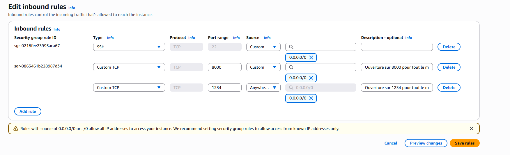
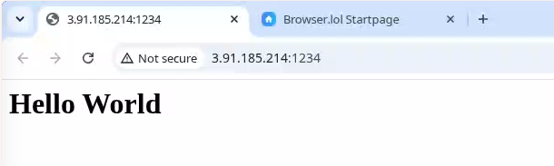
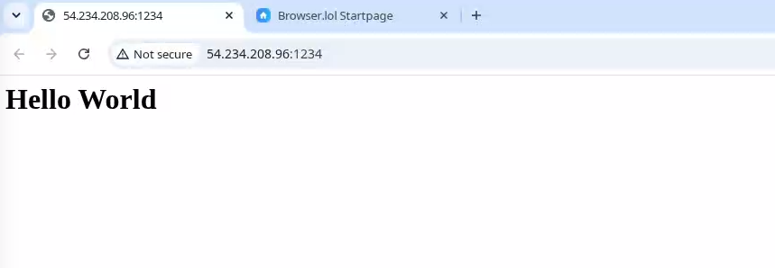

# 3.2 - EC2 & VPC (Pt. 2)

### Quick summary

The next exercise is to create an **EC2** instance, deploy a small web app on a custom port, build a custom AMI from it, then launch a new instance from that AMI. Everything is done from the command line with the AWS CLI, since it's faster and more convenient. We then use `userdata` to get the same configuration from a base AMI.

### Custom AMI vs userdata: two complementary approaches

* A **custom AMI** bundles everything that's needed: the application code, the service already set to start automatically, and the application port already configured. It boots fast, but has to be rebuilt after every configuration change.
* A **userdata** script, on the other hand, applies the same configuration to a generic AMI (for example a standard Ubuntu image) when the instance boots. It's more flexible and easier to maintain, at the cost of a slightly longer boot time. This is the approach we'll favor.

### 1. Listing and deleting existing instances

Before creating a new instance, we list the existing ones:

```bash
aws ec2 describe-instances --profile myProfile | head -n 100
```

An extract of the output shows the instance ID, the instance type, the associated security group and the tags:

```bash
$ aws ec2 describe-instances --profile myProfile | grep "Instance"
            "Instances": [
                        "InstanceMetadataTags": "disabled"
                    "UsageOperation": "RunInstances",
                    "CurrentInstanceBootMode": "uefi",
                    "InstanceId": "i-0b77656d60b46bab1",
                    "InstanceType": "t3.micro",
```

The previously created instance (ID `i-0b77656d60b46bab1`) is then terminated:

```bash
$ aws ec2 terminate-instances --profile myProfile --instance-ids i-0b77656d60b46bab1
{
    "TerminatingInstances": [
        {
            "InstanceId": "i-0b77656d60b46bab1",
            "CurrentState": {"Code": 32, "Name": "shutting-down"},
            "PreviousState": {"Code": 16, "Name": "running"}
        }
    ]
}
```

### 2. Creating a new EC2 instance with the CLI

A new instance, `mcflurry-kostan`, is created from the same Ubuntu AMI as before (`ami-091138d0f0d41ff90`), in the existing security group `sg-0cfd8e43809678d1b`. Its details can be checked with:

```bash
$ aws --profile myProfile ec2 describe-security-groups
```

Port 8000 is already open to everyone:

```bash
"VpcId": "vpc-02a9f67924e244fe1",
"SecurityGroupArn": "arn:aws:ec2:us-east-1:960583973458:security-group/sg-0cfd8e43809678d1b",
"GroupName": "launch-wizard-1",
"IpPermissions": [
    {
        "IpProtocol": "tcp",
        "FromPort": 8000,
        "ToPort": 8000,
        "IpRanges": [
            {
                "Description": "Ouverture sur 8000 pour tout le monde",
                "CidrIp": "0.0.0.0/0"
            }
        ]
    }
]
```

> **Important**: a security group must be in the **same VPC** as the target subnet.

So we first list the subnets available in that VPC:

```bash
$ aws --profile myProfile ec2 describe-subnets \
  --filters 'Name=vpc-id,Values=vpc-02a9f67924e244fe1' \
  --query 'Subnets[*].[SubnetId,CidrBlock,AvailabilityZone,MapPublicIpOnLaunch]' \
  --output table
----------------------------------------------------------------------
|                           DescribeSubnets                          |
+---------------------------+------------------+-------------+-------+
|  subnet-098df6a2925d1fca8 |  172.31.16.0/20  |  us-east-1c |  True |
|  subnet-0008bd79a2ecf7a68 |  172.31.80.0/20  |  us-east-1b |  True |
|  subnet-0b1bbada0f21af10e |  172.31.64.0/20  |  us-east-1f |  True |
|  subnet-0f0b9308ad4d9d377 |  172.31.32.0/20  |  us-east-1d |  True |
|  subnet-09d09309039b4b997 |  172.31.48.0/20  |  us-east-1e |  True |
|  subnet-05388da4c4c8a241a |  172.31.0.0/20   |  us-east-1a |  True |
+---------------------------+------------------+-------------+-------+
```

We pick the first subnet in the list and create the instance (with the `mcflurry-kostan` SSH key, whose `.pem` file is on my local Ubuntu VM):

```bash
aws --profile myProfile ec2 run-instances \
  --image-id "ami-091138d0f0d41ff90" \
  --instance-type t3.micro \
  --key-name mcflurry-kostan \
  --subnet-id subnet-098df6a2925d1fca8 \
  --security-group-ids sg-0cfd8e43809678d1b \
  --count 1
```

The instance then shows up in the list, in the "**running**" state:

```bash
$ aws --profile myProfile ec2 describe-instances \
  --query 'Reservations[*].Instances[*].[InstanceId,PrivateIpAddress,PublicIpAddress,State.Name,InstanceType,Placement.AvailabilityZone,Tags[?Key=="Name"].Value[0]]' \
  --output text

i-0185cd42945adedf2     None    None    terminated      t3.micro        us-east-1c      None
i-0c43b9365ca050097     172.31.21.197   54.164.35.204   running t3.micro        us-east-1c      None
i-0ba4e0207fc7921c6     None    None    terminated      t3.micro        us-east-1c      None
```

→ instance used: `i-0c43b9365ca050097`

### 3. Connecting and deploying the application

We can now SSH into the new instance and clone the course's example repository:

```bash
$ ssh -i mcflurry-kostan.pem ubuntu@54.164.35.204
Welcome to Ubuntu 26.04 LTS (GNU/Linux 7.0.0-1004-aws x86_64)

ubuntu@ip-172-31-21-197:~$ git clone https://github.com/ttwthomas/mcflurry
Cloning into 'mcflurry'...
remote: Enumerating objects: 131, done.
remote: Counting objects: 100% (131/131), done.
remote: Compressing objects: 100% (116/116), done.
```

### 4. Blocked by Cloudflare

The application gets a 403 error on its API calls. After investigating, the cause isn't the authentication token but a **Cloudflare** block: the source site (SkipTheDishes) uses bot protection that rejects requests that don't come from a real browser. The token used by the application may well still be valid, but the request is blocked by Cloudflare before it even reaches the API.

Given this block, I replaced the full application with a simple "**hello world**" HTML page served by Nginx on port 1234:



With a little help from Claude :P The matching firewall rule is configured on AWS:



The instance now runs Nginx on port 1234, tested first locally, then through the public IP:

```bash
ubuntu@ip-172-31-29-20:~/mcflurry$ curl http://localhost:1234
<h1>Hello World</h1> 
ubuntu@ip-172-31-29-20:~/mcflurry$ curl http://3.91.185.214:1234
<h1>Hello World</h1>
```

> The university network I used for testing (eduroam) blocked the exposed port. In that case, [browser.lol](https://browser.lol/), a browser running inside a browser, lets you test access from an outside network. Very handy for this kind of check.



### 5. Creating an AMI from the configured instance

We first get the ID of the instance to turn into an image:

```bash
aws --profile myProfile ec2 describe-instances \
  --query 'Reservations[*].Instances[*].[InstanceId,PrivateIpAddress,PublicIpAddress,State.Name,InstanceType,Placement.AvailabilityZone,Tags[?Key=="Name"].Value[0]]' \
  --output text

i-05baafd242242ec4b     172.31.29.20    3.91.185.214    running t3.micro        us-east-1c    None
```

Then we create the image from that instance:

```bash
aws --profile myProfile ec2 create-image \
  --instance-id i-05baafd242242ec4b \
  --name "AMI-McFlurry-2026-06-11" \
  --description "AMI McFlurry"
```

→ resulting AMI: `ami-0727c7aa82635c7c6`

Image creation progress can be followed through the underlying EBS snapshot:

```bash
# 1. Récupérer les snapshots liés à l'AMI
aws --profile myProfile ec2 describe-images \
  --image-ids ami-0727c7aa82635c7c6 \
  --query 'Images[0].BlockDeviceMappings[*].Ebs.SnapshotId'
[
    "snap-039038f544198a2ef"
]

# 2. Vérifier l'état du snapshot
aws --profile myProfile ec2 describe-snapshots \
  --snapshot-ids snap-039038f544198a2ef \
  --query 'Snapshots[0].{State:State, Progress:Progress}'
{
    "State": "completed",
    "Progress": "100%"
}
```

### 6. Launching an instance from the custom AMI

The instance used to build the image is terminated first:

```bash
aws --profile myProfile ec2 terminate-instances --instance-ids i-05baafd242242ec4b
```

Then we launch a new instance from the custom AMI, with the SSH key to connect to it:

```bash
aws --profile myProfile ec2 run-instances \
  --image-id ami-0727c7aa82635c7c6 \
  --instance-type t3.micro \
  --count 1 \
  --key-name mcflurry-kostan \
  --security-group-ids sg-0cfd8e43809678d1b \
  --tag-specifications 'ResourceType=instance,Tags=[{Key=Name,Value=mcflurry-instance}]'
```

The new instance's IP address shows up:

```bash
i-0f662bc75b1c1e4b9     None    None    terminated      t3.micro        us-east-1c
i-01fec26f5dc98e17d     172.31.30.79    54.234.208.96   running t3.micro        us-east-1c
```

The site is directly accessible, with no extra manual configuration, since everything is already baked into the custom AMI:



### 7. Adding the userdata script

The custom AMI works, but it has to be rebuilt after every change. The goal is therefore to move the whole configuration into a `userdata` script:

```bash
#!/bin/bash

# Mise à jour des paquets
apt update -y

# Installation de nginx
apt install nginx -y

# Changement du port 80 en 1234
sed -i 's/listen 80/listen 1234/g' /etc/nginx/sites-available/default
sed -i 's/listen \[::\]:80/listen [::]:1234/g' /etc/nginx/sites-available/default

# Création de la page HTML
echo "<h1>Hello World!</h1>" | tee /var/www/html/index.html

# Test de la config et redémarrage nginx
nginx -t && systemctl restart nginx

# Vérification que le site répond
curl http://localhost:1234 > /home/ubuntu/site-state.html
```

We launch a new instance, passing the script with the `--user-data` option:

```bash
aws --profile myProfile ec2 run-instances \
  --image-id ami-0727c7aa82635c7c6 \
  --instance-type t3.micro \
  --count 1 \
  --key-name mcflurry-kostan \
  --user-data file:///home/jpmm/Documents/aws-formation/ec2/userdata.sh \
  --security-group-ids sg-0cfd8e43809678d1b \
  --tag-specifications 'ResourceType=instance,Tags=[{Key=Name,Value=mcflurry-instance}]'
```

### 8. Creating the security group from scratch with the CLI

We create a dedicated security group from scratch:

```bash
aws ec2 create-security-group --group-name mcflurry --description "mcflurry"
```

And open ports 22 (SSH) and 1234 (application):

```bash
aws ec2 authorize-security-group-ingress --group-id sg-090e568fe9800aed2 \
  --protocol tcp --port 22 --cidr 0.0.0.0/0
aws ec2 authorize-security-group-ingress --group-id sg-090e568fe9800aed2 \
  --protocol tcp --port 1234 --cidr 0.0.0.0/0
```

> The machine can't be pinged by default: ICMP isn't allowed automatically, even when other ports are open. A custom ICMP rule must be added explicitly to allow ping.

### Useful logs for debugging

If a userdata script misbehaves, the logs are in:

```bash
/var/log/cloud-init.log
```