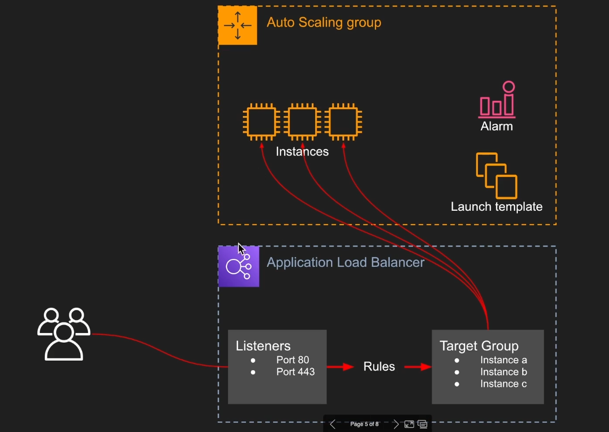
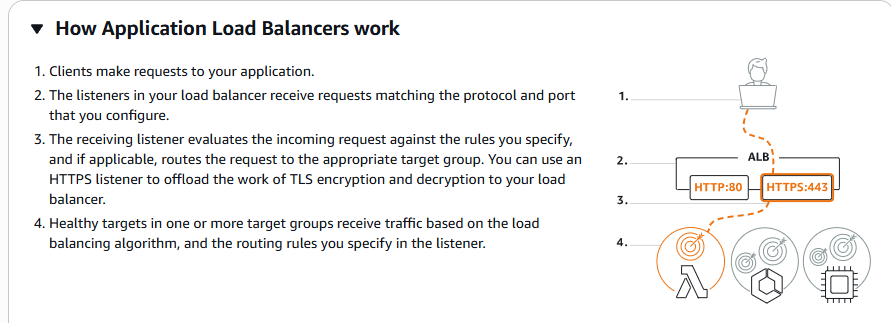
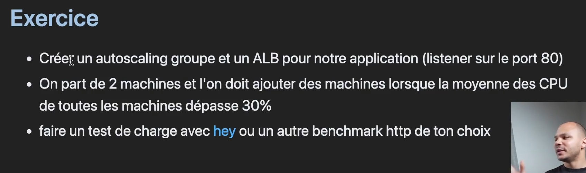
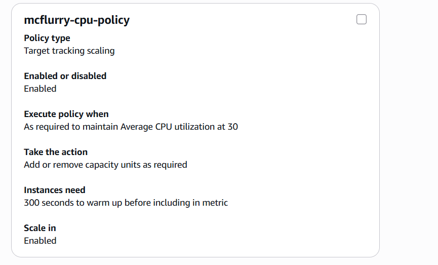
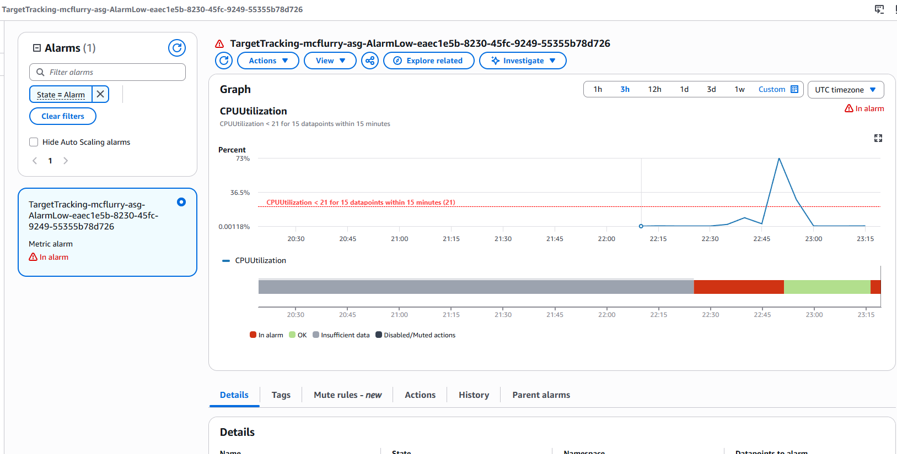

# 4 - ASG & ELB

### ASG (Auto Scaling Group)

An ASG applies scaling rules: for example, adding a machine when CPU usage exceeds a threshold, and removing one when the load drops (automatic scale-out / scale-in). The ASG service itself is free, but the resources it launches (instances, etc.) are billed. This lets us keep a **stateless**, easily replicable infrastructure, managing a group of machines rather than a single one.

The ASG monitors the health of its instances around the clock: if an instance fails its health checks, it is terminated and automatically replaced. With this mechanism, you no longer have to worry about individual machine failures, since a broken machine is recreated automatically. This ensures the service stays **available**.

Finally, instances can be spread across several AZs: if a data center goes down, new instances start in another zone.

### ASG concepts

* **Launch Template**: defines what to launch (AMI, instance type, SG...) whenever the ASG needs to create a new instance.
* **Scaling policy**: defines the conditions for adding or removing machines (for example, a CPU usage threshold).


_"And one more... ;)"_

> Be careful with the number of scaling rules: too many, or poorly designed ones, can conflict with each other.

### ELB (Elastic Load Balancing)

An ELB spreads incoming traffic across several EC2 instances, so that no single machine takes the whole load. It's called "elastic" because it scales with the traffic, whether that's thousands or millions of requests. It forwards traffic received on a given port to the matching targets (here, the ASG's instances). The main types are:

* **NLB (Network Load Balancer)**: operates at layer 4 (TCP/UDP), with very high performance and low latency.&#x20;
* **ALB (Application Load Balancer)**: operates at layer 7 (HTTP/HTTPS) instead of the TCP level. It supports finer-grained routing rules, such as forwarding a request to a different service depending on the requested URL.

### ALB: the most common

The ALB is the most widely used, so that's the one we'll focus on. It relies on these building blocks:

* **Listener**: the port the load balancer listens on.
* **Target group**: the group of instances requests are forwarded to.
* **Rules**: the routing rules.

As for **pricing**, an ALB has a fixed base cost of around $16/month, plus usage.

An ELB is usually dedicated to a single application. You can share one ELB across several environments (for example dev and prod), but that can cause problems, since one environment could then affect the other.

Overall architecture diagram:



The ASG + ELB combo makes the infrastructure self-sufficient: it adapts to the load and heals itself when an instance fails:



## Hands-on exercise with the AWS CLI

The following exercise is done entirely from the command line:



**The order of operations matters**, since some steps need the ARN (resource identifier) produced by a previous one:

```
1. Launch Template
2. Load Balancer      → récupérer son ARN
3. Target Group       → récupérer son ARN
4. Listener            → utilise ARN LB + ARN TG
5. ASG                  → utilise ARN TG
6. Scaling Policy      → utilise le nom de l'ASG
```

### 1. Creating the Launch Template

As seen above, it defines the configuration of the instances launched by the ASG:

```bash
aws --profile myProfile ec2 create-launch-template \
  --launch-template-name mcflurry-lt \
  --version-description "v1" \
  --launch-template-data '{
    "ImageId": "ami-0727c7aa82635c7c6",
    "InstanceType": "t3.micro",
    "KeyName": "mcflurry-kostan",
    "SecurityGroupIds": ["sg-0cfd8e43809678d1b"]
  }'
```

With the following parameters:

`--launch-template-name mcflurry-lt`: the template's name

`--version-description "v1"`: launch template versioning, to identify versions or roll back if something goes wrong. Here we start with v1.

Then in `launch-template-data`:

* `ImageId`: the AMI each instance boots from
* `InstanceType: t3.micro`: the instance type, here a **t3.micro** with 2 vCPUs and 1 GiB of RAM. Lightweight and ideal for testing.
* `KeyName`: the SSH key pair attached to the instances, to connect to them later
* `SecurityGroupIds`: the SGs to apply, and therefore the associated firewall rules&#x20;

### 2. Creating the Load Balancer (ALB)

The load balancer must be created before the listener. We first get the available subnets in each AZ:

```bash
$ aws --profile myProfile ec2 describe-subnets \
  --query 'Subnets[*].{ID:SubnetId, AZ:AvailabilityZone, CIDR:CidrBlock}' \
  --output table
--------------------------------------------------------------
|                       DescribeSubnets                      |
+------------+------------------+----------------------------+
|     AZ     |      CIDR        |            ID              |
+------------+------------------+----------------------------+
|  us-east-1c|  172.31.16.0/20  |  subnet-098df6a2925d1fca8  |
|  us-east-1b|  172.31.80.0/20  |  subnet-0008bd79a2ecf7a68  |
|  us-east-1f|  172.31.64.0/20  |  subnet-0b1bbada0f21af10e  |
|  us-east-1d|  172.31.32.0/20  |  subnet-0f0b9308ad4d9d377  |
|  us-east-1e|  172.31.48.0/20  |  subnet-09d09309039b4b997  |
|  us-east-1a|  172.31.0.0/20   |  subnet-05388da4c4c8a241a  |
+------------+------------------+----------------------------+
```

The ALB is then created across these subnets:

```bash
aws --profile myProfile elbv2 create-load-balancer \
  --name mcflurry-alb \
  --subnets subnet-098df6a2925d1fca8 subnet-0008bd79a2ecf7a68 subnet-0b1bbada0f21af10e subnet-0f0b9308ad4d9d377 subnet-0f0b9308ad4d9d377 subnet-09d09309039b4b997 subnet-05388da4c4c8a241a \
  --security-groups sg-0cfd8e43809678d1b \
  --scheme internet-facing \
  --type application
```

### 3. Creating the Target Group

The target group must be created before the listener and the ASG, since both need its ARN:

```bash
aws --profile myProfile elbv2 create-target-group \
  --name mcflurry-tg \
  --protocol HTTP \
  --port 1234 \
  --vpc-id vpc-02a9f67924e244fe1 \
  --health-check-protocol HTTP \
  --health-check-port 1234 \
  --health-check-path /
```

Which returns:

```bash
"TargetGroupArn": "arn:aws:elasticloadbalancing:us-east-1:960583973458:targetgroup/mcflurry-tg/a02a4cce8d6a248f",
```

### 4. Creating the Listener

The listener connects the load balancer (by its ARN) to the target group (also by its ARN), on a given port:

```bash
aws --profile myProfile elbv2 create-listener \
  --load-balancer-arn arn:aws:elasticloadbalancing:us-east-1:960583973458:loadbalancer/app/mcflurry-alb/cf159c6b1ee5acd6 \
  --protocol HTTP \
  --port 8000 \
  --default-actions Type=forward,TargetGroupArn=arn:aws:elasticloadbalancing:us-east-1:960583973458:targetgroup/mcflurry-tg/a02a4cce8d6a248f
```

```bash
"ListenerArn": "arn:aws:elasticloadbalancing:us-east-1:960583973458:listener/app/mcflurry-alb/cf159c6b1ee5acd6/e0c2e25f6133a417",
```

### 5. Creating the Auto Scaling Group

We create the ASG with the launch template and the target group's ARN:

```bash
aws --profile myProfile autoscaling create-auto-scaling-group \
  --auto-scaling-group-name mcflurry-asg \
  --launch-template LaunchTemplateName=mcflurry-lt,Version='$Latest' \
  --min-size 1 \
  --max-size 3 \
  --desired-capacity 2 \
  --vpc-zone-identifier "subnet-098df6a2925d1fca8,subnet-0008bd79a2ecf7a68,subnet-0b1bbada0f21af10e,subnet-0f0b9308ad4d9d377,subnet-09d09309039b4b997,subnet-05388da4c4c8a241a" \
  --target-group-arns arn:aws:elasticloadbalancing:us-east-1:960583973458:targetgroup/mcflurry-tg/a02a4cce8d6a248f
```

Then we check that the ASG is attached to the right target group:

```bash
aws --profile myProfile autoscaling describe-auto-scaling-groups \
  --auto-scaling-group-name mcflurry-asg \
  --query 'AutoScalingGroups[0].TargetGroupARNs'
[
    "arn:aws:elasticloadbalancing:us-east-1:960583973458:targetgroup/mcflurry-tg/a02a4cce8d6a248f"
]
```

### 6. Creating the scaling policy

We then create a scaling policy targeting an average CPU usage of 30% across the ASG:

```bash
aws --profile myProfile autoscaling put-scaling-policy \
  --auto-scaling-group-name mcflurry-asg \
  --policy-name mcflurry-cpu-policy \
  --policy-type TargetTrackingScaling \
  --target-tracking-configuration '{
    "PredefinedMetricSpecification": {
      "PredefinedMetricType": "ASGAverageCPUUtilization"
    },
    "TargetValue": 30.0
  }'
```

This command automatically creates two associated CloudWatch alarms (high and low thresholds):

```json
{
    "PolicyARN": "arn:aws:autoscaling:us-east-1:960583973458:scalingPolicy:9c231a32-a027-43b5-b84e-309658987196:autoScalingGroupName/mcflurry-asg:policyName/mcflurry-cpu-policy",
    "Alarms": [
        {
            "AlarmName": "TargetTracking-mcflurry-asg-AlarmHigh-6ed14898-cf35-4940-a797-68093e46fc5d",
            "AlarmARN": "arn:aws:cloudwatch:us-east-1:960583973458:alarm:TargetTracking-mcflurry-asg-AlarmHigh-6ed14898-cf35-4940-a797-68093e46fc5d"
        },
        {
            "AlarmName": "TargetTracking-mcflurry-asg-AlarmLow-eaec1e5b-8230-45fc-9249-55355b78d726",
            "AlarmARN": "arn:aws:cloudwatch:us-east-1:960583973458:alarm:TargetTracking-mcflurry-asg-AlarmLow-eaec1e5b-8230-45fc-9249-55355b78d726"
        }
    ]
}
```

The policy also shows up in the console:



The load balancer is now live on port 8000 and serves the application's page:

```bash
curl http://mcflurry-alb-8475791.us-east-1.elb.amazonaws.com:8000/
<h1>Hello World</h1>
```

### 7. Testing automatic scale-out

**Problem**: Nginx on my servers only serves a simple HTML page, which uses very little CPU. Even with a large number of requests, CPU usage would likely stay low and never trigger the scaling policy.

**The solution?** Stress the instances' CPU directly with the `stress` tool (installed beforehand), to see whether the policy kicks in and launches new machines:

```bash
ssh -i mcflurry-kostan.pem ubuntu@35.168.112.58 "sudo apt install stress -y && stress --cpu 4 --timeout 300"

No VM guests are running outdated hypervisor (qemu) binaries on this host.
stress: info: [1552] dispatching hogs: 4 cpu, 0 io, 0 vm, 0 hdd

stress: info: [1552] successful run completed in 300s
```

We open another terminal to watch it live:

```bash
Toutes les 10,0s: aws --profile myProfile autoscalin...  kos-boss: Sun Jun 14 00:54:55 2026

[
    {
        "ID": "i-0314092b550775c01",
        "State": "InService"
    }
]
```

After 5 minutes of load, two new instances have appeared! We now have three running instances:

```bash
Toutes les 10,0s: aws --profile myProfile autoscalin...  kos-boss: Sun Jun 14 00:54:55 2026

[
    {
        "ID": "i-0314092b550775c01",
        "State": "InService"
    },
    {
        "ID": "i-040c8e6681848a597",
        "State": "InService"
    },
    {
        "ID": "i-08d82f6f3e803a1c0",
        "State": "InService"
    }
]
```

The scaling policy works as expected. The group's CPU usage graph shows the load increase:

