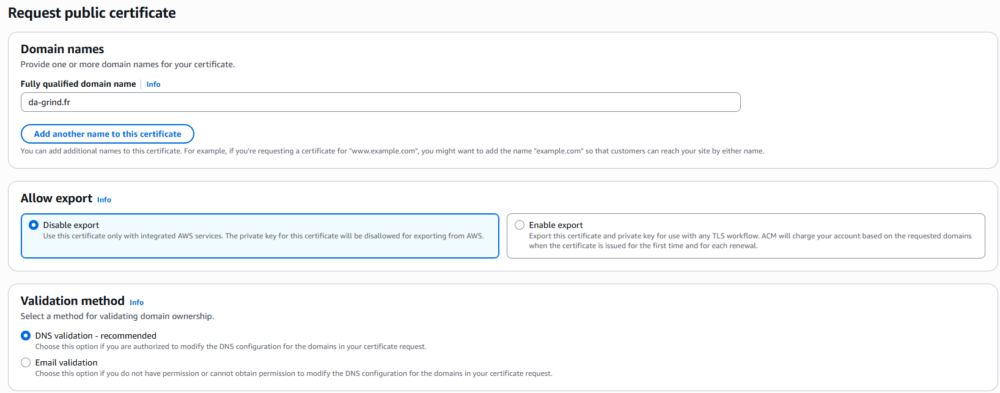
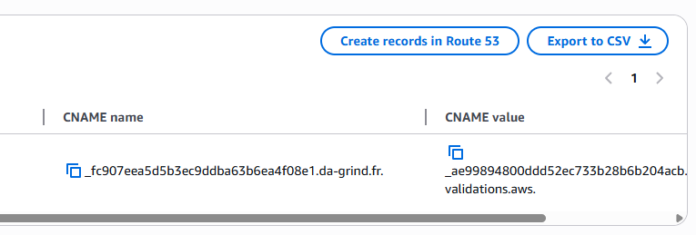
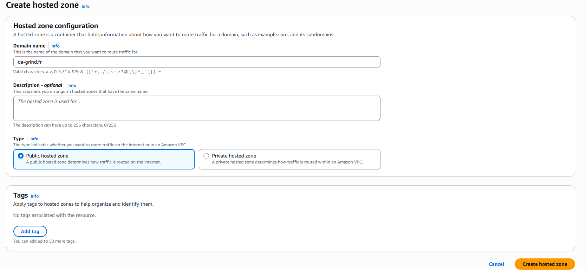
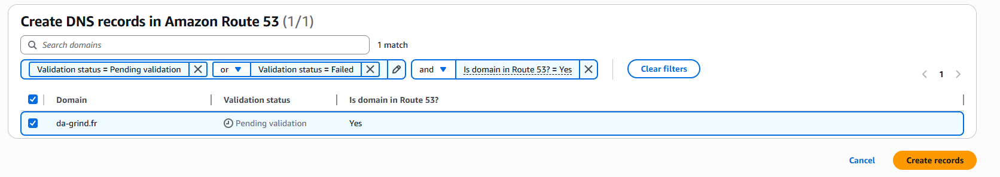
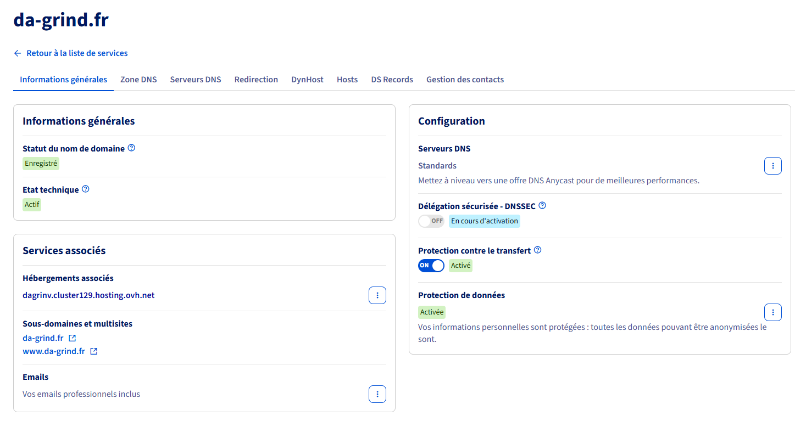
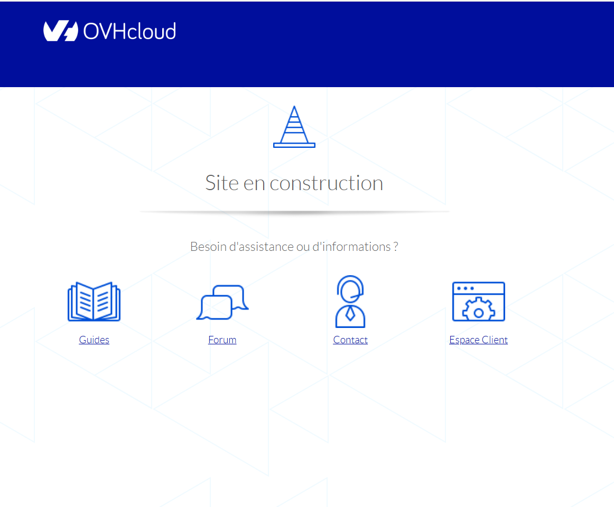
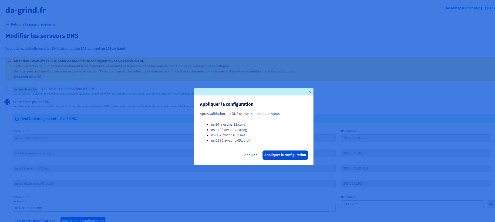

# Bonus - Registering a domain name

NOTE: this part is still a work in progress. Migrating the site from the AWS instance to this domain remains to be done, and will be documented here once finished.

When a **Hosted Zone** is created in Route 53 for a domain, AWS automatically generates two mandatory records that can't be deleted:

| Type                         | Role                                                                                    |
| ---------------------------- | --------------------------------------------------------------------------------------- |
| **NS** (Nameserver)          | Lists the 4 Route 53 name servers to use for the domain                                 |
| **SOA** (Start of Authority) | DNS authority information for the zone (primary server, refresh settings)               |

To validate an SSL certificate through DNS (with ACM on AWS), a CNAME record must be added to the domain's DNS zone. Until that CNAME exists, the certificate stays in "**pending validation**" status. As a result, resources that depend on the certificate (like a CloudFront distribution in front of an S3 bucket) can't be finalized until it is validated.

So we'll register a domain name to stop dealing with an invalid certificate.

## Procedure

We can first try to create an SSL certificate for the `da-grind.fr` domain from the console:



> Prefer DNS validation over e-mail validation.

The corresponding record must then be created in Route 53 to prove domain ownership:



Except... validation gets stuck: the DNS records appear greyed out. The record can't be created as long as there is no hosted zone for the domain in Route 53, so let's fix that:



A Route 53 **Hosted Zone** for `da-grind.fr` automatically creates the NS and SOA records mentioned above. The DNS validation record for the ACM certificate is then created in turn:



Three DNS records are now present in Route 53:

| Record                                          | Type      | Role                                                    |
| ----------------------------------------------- | --------- | ------------------------------------------------------- |
| `da-grind.fr`                                   | **NS**    | Route 53 name servers for the domain                    |
| `_fc907eea5d5b3ec9ddba63b6ea4f08e1.da-grind.fr` | **CNAME** | DNS validation for the ACM certificate                  |
| `da-grind.fr`                                   | **SOA**   | Zone authority (mandatory, created automatically)       |

### 2. Buying the domain from OVH

In the course, the instructor (Cocadmin) used his own domain name. Following along led me to an error: I had tried to generate a certificate for a domain that wasn't actually registered. So I bought the `da-grind.fr` domain from OVH so that it would exist:



Cost: about €4/month, with a one-year commitment.

**Check before purchase**: the domain doesn't exist yet (`NXDOMAIN`):

```bash
dig da-grind.fr

;; ->>HEADER<<- opcode: QUERY, status: NXDOMAIN, id: 62083
;; QUESTION SECTION:
;da-grind.fr.			IN	A

;; AUTHORITY SECTION:
fr.			270	IN	SOA	a.nic.fr. dnsmaster.afnic.fr. 2245363674 3600 1800 1209600 600
```

**Check after purchase**: the domain now resolves to an IP address:

```bash
dig www.da-grind.fr

;; ->>HEADER<<- opcode: QUERY, status: NOERROR, id: 8454
;; QUESTION SECTION:
;www.da-grind.fr.		IN	A

;; ANSWER SECTION:
www.da-grind.fr.	3561	IN	A	51.91.236.255
```

For now, the site shows a default "under construction" page provided by OVH:



### 3. Signing in to AWS with the CLI

Sign-in with a dedicated profile named `myProfile`:

```bash
jpmm@kos-boss:~/Documents/aws-formation$ aws login --profile myProfile
No AWS region has been configured. The AWS region is the geographic location of your AWS resources.

https://us-east-1.signin.aws.amazon.com/v1/authorize?[...]

Updated profile myProfile to use arn:aws:iam::960583973458:user/negrospies-777 credentials.
Use "--profile myProfile" to use the new credentials, such as "aws sts get-caller-identity --profile myProfile"
```

After authenticating in the browser, we check the profile's identity:

```bash
$ aws sts get-caller-identity --profile myProfile
{
    "UserId": "AIDA57J2EHJJGGICHP6LM",
    "Account": "960583973458",
    "Arn": "arn:aws:iam::960583973458:user/negrospies-777"
}
```

We list the S3 buckets accessible with this profile:

```bash
$ aws s3 ls --profile myProfile
2026-05-30 16:19:12 cocadmin-blog-s3
```

The bucket's contents can be listed too:

```bash
$ aws s3 ls cocadmin-blog-s3 --profile myProfile

2026-05-30 16:44:47        805 index.html
2026-05-30 16:44:47         39 index.js
2026-05-30 16:44:48       1793 map.js
2026-05-30 16:44:48       6948 mcdonalds-closed.png
2026-05-30 16:44:48       8031 mcdonalds-unavail.png
2026-05-30 16:44:48       8811 mcdonalds.png
2026-05-30 16:44:49      23204 missingflurry.js
2026-05-30 16:44:49       4742 styles.js
2026-05-30 16:44:50       5173 styles2.js
```

### 4. Pointing the OVH domain to the AWS name servers

Since the domain was bought from OVH, its name servers must be replaced with the ones provided by the Route 53 Hosted Zone, so that AWS becomes responsible for the domain's DNS resolution.

We first check the IP addresses of the Route 53 name servers with an `nslookup` loop:

```bash
for SITE in ns-97.awsdns-12.com ns-1106.awsdns-10.org ns-932.awsdns-52.net ns-1580.awsdns-05.co.uk
do 
    echo "----- $SITE -----"
    nslookup "$SITE"
done
```

Result for each of the four name servers (IPv4 and IPv6 address):

```bash
----- ns-97.awsdns-12.com -----
Name:	ns-97.awsdns-12.com
Address: 205.251.192.97
Name:	ns-97.awsdns-12.com
Address: 2600:9000:5300:6100::1

----- ns-1106.awsdns-10.org -----
Name:	ns-1106.awsdns-10.org
Address: 205.251.196.82
Name:	ns-1106.awsdns-10.org
Address: 2600:9000:5304:5200::1

----- ns-932.awsdns-52.net -----
Name:	ns-932.awsdns-52.net
Address: 205.251.195.164
Name:	ns-932.awsdns-52.net
Address: 2600:9000:5303:a400::1

----- ns-1580.awsdns-05.co.uk -----
Name:	ns-1580.awsdns-05.co.uk
Address: 205.251.198.44
Name:	ns-1580.awsdns-05.co.uk
Address: 2600:9000:5306:2c00::1
```

These four name servers are then entered in the OVH interface, replacing OVH's default name servers, to delegate the domain's DNS to Route 53:

